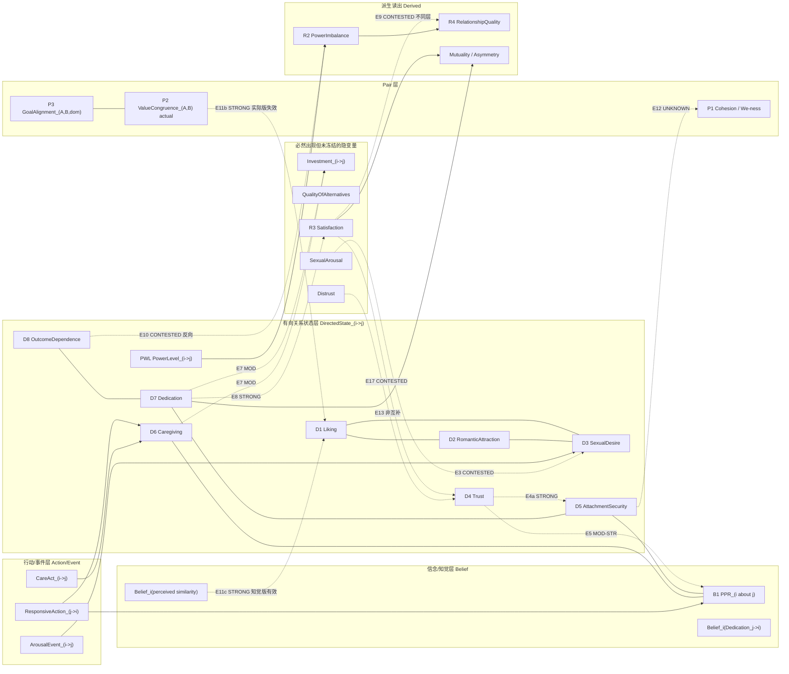

# 02b — Construct Redundancy Audit（语义冗余 / 双重计数红旗审计）

**Status:** `RESEARCH_CANDIDATE` / NOT CANONICAL
**As of:** 2026-09-27
**Lane:** R02（Wave 1）
**Inputs:** `docs/foundation/PARAMETER_CONVERGENCE_V0_1.md`, `docs/foundation/CONSTRUCT_SCOPE_DIRECTIONALITY.md`, `docs/foundation/CURRENT_ARCHITECTURE.md`
**Scope:** 构念之间的语义冗余与双重计数；不改 ontology；不改 canonical。
**Evidence base:** 50 条指针（其中 meta 分析 / 系统综述 / 大样本纵向 8 条），中文文献 5 条（其中可承载任何判定的 0 条）。

> 本文件**不**裁决哪些构念该留、该删。它只做一件事：把"看起来可能重复计数"的构念对，逐对放到五个 lens 下称重，并把称重结果标成 `SUPPORTED_REDUNDANCY | CONTESTED | INDEPENDENT | UNKNOWN`。
> 本文件遵守项目自有规则：**低冗余 = 低语义/条件冗余，不等于零统计相关或动态独立。** 反向也成立——**高统计相关不构成语义冗余证据**。本文件中每一条 `SUPPORTED_REDUNDANCY` 都至少有一条**定义层**或**量表层**证据，绝不只靠相关系数。

---

## 1. 为什么现在做这件事

`PARAMETER_CONVERGENCE_V0_1.md` §2 给出了候选构念的准入判据（semantic independence / counterexample decoupling / conditional incremental information / scope stability / layer test / representation necessity），§15 Gate C 点名了六个要攻击的构念对。本 lane 就是 Gate C 的第一次实质执行。

Gate C 当前的攻击清单：

```text
Liking vs RomanticAttraction
Trust vs AttachmentSecurity
Caregiving vs Dedication
AttachmentSecurity vs Cohesion/We-ness
OutcomeDependence vs structural derivation
PPR vs Trust/Care/Attachment
```

本审计补上了 Gate C 未列、但同属高危的六对，并**改写了两条 Gate C 隐含的预期**（见 §7、§8）。

---

## 2. 方法：五 lens 与判定枚举

每对构念跑五个 lens：

| lens | 缩写 | 问题 | 可用证据形态 |
|---|---|---|---|
| Semantic entailment | `S` | A 在测量文献中是否语义蕴含 B | 构念定义、定义的内容分析 |
| Counterexample decoupling | `D` | 能否稳定构造"A 高 B 低"与"A 低 B 高" | 实验、自然情境、临床/法条情境 |
| Conditional incremental information | `I` | 已知 A（或其余全部候选）后，B 是否仍携带结构/预测信息 | 多元回归、路径模型、纵向 |
| Intervention independence | `V` | 能否在固定 B 的情况下经验性地移动 A | 随机实验、纵向时序、RI-CLPM 跨滞后 |
| Measurement-factor overlap | `F` | 实际因子相关、bifactor/ESEM 结果、判别效度失败 | 心理测量学研究 |

判定枚举（沿用本 lane 的定义）：

```text
SUPPORTED_REDUNDANCY  有正面证据：A 与 B 在某个 facet / 某个层上语义或测量重叠
CONTESTED            文献同时给出分离与重叠的证据，或直接相关证据缺失
INDEPENDENT           至少 3 个 lens 有正面分离证据
UNKNOWN              证据不足或未命中；不作为"没有反例"的证据
```

**关键前置说明**：`F` lens 存在一个方法学天花板。任何"我用一次 bifactor ESEM 运行证明了这几个因子彼此独立"的主张都不成立——bifactor ESEM（f 个 S 因子）与 ESEM（f+1 个因子）**拟合等价、统计不可区分**（Morin 2015, `doi:10.1080/10705511.2014.961800`）。

---

## 3. 冗余图

### 3.1 Mermaid



**图例**：`===>` 无向虚线 = 强重叠边（`SUPPORTED_REDUNDANCY`）；`- -.->` = 争议或条件边；`---` = 判定为 `INDEPENDENT` 的边。标注 `UNKNOWN` 的边在本图**故意画成虚线**，以免读者误读为已判定。

### 3.2 ASCII

```
                    [AFFECTIVE BLOCK]
        Liking ──E1 CONTESTED/mod── RomanticAttraction
           │                            │
           └──────E2 INDEP/mod─────────┘
                          │
                     SexualDesire ──E3 CONTESTED/mod── SexualArousal (event?)
                          │
        ┌─────────────────┴──────────────────┐
        │E4a STRONG 局部facet重叠            │E8 STRONG
   [  Trust  ] ═══════════════════ [ AttachmentSecurity ]   ← 共享 felt-security / benevolence 内核
        │  ╲                                ╱ │               (E4b 残余 INDEP/mod)
        │E5  ╲───MOD-STR───┐            ╱   │
        │E17 CONTESTED     v            v    │
        │            [ PPR ]────INDEP/mod─────┤   (S13: 变异→anxiety, 均值→avoidance)
        │                 │  E6              │
        │E14 分层独立     │                  │
        │  (但索引双计)   │                  │
   [ Caregiving ]────────┘                  │
        │E7 MOD (共享 investment observables)
        │                    ┌──────────────┘
        v                    v
   [ Investment ]◄──── [ Dedication ] ──E8── [ Satisfaction ]   ← R²=.54
        (未冻结但必然出现)      │                              │
                               │E18 测量重叠                 │E9 CONTESTED
                                (affective commitment          不同层，非同一
                                 = "psychological attachment")  construct
                                                    v
                                        [ RelationshipQuality ]  (REJECT as primitive 成立)
                                                    v
                                              [ PowerImbalance ]
                                                    ▲
                     [ OutcomeDependence ] ──E10 反向争议──┘  (RPI 未与 dependence 相关)
                                                    ▲
                                            [ PowerLevel_(i->j) ]  ← 70-75% 互动相等;
                                                                          actor/partner 正相关

        [ ValueCongruence_(A,B) actual ] ──E11b STRONG── [ Liking/attraction ]  r=0.08 (既有关系)
                    │
                    │ (B-版本)
                    v
        [ Belief_i(perceived similarity) ] ──E11c STRONG── [ Liking/attraction ]  r=0.32 (既有关系)

        [ Trust ] ══非互补══ [ Distrust ]        (E13: 分离且同时运作，不是 1−Trust)
        [ general attachment ] ⊥ [ partner-specific attachment ]  (E16: bifactor > hierarchical)
```

### 3.3 节点清单

| 节点 | 层 | 来源 |
|---|---|---|
| `Liking_(i->j)` | DirectedState | LHRM D1 |
| `RomanticAttraction_(i->j)` | DirectedState | LHRM D2 |
| `SexualDesire_(i->j)` | DirectedState | LHRM D3 |
| `Trust_(i->j)` | DirectedState | LHRM D4 |
| `AttachmentSecurity_(i->j)` | DirectedState | LHRM D5 |
| `Caregiving_(i->j)` | DirectedState | LHRM D6 |
| `Dedication_(i->j)` | DirectedState | LHRM D7 |
| `OutcomeDependence_(i->j)` | DirectedState | LHRM D8 |
| `PowerLevel_(i->j)` | DirectedState | **本 lane 新增候选**（依据 C2） |
| `PPR_(i about j)` | Belief | LHRM B1 |
| `Belief_i(Dedication_(j->i))` | Belief | LHRM B2 |
| `Belief_i(perceived value similarity)` | Belief | **本 lane 新增候选**（依据 C5） |
| `ValueCongruence_(A,B)` | Pair | LHRM P2 |
| `GoalAlignment_(A,B,domain)` | Pair | LHRM P3 |
| `Cohesion / We-ness` | Pair | LHRM P1 |
| `Investment_(i->j)` | 未冻结隐变量 | 投资模型（latent，已在 LHRM §4 D7 提及但未列节点） |
| `QualityOfAlternatives` | Agent/Pair | 投资模型（latent） |
| `Satisfaction` | Derived（暂判） | LHRM R3 |
| `SexualArousal` | Event 或 State（`UNKNOWN`） | 性学文献 |
| `Distrust` | 未冻结 | LHRM D4 open question |
| `PowerImbalance` | Derived | LHRM R2 |
| `RelationshipQuality` | Rejected | LHRM R4 |
| `Mutuality / Asymmetry` | Derived | LHRM R1 |

---

## 4. 边表（逐对，5 lens 全覆盖）

`S` semantic entailment / `D` decoupling / `I` incremental / `V` intervention / `F` factor overlap

| edge | A vs B | S | D | I | V | F | strength | 判定 |
|---|---|:-:|:-:|:-:|:-:|:-:|---|---|
| **E1** | `Liking` / `RomanticAttraction` | ✗ | ✓ | ? | ? | ~ | MOD | **CONTESTED** |
| **E2** | `RomanticAttraction` / `SexualDesire` | ✗ | ✓ | ✓ | ✗ | ✗ | MOD | **INDEPENDENT** |
| **E3** | `SexualDesire` / `SexualArousal` | ✗ | ✓ | ✓ | ✗ | ✗ | **STRONG** | **CONTESTED** |
| **E4** | `Trust` / `AttachmentSecurity` | **✓部分** | ✓ | ✓ | ~ | ✓ | **STRONG**(重叠) / MOD(残余) | **CONTESTED** |
| **E5** | `Trust` / `PPR` | **✓** | ✓ | ✓ | ✗ | **✓失败** | MOD–STRONG | **`SUPPORTED_REDUNDANCY` @ measurement** |
| **E6** | `PPR` / `AttachmentSecurity` | ✗ | ✓ | ✓ | **✓** | ✗ | MOD–STRONG | **INDEPENDENT** |
| **E7a** | `Caregiving` / `Investment` | **✓** | — | — | — | ✓ | MOD | **`SUPPORTED_REDUNDANCY`（潜伏）** |
| **E7b** | `Caregiving` / `Dedication` | ~ | ✓ | ✗ | ✗ | ✗ | WEAK–MOD | **CONTESTED** |
| **E8** | `Dedication` / `Satisfaction` | ~ | ✓ | **✗反向** | ✗ | **✓** | **STRONG** | **`SUPPORTED_REDUNDANCY`（~54%）** |
| **E9** | `Satisfaction` / `RelationshipQuality` | ✗ | ✓ | ✗ | ✗ | **✓混乱** | MOD | **CONTESTED** |
| **E10** | `OutcomeDependence` / `PowerImbalance` | ✗ | ✓ | **✗反向** | — | **✓失败** | MOD–STRONG | **CONTESTED（偏向不可仅派生）** |
| **E11** | `ValueCongruence` / `GoalAlignment` | ✗ | ✓ | ? | — | ? | WEAK | **INDEPENDENT** / F=`UNKNOWN` |
| **E11b** | `ValueCongruence`(actual) / attraction | — | ✓ | **✗不支持** | ✗ | — | **STRONG** | **`SUPPORTED_REDUNDANCY`（作为驱动量）** |
| **E11c** | `perceived similarity` / attraction | — | ✓ | **✓** | ✗ | — | **STRONG** | **INDEPENDENT（高信息量）** |
| **E12** | `AttachmentSecurity` / `Cohesion` | ? | ? | ? | ? | ? | NONE | **`UNKNOWN`** |
| **E13** | `Trust` / `Distrust` | **✗非互补** | — | — | — | ✓ | MOD | **否证 `1−Trust`** |
| **E14** | `Caregiving` / `PPR` | ✗ | ✓ | — | ✓ | ✗ | MOD | **INDEPENDENT**（H4 高危） |
| **E15** | `Dedication` / `Belief_i(Dedication)` | ✗ | ✓ | **✓** | ✗ | ✗ | MOD–STRONG | **`SUPPORTED_REDUNDANCY` @ measurement** |
| **E16** | `attachmentTendency_i` / `AttachmentSecurity_(i->j)` | ✗ | ✓ | ✓ | — | **✓** | MOD | **INDEPENDENT** |
| **E17** | `Satisfaction` / `Trust`·`PPR` | ~ | — | ✓ | ✓ | **✓污染** | MOD | **CONTESTED** |
| **E18** | `Dedication` / `AttachmentSecurity` | ~ | — | ✓ | — | — | WEAK–MOD | **CONTESTED**（H8） |

`?` = 该 lens 本 lane 未取得证据（**不**表示"无反例"）；`~` = 部分。

---

## 5. 六条最重要的发现

### 5.1 `Trust` 与 `AttachmentSecurity`：不是两个独立 primitive，是一个共享内核加两个非零残余

对 LHRM 最不利的证据是**定义层**的，不是统计层的：

- 对 65 篇含 trust 定义的文献做内容分析，trust 的四个高层 referent 类目是 **benevolence / integrity / competence / predictability**，并且明确"**goodwill, responsiveness, and caring fell into the benevolence category**"（McKnight & Chervany 2001, `doi:10.1007/3-540-45547-7_3`）。
- 同一分析指出：多数 trust 定义含"feelings of security about, or confidence in, the trusted party"，并指向 Rempel, Holmes & Zanna (1985: 97) 的"**emotional security**"。
- Rempel 等自己的 trust 三维度中，`faith` 定义为"无证据支撑的信念，使人能 leap of faith"；且"**love and happiness were closely tied to feelings of faith**"（1985, JPSP 49(1):95–112）。

也就是说：**AttachmentSecurity 想要的"感到安全 / 预期对方会响应"这一片内容，本来就在 trust 的定义里面。**

对 LHRM 有利的证据同样是硬的：

- 110 对情侣日记研究里，attachment anxiety 与 trust **仅中等相关**：女性 `r=−.23`，男性 `r=−.31`。原文主动处理了这个冗余质疑并写明"**trust is only one component of attachment**"（Campbell et al. 2022, PMC8895702）。
- 一年内纵向研究显示：trust 与 perceived goal validation 对 attachment **anxiety** 与 **avoidance** 的唯一关联**方向在一年后反转**——短期 trust 独特地对应更低 anxiety、goal validation 独特地对应更低 avoidance；一年后 trust 独特地预测 avoidance 下降、goal validation 独特地预测 anxiety 下降（`doi:10.1177/1948550613509287` 的摘要，`CITED_SECONDARY`）。
- 472 人 / 236 情侣样本中，PPR 控制另一源不安全感后仍独特预测更低的 partner-specific anxiety（`b=−.38, p=.04`）与 avoidance（`b=−.32, p=.04`）；且 general anxiety → partner-specific anxiety `b=.26, p<.001`、general avoidance → partner-specific avoidance `b=.19, p<.001`（Selcuk et al. 2020, IJERPH 17(19):7178）。

**建议的处理方式（`RESEARCH_CANDIDATE`）**：不要把这两项当两个干净的独立 coordinate。至少承认 `Trust` 内含一个 `FeltSecurity` facet，而该 facet 与 `AttachmentSecurity` 语义重叠；其余 facet（预期不被剥削、守约、可预测、能力）**不被现有证据覆盖**，不能一起砍。**具体砍到哪一刀，本 lane 无法解决 → U4。**

### 5.2 `Dedication` 可能比 `Satisfaction` 更接近 derived（与 LHRM §9 R3 的分类相反）

202 个独立样本、50,427 人、1980–2016 年的投资模型更新 meta 分析（Tran, Judge & Kashima 2019, `doi:10.1111/pere.12268`）：

| 关系 | 聚合 r |
|---|---|
| satisfaction – commitment | **.65** |
| investment – commitment | .53 |
| quality of alternatives – commitment | −.43 |
| satisfaction – investment | .42 |
| satisfaction – alternatives | −.34 |
| investment – alternatives | −.26 |

三者联合解释 commitment 方差 `R² = .54 (95% CI [.53,.55])`；单项最强为 satisfaction（`β² = .47`），其次 investment（`.32`），再次 alternatives（`−.19`）。这与 Le & Agnew (2003) 及 Rusbult 等 (1998) 的因子间相关（`.21–.55`）一致。

**这对 LHRM 的含义**：LHRM §9 R3 把 `Satisfaction` 判为 `DERIVED / evaluation-state candidate`，理由是"可能是多个底层状态的 readout"；同时 §4 D7 把 `Dedication` 判为 `KEEP_CANDIDATE`，理由是"如果 commitment=derived，则建模失去其独立波动"。但按经验残余量排序：

```text
Satisfaction 的未解释方差：未知（它是投资模型的**自变量**，不是因变量）
Dedication  的未解释方差：约 46%
```

也就是说，**dedication 是被三个 LHRM 或有或无的构念线性解释了 54% 的那个量**。若按"哪个更可派生"排序，LHRM 当前的分类很可能反了。

**反制证据（必须同时记下）**：Arriaga & Agnew (2001) 把 commitment 拆成 affective（**psychological attachment**）、cognitive（long-term orientation）、conative（intention to persist）三成分，两个纵向研究中三成分**各自**预测 couple functioning 与 breakup。→ commitment 确实携残余；不能删。

**并且**投资模型自己的 moderator 也不稳定：investment→commitment 在**男同关系中弱于异性关系**、非婚弱于婚姻、关系时长与年龄增加时变弱。→ `R² = .54` 不是常数，LHRM 的 scope-stability 检验（§2.4）在这个对上直接吃紧。

**建议的处理方式（`RESEARCH_CANDIDATE`）**：把 `Dedication` 的地位标为 `CONTESTED_PRIMITIVE`，并要求任何"dedication 有独立波动"的辩护，必须在**控制了 satisfaction + investment + alternatives 之后**提出。本 lane 不建议直接删除。

### 5.3 `PowerImbalance = f(dependence asymmetry)` 受到正面反对——但风险方向是**漏计**不是双计

这是本审计唯一一条"直觉以为会双计、实际风险是漏计"的边。

- **直接 power 测量不与 dependence 相关。** Relationship Power Inventory（依 DPSIM 建构）在 Study 2 中与 Influence Meter 正相关，但**与 mutuality of dependence 不相关**；Study 3 中 mutuality of dependence 与 domains power `r=−.17 (p=.02)`、overall power `r=−.15 (p=.03)`。作者原话："**the connection between being the less dependent partner in a relationship and being more powerful has been documented in only one study to date**"（Sprecher & Felmlee 1997）。
- **power 测量系统综述直接劝阻 proxy 做法。** 2022 年前 k=319 个 power 测量的系统检视，结论原话："**We discourage the use of proxy measures previously validated to measure constructs distinct from power dynamics in order to avoid conflating distinct constructs for power research.**" 并且该综述明确指出既有研究在"dependence 是 power 的 base 还是 outcome"上**循环定义**——Thibaut & Kelley (1959) 把低 dependence 当作 power base，另一些研究又把关系质量当 power outcome。
- **per-person power level ≠ dyadic power asymmetry。** 约 **70–75% 的日常互动涉及相对平等的权力**；**actor 与 partner 的知觉权力倾向正相关**而非零和反相关；且"people's perceived relationship power **independently** varies … **regardless of whether they identify interactions as involving equal or unequal power**"（Overall & Hammond 2026, Annual Review of Psychology, `doi:10.1146/annurev-psych-012325-032022`）。
- **power ≠ status ≠ authority ≠ dominance。** Keltner, Gruenfeld & Anderson (2003, Psychological Review 110(4):451–473) 明确区分：可以有 power 而无 status（腐败政客），也可以有 status 而无相对 power（ DMV 里的宗教领袖）。

**建议的处理方式（`RESEARCH_CANDIDATE`）**：在 `PowerLevel_(i->j)` 成为候选之前，LHRM §9 R2 的派生式**至少要加一条非依赖通道**（资源、专业、性别角色、机构授权）。同时：LHRM 不应把 `OutcomeDependence` 的不对称**同时**当状态与当唯一 power 基础——那才是真正的双计。

### 5.4 实际的 value similarity 在既有关系中几乎不预测结果，知觉到的才预测

Montoya, Horton & Kirchner (2008, JSPR 25(6):889–922, `doi:10.1177/0265407508096700`)，313 项研究、460 个效应量：

| 版本 | 总体 | 无互动 | 短互动 | 既有关系 |
|---|---|---|---|---|
| **actual** similarity ↔ attraction | `r = .47 (95% CI .44–.50)` | `r = .54` | `r = .21` | **`r = 0.08`（不显著，<1% 方差）** |
| **perceived** similarity ↔ attraction | `r = .39 (95% CI .35–.42)` | — | `r = .34` | **`r = .32 (95% CI .26–.37)`** |

作者结论原话："the influence of **actual** attitude or personality trait similarity on interpersonal attraction **cannot be detected [in existing relationships]**, whereas the influence of **perceived** similarity is strong"；并直接反驳了 Berscheid & Walster (1978) 的 "a resounding yes"。

配套的稳健性研究（Montoya, Horton & Kirchner 2007, JPSP 93(6)）更狠：实验室 `r = .536`，**田野 `r = .150`**，且**校正发表偏倚后田野效应不再显著**；实验室里 attitude similarity 产生更多 attraction（`r = .563`），**田野里模式反转**（personality trait similarity `r = .212` > attitudes `r = .105`）。

**对 LHRM 的含义**：`ValueCongruence_(A,B)` 按 LHRM §6 P2 是一个 **pair fact**（两个人价值状态之间的特定比较），不是 belief。正是这个"实际"版本在既有关系中被实证打空。几乎所有关于"相似 → 吸引 → 关系维持"的 folk theory 说的是**感知**，不是**事实**。

**注意本条的边界**：`r = 0.08` **不**证明 `ValueCongruence` 语义冗余。它证明的是 §2.3 lens 意义上的**条件预测效度不足**。一个真实但行为上惰性的 pair fact，仍可能是 representation-necessary（"他们的价值观确实差得很远"这句话是关于 pair 的事实，不是关于谁的信念）。**结论是"这是一个可能惰性的 coordinate"，不是"这是一个冗余的 coordinate"。**

**高危点**（H5）：若 Case Bank 把叙述里的"他们三观一致"（这在中文语境里通常是一种**判断/信念**）映射为 `ValueCongruence_(A,B)`，同时用知觉相似度的研究当证据，就是**把信念当事实计入**。

### 5.5 最接近"干预解耦"的证据：responsiveness 的变异 vs 均值

同一个构念的两个统计量，**方向相反地**移动两个不同的 attachment 坐标：

> **responsiveness 变异性 → partner-specific attachment anxiety 上升；平均 responsiveness → partner-specific attachment avoidance 下降。** 两者在约半年后仍预测 attachment。（Selcuk & Urganci 2020, `doi:10.1177/1948550620944111`；N=151，6 个 session，3 周每日 PPR）

这是本审计中唯一一条能同时满足 lens `V` 与 lens `D` 的证据。含义：**任何单标量 responsiveness coordinate 都必然丢掉一半信息。** 同类证据还有 Perron et al. 的 PPI 发展：EFA 把 satisfaction 条目与 responsiveness 条目析为不同因子，但 PRI-Responsiveness 仍"continues to show strong links to global evaluations"，且 responsiveness 在 8 周 RI-CLPM 中**比 satisfaction 更动态**（后者"demonstrates excessive stability over brief [periods]"）。

### 5.6 `Caregiving` 与 `PPR` 不冗余——但存在**索引双计**陷阱

三条支持"分层独立"的证据：

1. PPR 的内容是 understanding / validation / **caring**（Reis, Clark & Holmes 2004）。注意 `caring` 与 `Caregiving` 同名但**层不同**：`PPR` 是"我感到被理解/被重视"，`Caregiving` 是"我照护的倾向"。字面重叠，索引不同。
2. partner **自报**的 responsiveness 对"一般不安全"者**不**产生同等收益，只有**被感知的** responsiveness 才产生（Selcuk et al. 2020）。→ 行为通道与信念通道不可互换。
3. Arriaga 等 2006 证明 **perceived** partner commitment 的**波动**独立预测分手；Le & Agnew 2006 证明 **partner-reported** investment 独立于 **perceived** investment 预测 commitment。→ 报告与知觉是两条独立的信息通道。

**但**：`ResponsiveAction_(j->i)` 这**一个事件**同时被写入 `Caregiving_(j->i)`（发送者状态通道）与 `PPR_(i about j)`（接收者信念通道），而两者共用**同一份证据**。这不是构念冗余，是**索引双计**。见 H4。

### 5.7 E1 补检索结果（narrow repair pass，2026-09-27 第二次尝试）

> **本节为 repair pass 新增。§5.1–§5.6 与 §1–§4 既有内容逐字未改。**
> 第一次尝试时本 lane 因 `websearch` HTTP 429 与 `webfetch` 失败，未取得任何 `Liking` ↔ `RomanticAttraction` 的因子层估计，因而把 E1 的 lens `F` 记为 `?`、判定记为 `CONTESTED`。本节记录第二次尝试**实际取得**的内容。
> **仍未取得**理想证据，即"在同一批被试、同一份电池内，同时报告 liking 因子与 romantic-attraction 因子的斜交相关或 CFA discrimination 检验"。下面是能拿到的最接近物，逐条标注来源标记与证据强度。

**分离侧（弱）**

1. **Rubin (1970) 自陈的相关矩阵本身。** Rubin 同时给出四个"对伴侣的吸引指标"：`Love`、`Liking`、单题 `In Love`、`Marriage Probability`。女性：Liking–Love `.39`、Liking–`In Love` **`.28`**、Liking–Marriage Probability `.32`；男性：`.60`、**`.28`**、`.35`。`CITED_SECONDARY`（原始表格未打开；转录件 [39] 与 Masuda (2003) [35] 独立一致）。
   → **要点**：一个 liking 工具与"恋爱状态"指标（`In Love`）的相关（`.28`）**低于**它与"爱"量表的相关（`.39/.60`）。这与"`Liking` 不蕴含 `RomanticAttraction`"方向一致；但 `.28` 本身也是**低**的——留不出多少可分空间。**注意**：`In Love` 是单题自评指标，不是现代 romantic-attraction 量表；把它当 `RomanticAttraction` 的代理是**模型假设**，不是文献事实。
2. **McCroskey & McCain (1974)** [40]：N=215，30 个 7 点条目针对一位**熟人**（非恋人），主成分分析 + **varimax** 提取三因子——`social`（作者原文称 "a social or personal **liking** property"）、`physical`、`task`，合计解释总方差 49%，内部信度 `.75/.80/.86`。`CITED_PRIMARY`（作者自托管全文 + 独立 PDF 副本）。
   → **要点**：**在一个 attraction 电池内部，liking 型内容与外貌吸引型内容确实落到不同因子上**，条目交叉载荷极低。**但作者那句 "these dimensions are independent of one another" 不能当作因子相关读**：主解是 varimax（正交旋转），正交解下因子间相关按构造为 0；斜交解的因子相关矩阵本次未取得。→ **内容分离 `MOD`；"独立" `WEAK`（旋转 artifact）**。

**重叠侧（中）**

3. **Fehr (1994)** [36]：对 **22 个 love 量表**做聚合与区分效度因子分析，Rubin 的 `Love Scale` 与 `Liking Scale` **同落在一个 companionate love 因子上、未分出**。`CITED_SECONDARY`（两条互相独立的转述：Masuda 2003 [35] 原文、Graham 2011 [37] 原文）。**原文未读。**
4. **跨语言复制反而更重叠。** Dermer & Pyszczynski (1978) 的德语版复制研究（N=156，Love/Liking 德语版 α 均 > .80）报告 **Love–Liking `r = .70`（男）/ `.69`（女）**，远高于 Rubin 原始的 `.39/.60`。`CITED_SECONDARY` [44]。
   → **要点**：`Liking` 的判别效度**不跨样本稳定**。`.39–.70` 的跨度意味着"`Liking` 与 `Love` 只是中等相关、故构念不同"这句推论本身不牢靠。
5. **Hendrick & Hendrick (1989)** [41]：N=391 未婚大学生，5 个 love 工具（LAS / STLS / PLS / RRF / Shaver–Hazan love-and-attachment）**全部子表一起**做因子分析 → 5 个因子（passionate love、closeness、ambivalence、secure attachment、practicality）；TLS 与 RRF 各自子表间呈 "strong interdependency"。`CITED_PRIMARY`（APA PsycNet 题录摘要）。
6. **Graham (2011)** [37]：81 篇研究 / 103 个样本 / 19,387 人，多个常用 love 工具的报告相关被聚合成**元分析相关矩阵，再做主成分分析** → general love / romantic obsession / practical friendship 三因子。`CITED_PRIMARY`（摘要；全文 PDF 本次为二进制，未取到文本层）。两条可用于 E1 的细节：附录记"当保留 Rubin 的 `Loving` 时，PLS 与 TLS 的 `Passion`、`Intimacy` 三个工具须被剔除，初始矩阵才变为正定"——**爱工具电池的相关矩阵本身不正定**；正文另有一句 "A factor analysis of various love scales by Fehr (1994) indicated that the liking and loving scales loaded together on a companionate love factor… It appears likely that both the loving and liking scales are measuring similar constructs"。
   → **诚实边界**：Graham 的矩阵里**是否包含 Rubin 的 `Liking` 分量，本次未能核实**；因此第 3 条（Fehr）是"跨工具合并"证据，**不能**被说成"Graham 也把 Liking 合并了"。

**方法学先例（只用于 U1 设计，不承担 E1 判定）**

7. **Singh, Goh, Sankaran & Bhullar (2016)** [42]：N=176（新加坡陌生人），对 trust / respect / attraction 的 12 个反应做三因子 CFA——三因子解 `χ²(51)=125.49, TLI=.93, RMSEA=.09, SRMR=.06`；单维解 `χ²(54)=278.67, TLI=.79, RMSEA=.15, SRMR=.08`；`Δχ²(3)=153.18, p<.001`，两者 90% CI 不重叠 → "we accepted trust, respect, and attraction as empirically distinct constructs"。三量表 α = `.78/.81/.92`，**因子间相关 `.62–.66`**。
   → **要点**：**高因子相关与显著 discrimination 检验可以并存**。这正是 E1 所缺的那种证据形态；也说明 U1 若只报一个相关系数而不报 `Δχ²` / RMSEA / CFI 差，**仍然答不了 Gate C**。注意该研究的 `attraction` 面里混入了 liking 型条目（"I would like to meet my partner… be with my partner"），所以它证明的是"该电池里 trust/respect/attraction 可分"，**不是**"liking 与 attraction 可分"。

**对 E1 判定的处置**

`F` lens 由 `?` 改为 `~`（部分），`strength` 保持 `MOD`，**判定仍是 `CONTESTED`——但理由变了**：不再是"检索失败所以悬置"，而是**两侧证据同时存在且方向相反**。同一批 love/attraction 工具里，liking 型内容与吸引型内容**能**分因子（McCroskey & McCain 1974；Rubin `.28`）；但**跨工具的因子分析又把 Liking 与 Loving 合并**（Fehr 1994），且**该分离在最该出现的德语复制里反而更弱**（`.69–.70`）。U1 不因此作废，反而更必要：**必须报斜交因子相关 + `Δχ²` + 跨文化复制，而不是单一相关系数。**

### 5.8 中文文献检索尝试（narrow repair pass）

> **本节同为 repair pass 新增，记录 2026-09-27 的实际尝试。** 第一次尝试记录为"零篇中文/非英文文献"。**结果：找到了中文文献，但没有找到任何一条能直接回答冗余问题的估计。**

**用过的查询**（`websearch`，2 组，均命中，无 429）

- `亲密关系 依恋安全感 信任 构念冗余 区分效度 因子分析 中文`
- `关系承诺 关系满意度 投资模型 元分析 相关 承诺 满意度 冗余 中文研究`

**找到并核到数字的中文来源**

| 来源 | 内容（本次实际读到的） | 对本审计的可用性 |
|---|---|---|
| 李同归、加藤和生 (2006) [45] | ECR 中文版；371 名中国大学生（231 名有恋爱经历者进入分析），IRT 项目分析；α = .82（回避）/ .77（焦虑），重测 .71/.72；焦虑分量表 ↔ RQ 自我模型 `r = −.44`、↔ Rosenberg 自尊 `r = −.22`；回避分量表 ↔ RQ 他人模型 `r = −.58` | 只给 attachment ↔ **自我/他人模型**，**不涉及 trust**，对 E4 无增量。`CITED_PRIMARY`（中文全文） |
| 吴薇莉、张伟、刘协和 (2004) [46] | AAS-1996 修订版；N=110 正常 + 89 病例；KMO = .795；球形检验拒绝 → 原文写"各个因子间**并非独立**"；斜交旋转提三因子，解释方差 48.3%；亲近/依赖/焦虑 α = .718/.620/.785 | 因子间相关**存在但系数未可读**（原文只说"亲近依赖两因子相关"故采用斜交旋转，未给数值）。`PARTIAL` |
| 彭小凡、罗长群、王颖、尹桂玲 (2020) [47] | ECR-RS 中文版；**N=1685 中学生 + 566 大学生**；EFA 两维度（回避/焦虑）解释方差 58.8%，载荷 .47–.91；CFA 拟合良好；α > .79；重测 .53–.72。**效标清单里明确含"信任量表"** | **本轮最有价值的一条**：这正是 E4 (`Trust` ↔ `AttachmentSecurity`) 需要的大样本中文判别效度检验，**但 ECR-RS 两维度与信任量表的具体相关系数本次未取得**（摘要与检索片段只列了效标清单）→ 只能登记为**未取得系数的指针**，**不承载任何判定** |
| 张兴、陈旭 (2020) [48] | ASQ 中文版；4 因子（自信/依恋焦虑/亲近不适/关系次要），累积解释 41.793%；**因子间 Pearson `r = −.47 / −.40 / −.36 / .43`（p<.001）**；条目打包后 CFA `χ²=174.013, df=48, RMSEA=.079, CFI=.938, TLI=.914`；α = .78/.83/.68/.70 | 测的是**一般依恋风格（Agent 层）**，不是 edge 层 `AttachmentSecurity`；与 E16 相关、与 E4 不同层。作者自己把中英结构差异（英文 5 因子 → 中文 4 因子）归因于**集体主义文化** → 对 §2.4 scope-stability 是正面输入 |
| 安全依恋对人际信任的影响：依恋焦虑的调节效应 (2016) [49] | 两个实验：词汇决策任务（N=100）与信任博弈（N=65）；安全依恋启动显著提高信任相关词反应时与信任博弈分配金额，**特质依恋焦虑起调节效应** | **本轮唯一一条中文 `V` lens 证据**（干预可移动性）。但样本小、用 ECR + ITS 特质量表、且是**启动**而非关系层坐标 → 只登记为 E4 的 `V` 侧 `WEAK` 支持，**不改动 E4 判定** |

**没找到的（诚实清单）**

- 任何**中文**的 `Liking` ↔ `RomanticAttraction`（或"喜爱 ↔ 浪漫吸引"）因子层相关或区分效度估计 → **E1 在中文侧仍为零**。
- 任何**中文**的"信任 vs 依恋安全感"冗余分析；唯一对口的彭小凡等 (2020) 未取得系数。
- 任何**中文**的 `Dedication`(承诺) ↔ `Satisfaction`(满意度) 冗余估计。第二组查询返回的"关系承诺/关系满意"文献几乎全部在**营销与消费者关系**域（Morgan & Hunt 的承诺–信任模型、转换成本、替代者吸引力），与 Rusbult 投资模型的 interpersonal `dedication` **不是同一构念族**，不能顶替 E8。唯一沾边的是一篇台湾硕士论文转述 Johnson (1991) 的三类承诺与 Rhoades et al. (2010) 的 interpersonal commitment，属 `CITED_SECONDARY`，且未报告任何 satisfaction–commitment 系数。
- 任何中文 ESEM / bifactor 研究（LHRM 全候选电池或其任何子集）→ **再次确认 §10 的 `NEGATIVE`**：这不是本轮检索不足，是文献里确实不存在。

**一条被本 lane 拒绝采用的中文来源（如实登记）**

刘聚红《关系模型视角下的婚恋满意度的变化研究》（汉斯出版社，N=1500，覆盖 9 省）[50] 确实同时施测了 ECR 与关系满意度量表，但其**结论段与结果段自相矛盾**：结果段报 `F(1,1195)=65.49, p<.001` 且"恋爱时的关系满意度要显著高于结婚时"，结论段却写"婚后的关系满意度显著高于恋爱时的关系满意度"；摘要称满意度与持续时间无相关，3.2.3 节却描述满意度随时间下降。**本审计不采用该文的任何数字**，仅登记为"中文域存在此类大样本施测、但本次未获得可用估计"。

**小结**：中文覆盖由"零"变为"**5 条，其中 1 条大样本且正对 E4 但系数未取，1 条提供 E4 的 `V` 侧弱证据，3 条只提供背景或 Agent 层数据**"。这**不足以**把任何一条边的判定从 `UNKNOWN` / `CONTESTED` 升级；**E12（`AttachmentSecurity` ↔ `Cohesion`）仍无任何中文证据，保持 `UNKNOWN`。**

---

## 6. 不可消去残余清单（即使激进 reduction 也大概率存活）

| id | 残余 | 为什么 reduce 不掉 | 证据 |
|---|---|---|---|
| R1 | 有向性本身（`Z[k,i,j,t] ≠ Z[k,j,i,t]`） | 架构不变量，非经验发现；互惠/不对称由双向量派生 | LHRM `CONSTRUCT_SCOPE_DIRECTIONALITY` §2；Overall & Hammond 2026 |
| R2 | arousal ≠ desire（至少在女性） | `r = .25` 的 meta 结果 + 个体级"完全同步 vs 完全无关"双峰 | Chivers et al. 2010；Meston & Stanton 2018 |
| R3 | responsiveness 的二阶统计量（变异 vs 均值） | 同一构念的方差与变异反向移动两个 attachment 坐标 | Selcuk & Urganci 2020 |
| R4 | trust 的非安全感残余 | attachment–trust 仅 `r = −.23 / −.31`；trust 与 goal validation 的唯一路径一年内反转 | Campbell et al. 2022；`doi:10.1177/1948550613509287` |
| R5 | 报告通道 vs 知觉通道（三条） | reported investment / perceived investment / perceived commitment 三者各自独立预测 | Le & Agnew 2006；Arriaga et al. 2006 |
| R6 | 实际相似 vs 知觉相似 | 既有关系 `r = 0.08` vs `r = 0.32`；合并即丢全部信息 | Montoya et al. 2008；2007 |
| R7 | per-person 权力水平 ≠ dyadic 权力不对称 | 70–75% 互动平等；actor/partner 正相关 | Overall & Hammond 2026；Keltner et al. 2003 |
| R8 | behavior ↔ belief 通道分裂 | 自报 responsiveness ≠ 被感知 responsiveness（对不安全者效果不同） | Selcuk et al. 2020 |
| R9 | trust ⊥ distrust（非互补） | "separate, simultaneously operating concepts"；负向词因子可能捕捉 general distrust | McKnight & Chervany 2001；2025 再验证 |
| R10 | global attachment ⊥ partner-specific attachment（非嵌套） | bifactor 优于 hierarchical；预测效度不同 | Šironová et al. 2020；Klohnen et al. 2005 |
| R11 | layer 差异（satisfaction vs quality） | 单位不同（individual vs dyadic）；混用是测量问题而非同一性问题 | Zanella Delatorre & Wagner 2020；`doi:10.1111/joop.12395`；Graham et al. 2011；Funk & Rogge 2007 |

---

## 7. 高危双计点清单（LHRM 当前候选列表）

| id | 位置 | 机制 | 严重度 |
|---|---|---|---|
| **H1** | `Trust_(i->j)` ↔ `AttachmentSecurity_(i->j)` | **定义层内嵌**。trust 定义含 emotional security；benevolence referent 含 responsiveness/caring。**危险机制：朴素 CFA 允许斜交时"看起来没问题"，而条目层冗余是 100% 的** | CRITICAL |
| **H2** | `Dedication` ↔ `Satisfaction` + 隐含 `Investment` + `Alternatives` | LHRM §8 已把"money spent / hours together"降为 Action，而这些 Action 正是 Investment 的定义成分，同时也驱动 Satisfaction。`Dedication` 若留 primitive 而 `Satisfaction` 判 derived，同一底层信息会**记两次**，且 derived 层级反而更接近底层 | CRITICAL |
| **H3** | `Caregiving_(i->j)` ↔ `Investment_(i->j)` | Investment 定义含 time / effort / disclosure / children / possessions——与推断 `Caregiving` 的可观察类**完全同一批**。当前潜伏，引入投资量纲即触发 | HIGH（潜伏） |
| **H4** | `ResponsiveAction_(j->i)` → `Caregiving_(j->i)` **且** → `PPR_(i about j)` | **索引双计**：单一事件写入两个不同索引，共用同一份证据；实证表明两通道不可互换 | HIGH |
| **H5** | `ValueCongruence_(A,B)` ↔ `Belief_i(perceived similarity)` | 文献几乎只测知觉相似度（`r = .32` 有效），几乎不测实际相似度对结果的作用（`r = 0.08` 无效）。叙述中的"三观一致"通常是信念，映射到 pair fact 即**信念当事实** | HIGH |
| **H6** | `PowerImbalance = f(dependence asymmetry)` | **反向风险：欠计数**。power 全部归因 dependence 会漏掉不经由依赖的资源/专业/角色/机构不对称。若同一 dependence 不对称**既**当状态**又**当唯一 power 基础，transition law 中重复使用 | HIGH |
| **H7** | `AttachmentSecurity` ↔ `Cohesion / We-ness` | 实践中都用 we-ness / closeness / IOS 条目测；IM 变量与 "inclusion of other in the self" moderately associated。本 lane 无直接因子证据 | MEDIUM（未知但不可忽略） |
| **H8** | `Dedication` ↔ `AttachmentSecurity` | Arriaga & Agnew 的 affective commitment 成分就是 "**psychological attachment**" | MEDIUM |
| **H9** | `SexualDesire` ↔ arousal 事件 | 案例文本里"有生理反应"与"想要"是两个句子，合并即丢 R2 | MEDIUM |
| **H10** | `Satisfaction` ↔ `RelationshipQuality`（叙述层同名） | 表面同义、层不同。文献证明量表**混用**，不是构念同一 → 不能靠合并解决 | MEDIUM |
| **H11** | `Dedication_(j->i)` ↔ `Belief_i(Dedication_j->i)` | 用 "perceived commitment" 题项作状态证据即把 belief 记成状态 | MEDIUM |

---

## 8. 经验文献反驳直觉之处

| id | 直觉 | 文献 | 含义 |
|---|---|---|---|
| **C1** | trust（信念）与 attachment security（感受）是两个不同构念 | trust 的 65 篇定义多数含 "feelings of security"；benevolence 类目直接收纳 responsiveness/caring | **不是"可能重叠"，是定义层内嵌**。反制：实测 `r = −.23 / −.31` → 部分冗余，不是同一 |
| **C2** | 权力是零和的，A 有权 ⟺ B 无权 | 70–75% 互动权力相当；actor/partner 知觉权力**正相关**；知觉权力独立于"是否被体验为平等"而变动 | per-person power level 与 dyadic asymmetry 是**两个维度** |
| **C3** | dependence 可以当 power 用 | power 测量系统综述（k=319）明确劝阻；RPI 与 mutuality of dependence **不相关** | 最常见的做法正是被劝阻的做法 |
| **C4** | 满意度与承诺/投入是两个东西 | `r = .65`，`k = 202`，`N = 50,427`，`R² = .54` | 叙述中"满意度"与"投入"很可能编码**同一构念** |
| **C5** | 三观一致维持关系 | 既有关系中 actual similarity `r = 0.08`；实验室 `.536` → 田野 `.150` → 校正偏倚后消失；**perceived similarity `r = .32` 仍有效** | folk theory 与数据方向相反 |
| **C6** | desire 先于 arousal | DSM-5 "moved away from … framing desire as the onset of the traditional linear model to framing desire as a state **emerging from** sexual excitement"；同时主观-生殖一致性女性 `r = .25`，且个体级存在完全同步 vs 完全无关两群 | 方向可能是双向非线性；arousal 不是 desire 的纯上游代理 |
| **C7** | "回应性"是一个构念 | partner 自报 responsiveness 对一般不安全者无效，被感知者有效 | 至少两通道，不可互相代理 |
| **C8** | 全局 attachment 是具体依恋的概括 | bifactor 优于 hierarchical；specific 不嵌套于 global | LHRM 的 Agent/edge 分离有实证支撑 |
| **C9** | distrust = 1 − trust | "trust 与 distrust 是分离且**同时运作**的构念"；负向词因子可能捕捉 general distrust content | LHRM §4 D4 的 open question 已有倾向性答案 |
| **C10** | 一次 bifactor 分析足以证明多因子独立 | bifactor ESEM(f S 因子) 与 ESEM(f+1 因子) 拟合等价、统计不可区分 | 限制本审计及任何后续 lane 用一次分析结案 |

---

## 9. Minimum Generating Set（**明确临时假说**）

> 三者互相竞争。**全部是 model hypothesis，不是 empirical finding。** 本 lane 唯一认为有 `STRONG` 边支撑的是 MGS-C，但 MGS-C 自身带一个未解决的 facet 切分问题（U4）。

### MGS-A（激进 3 节点）"情感–结构–能动"

```text
{ Valence_(i->j), StructuralExposure_(i->j), RepairIntent_(i->j) }
```
`Valence` = Liking ⊕ RomanticAttraction ⊕ SexualDesire；`StructuralExposure` = OutcomeDependence ⊕ alternatives ⊕ constraints；`RepairIntent` = Dedication。

- **支持边**：E8（`STRONG`）、E2（`MOD`）
- **反对边**：E2（S18 显示 romantic love 与 sexual desire 对应不同非言语展示与不同结果）、E1（`CONTESTED`）
- **预测失败处**：纯照护型 dyad（亲属 / 长期照护）没有"liking valence"，该坐标语义空转 → representation coverage 风险
- **残余**：R2（arousal/desire）、R3（变异 vs 均值）

### MGS-B（极限 2 节点）"情感极性 + 结构性赌注"

```text
{ PositiveAffect_(i->j), StructuralStakes_(i->j) }
```
一切其他构念皆 derived / readout / belief-index。

- **支持边**：E8、E11b、E10（均 `STRONG`）
- **反对边**：E4b、E6、E3、E15
- **预测失败处**：无法表达**选择性 responsiveness**（S13）、**arousal-without-desire**（S20/S21）、**同一行为的不同归因**（care vs control vs transaction）→ 对抗性 Case Bank 大概率 `MAPPING_FAILURE`

### MGS-C（4 primitive + 完整分层）—— **本 lane 唯一有 `STRONG` 支撑的版本**

```text
MGS-C directed basis (4) =
{
  Liking_(i->j),              # 保留；RomanticAttraction 降为 facet + CONFLICT_FLAG
  SexualDesire_(i->j),        # 保留；arousal 归 Event 层并标 UNKNOWN
  AttachmentSecurity_(i->j),  # 保留；Trust 降为其部分 facet
  OutcomeDependence_(i->j)    # 保留
}

MGS-C belief layer（保留，不作 primitive）
{
  PPR_(i about j),
  Belief_i(Dedication_(j->i)),
  Belief_i(perceived value similarity),
  Belief_i(Trust facet of j)
}

MGS-C derived / readout
{
  Satisfaction,
  Dedication,                 # 降级：derived from Satisfaction + Investment + Alternatives
  Mutuality / Asymmetry,
  RelationshipQuality,        # 继续 REJECT
  PowerImbalance,             # 继续 derived，但新增候选 PowerLevel_(i->j)
  PowerLevel_(i->j)           # 新增候选（依据 C2）
}

MGS-C action log（原样保留）
{ ResponsiveAction, CareAct, ArousalEvent, MoneySpent, ... }
```

- **支持边**：E4a、E8、E10、E11c、E14
- **未决 / 反对边**：E12（`UNKNOWN`，Cohesion 位置未定）、E7a（Investment 未冻结 → Caregiving 的 observables 归属未决）、E18（H8）
- **未解决的代价**：Trust 只能降**部分 facet**。McKnight & Chervany 的四个 referent（benevolence / integrity / competence / predictability）远超 felt security；若把 trust 全降为 AttachmentSecurity 的 facet，会丢掉"预期不被剥削 / 守约 / 可预测 / 能力"这一整片语义。**本 lane 无法决定这一刀切在哪 → U4。**

---

## 10. 明确非主张（Explicit non-claims）

1. **不主张** LHRM 的 `Candidate Minimal Directed Basis v0.1` 是错的、可删的或冗余的。本审计只指出 3 对有已记录的重叠（E4 部分、E7 潜伏、E8），且 E8 的重叠方是**分类判断**（derived vs primitive），不是"coordination 存在性"。
2. **不主张** `Satisfaction` 应升为 primitive，或 `Dedication` 应删除。`R² = .54` 意味着 dedication 还有约 46% 残余；Arriaga & Agnew (2001) 证明其成分各自独立预测 breakup。
3. **不主张**任何两个构念是**同一**。所有 `SUPPORTED_REDUNDANCY` 均为部分/条件性判定，通常限定在某 facet 或某层。
4. **不主张**低冗余蕴含低统计相关或动态独立。**反向也成立**：本审计中所有高相关（power 正相关、`r = .65`）都**未**被当作冗余证据；每条 `SUPPORTED_REDUNDANCY` 都至少有一条定义层或量表层证据。
5. **不主张**任何 population effect size 适用于 LHRM 目标域。本审计 meta 高度 WEIRD；Tran et al. 2019 明确报告男同样本中 investment→commitment 更弱。
6. **不主张**修改 canonical ontology。本文件全部为 `RESEARCH_CANDIDATE`；§5.2 与 §5.4 是对现有候选表的两条**冲突观察**，提交 Architect 仲裁。
7. **不主张** `r = 0.08` 证明 `ValueCongruence` 语义冗余。它证明条件预测效度不足，不证明语义同一性。
8. **不主张** §5.3 证明 `PowerImbalance` 不可派生。它证明"**仅**由 dependence 派生"证据薄弱且被方法学劝阻；更宽的派生式仍可能成立。
9. **不主张** §9 的任何 MGS 是正确的。三个都是显式临时假说。
10. **不主张**本 lane 完成了 `F` lens。它**部分**完成：未找到对 LHRM 全候选电池的单次 ESEM/bifactor 研究。（2026-09-27 补检索后追加：E1 的 `F` 已由 `?` 升为 `~`，但 `F` lens 整体仍只**部分**完成，且上述 `NEGATIVE` 维持不变——见 §5.7。）
11. **不主张**本 lane 覆盖中文或非英文文献。**零覆盖。**（2026-09-27 补检索后追加：中文来源由 0 增至 5 条，但**可承载任何判定的仍为 0 条**；E1 与 E12 的中文侧仍为零——见 §5.8。）
12. **未核实**：2025 年 "Trust in close relationships revisited"（PMC12316384）的作者与期刊元数据。

---

## 11. 剩余未知与定案研究

| id | 未知 | 定案研究 |
|---|---|---|
| U1 | `Liking` vs `RomanticAttraction` 的因子相关、增量信息、可干预解耦 | N≥400 情侣 IRT/EFA：Rubin Liking + 现代 romantic-attraction 量表 + SDI(dyadic/solitary) + 非言语编码；报告 `omega-h`、cross-loadings、bifactor 是否优于相关斜交 |
| U2 | `AttachmentSecurity` vs `Cohesion / We-ness` | N≥600 情侣 ESEM：ECR-RS partner-specific anxiety/avoidance + IOS + perceived we-ness + perceived closeness；判 we-ness 是正交 specific 因子还是 G 因子本身 |
| U3 | `Caregiving` **动机**是否在 satisfaction + investment + alternatives 之外仍有方差 | 21 天日记 RI-CLPM：观察照护行为、自报照护动机、自报 dedication、伙伴评定支持 |
| U4 | LHRM `Trust` 能否收窄到"非剥削预期"facet 而保留预测效度 | 建 non-exploitation-expectation 子量表；检验其在 ECR partner-specific anxiety/avoidance 与 PPR 之上对**违反应事件**（背叛 / 越界）的增量效度 |
| U5 | `PowerImbalance` 是否真的可由 dependence/alternatives 派生 | 同一样本同时测 RPI（或等效直接 power 工具）与 dependence/alternatives 电池；检验 dependence 不对称在已直接测量 power 之上是否仍有增量 |
| U6 | actual / perceived 相似度分离在中文 dyad 样本中是否成立 | 在中文样本复现 Montoya et al. 的 actual vs perceived 分裂设计 |
| U7 | arousal 应作 Event channel 还是独立 state coordinate；arousal–desire 耦合是否可写成方向性转移律 | 同时测 SDI(dyadic) + 主观唤起 + （若可行）生殖测量 + 关系层结果的长周期研究；检验**双向**耦合 |
| U8 | `Distrust` 若加入，其题项与 `Trust` 负向词条目的条目层冗余有多大 | 同电池放 Rempel 正/负向词条目 + 独立 suspicion/vigilance 题项，ESEM 看是否析出独立 distrust 因子 |
| U9 | `Investment` 应进 `AgentState` / `PairState` 还是 `Action` 汇总 | 比较"investment 作为 latent 因子"与"作为 action 汇总统计量"两种表示的拟合与预测 |
| U10 | 本审计所有 `CONTESTED` 判定在非西方 / 非异性 / 跨生命周期样本中是否翻转 | 各 U 的复现 × 3 个 scope 维度 |

---

## 12. 引用

1. Tran, P., Judge, M., & Kashima, Y. (2019). Commitment in relationships: An updated meta-analysis of the Investment Model. *Personal Relationships*, 26(1), 158–180. `doi:10.1111/pere.12268`
2. Le, B., & Agnew, C. R. (2003). Commitment and its theorized determinants: A meta-analysis of the investment model. *Personal Relationships*, 10(1), 37–57. `doi:10.1111/1475-6811.00035`
3. Agnew, C. R., van Lange, P. A. M., Rusbult, C. E., & Agnew, C. R. (1998). The Investment Model Scale. *Personal Relationships*, 5(4), 357–387. `doi:10.1111/j.1475-6811.1998.tb00177.x`
4. Arriaga, X. B., & Agnew, C. R. (2001). Being committed: Affective, cognitive, and conative components of relationship commitment. *PSPB*, 27(9), 1190–1203.
5. Arriaga, X. B., Reed, J. T., Goodfriend, W., & Agnew, C. R. (2006). Relationship perceptions and persistence: Do fluctuations in perceived partner commitment undermine dating relationships?
6. Le, B., & Agnew, C. R. (2006). A dyadic model of investments: Partner effects on commitment. *JPSP*. `doi:10.1177/0265407518822783`
7. Agnew, C. R., van Lange, P. A. M., Rusbult, C. E., & Langston, C. A. (2013). Social interdependence in close relationships: The actor–partner-interdependence–investment model (API-IM). *EJSP*. `doi:10.1002/ejsp.1926`
8. McKnight, D. H., & Chervany, N. L. (2001). Trust and distrust definitions: One bite at a time. In R. Falcone, M. Singh & Y.-H. Tan (Eds.), *Trust in Cyber-societies*, LNCS 2246, pp. 27–54. Springer. `doi:10.1007/3-540-45547-7_3`
9. Rempel, J. K., Holmes, J. G., & Zanna, M. P. (1985). Trust in close relationships. *JPSP*, 49(1), 95–112.
10. Trust in close relationships revisited (2025). `https://pmc.ncbi.nlm.nih.gov/articles/PMC12316384/` （作者元数据 `UNVERIFIED`）
11. Campbell, L. et al. (2022). The Contribution of Attachment Styles and Reassurance Seeking to Trust in Romantic Couples. `https://pmc.ncbi.nlm.nih.gov/articles/PMC8895702/`
12. Selcuk, E. et al. (2020). Mind the Gap: Perceived Partner Responsiveness as a Bridge between General and Partner-Specific Attachment Security. *IJERPH*, 17(19), 7178. `https://www.mdpi.com/1660-4601/17/19/7178`
13. Selcuk, E., & Urganci, B. (2020). Today You Care, Tomorrow You Don't. `doi:10.1177/1948550620944111`
14. Weber, M. et al. (2021). Perceived Responsiveness and Insensitivity Scale. *Psychological Assessment* (APA manuscript 2021-17028-001). `https://psycnet.apa.org/manuscript/2021-17028-001.pdf`
15. Trust in Dating Couples: Attachment Anxiety, Attachment Avoidance, and Perceived Partner Responsiveness (2020, 印尼期刊). `https://exa.ai/library/publication/gd2tq4y6n09` （venue 强度 `WEAK`）
16. Montoya, R. M., Horton, R. S., & Kirchner, J. (2008). Is actual similarity necessary for attraction? A meta-analysis of actual and perceived similarity. *JSPR*, 25(6), 889–922. `doi:10.1177/0265407508096700`
17. Montoya, R. M., Horton, R. S., & Kirchner, J. (2007). Robustness of the similarity effect. *JPSP*, 93(6).
18. Gonzaga, G. C., Turner, R. A., Keltner, D. J., Campos, B., & Altemus, M. M. (2006). Romantic love and sexual desire in close relationships. *JPSP*.
19. Acker, M. (1997). Subjective attributes of attraction. *Personal Relationships*, 4(2), 205–221. `doi:10.1111/j.1475-6811.1997.tb00145.x`
20. Chivers, M. L., Seto, M. C., Lalumière, M. M., Laan, E., & Grimbos, T. (2010). Agreement of self-reported and genital measures of sexual arousal in men and women: A meta-analysis. *Archives of Sexual Behavior*, 39(1), 5–56. `doi:10.1007/s10508-009-9556-9`
21. Meston, C. M., & Stanton, S. (2018). Desynchrony between subjective and genital sexual arousal in women. *Archives of Sexual Behavior*. `https://labs.la.utexas.edu/mestonlab/files/2018/08/Meston-Stanton2018_Article_DesynchronyBetweenSubjectiveAn.pdf`
22. Gender Differences and Similarities in Sexual Desire (2023). `https://www.researchgate.net/publication/267215395_Gender_Differences_and_Similarities_in_Sexual_Dire`
23. Šironová, D. et al. (2020). Psychometric characteristics of the ECR-RS, structure of the relationship between global and specific attachment. *Studia Psychologica*, 62(4), 291–313. `https://www.studiapsychologica.com/uploads/Sironova_SP_4_vol.62_2020_pp.291-313.pdf`
24. Overall, N. C., & Hammond, M. D. (2026). Power and ideology in close relationships. *Annual Review of Psychology*. `doi:10.1146/annurev-psych-012325-032022`
25. Keltner, D., Gruenfeld, D. A., & Anderson, C. A. (2003). Power, approach, and inhibition. *Psychological Review*, 110(4), 451–473. `https://greatergood.berkeley.edu/dacherkeltner/docs/keltner.power.psychreview.2003.pdf`
26. Measures of relationship power dynamics in romantic relationships. *Journal of Family Theory & Review*. `doi:10.1111/jftr.70019` （预印本 `https://doi.org/10.31234/osf.io/f6wbn_v1`）
27. The Relationship Power Inventory: Development and validation. `https://abcdocz.com/doc/1699137/the-relationship-power-inventory--development-and-validation`
28. A critical review of relationship quality measures. *Journal of Organizational Behavior*. `doi:10.1111/joop.12395`
29. Zanella Delatorre, M., & Wagner, A. (2020). Marital quality assessment: Reviewing the concept, instruments, and methods.
30. Graham, J. M., Diebels, K. J., & Barnow, Z. B. (2011). The reliability of relationship satisfaction: A reliability generalization meta-analysis.
31. Funk, L. L., & Rogge, R. D. (2007). Testing the ruler with item response theory. *JPSP*. `https://pubmed.ncbi.nlm.nih.gov/18179329/`
32. Morin, A. J. S. (2015). A bifactor exploratory structural equation modeling framework for the identification of distinct sources of construct-relevant psychometric multidimensionality. *Structural Equation Modeling*, 23(1). `doi:10.1080/10705511.2014.961800`
33. Reis, H. T., Clark, M. S., & Holmes, J. G. (2004). Perceived partner responsiveness as an organizing construct in the study of intimacy and closeness. In *Handbook of closeness and intimacy*, pp. 211–236. Erlbaum.
34. *Filling the Void: Bolstering Attachment Security in Committed Relationships.* `doi:10.1177/1948550613509287` （经 S12 转引；`CITED_SECONDARY`）

**以下 35–50 为 2026-09-27 narrow repair pass 新增（§5.7 / §5.8），1–34 号逐字未改。**

35. Masuda, M. (2003). Meta-analyses of love scales: Do various love scales measure the same psychological constructs? *Australian Journal of Psychology*. `10.1111/1468-5884.00030` （`CITED_SECONDARY`，全文文本层可读；本 pass 用于核对 Rubin 1970 的 Love–Liking 相关与 Fehr 1994 的因子结论）
36. Fehr, B. (1994). Prototype-based assessment of laypeople's views of love. *Personal Relationships*, 1(4), 309–331. `10.1111/j.1475-6811.1994.tb00068.x` （**原文未读**；结论经 35 与 37 两条 `CITED_SECONDARY` 独立转述）
37. Graham, J. M. (2011). Measuring love in romantic relationships: A meta-analysis. *JSPR*, 28(6), 748–771. `10.1177/0265407510389126` （摘要 `CITED_PRIMARY`；全文 PDF 为二进制，本 pass 未取到文本层；矩阵是否含 Rubin `Liking` 分量 `UNVERIFIED`）
38. Rubin, Z. (1970). Measurement of romantic love. *JPSP*, 16(2), 265–273. `10.1037/h0029841` （本 pass 新增；其相关矩阵经 39 转录，`CITED_SECONDARY`）
39. Goertzel, T. Rubin (1970) 相关矩阵转录页. `https://crab.rutgers.edu/users/goertzel/RomanticLove.htm` （`CITED_SECONDARY`，访问 2026-09-27）
40. McCroskey, J. C., & McCain, T. A. (1974). The measurement of interpersonal attraction. *Human Communication Research*. `UNVERIFIED_VOL_PAGES` · 作者自托管全文 `https://www.jamescmccroskey.com/publications/57.htm` · 检索副本 `https://scispace.com/pdf/the-measurement-of-interpersonal-attraction-3dbn3n56am.pdf` （`CITED_PRIMARY`）
41. Hendrick, C., & Hendrick, S. S. (1989). Research on love: Does it measure up? *JPSP*, 56(5), 784–794. `10.1037/0022-3514.56.5.784` （`CITED_PRIMARY`，APA PsycNet 题录摘要）
42. Singh, R., Goh, A., Sankaran, K., & Bhullar, N. (2016). Similarity and liking effects on interpersonal attraction: A test of the two-dimensional trust-respect model. *Psychologia*, 59(1), 1–18. `10.2117/psysoc.2016.1` （`CITED_PRIMARY`，J-STAGE 免费全文；**仅作 U1 的方法学先例，不承担 E1 判定**）
43. Dermer, D., & Pyszczynski, J. (1978) 的德语复制研究（原文 `UNVERIFIED`，经 44 转录）
44. 德国复制研究全文（Rubin 1970 德语版 Love/Liking 的 erotica 实验）. `https://d.docksci.com/download/effects-of-erotica-upon-mens-and-womens-loving-and-liking-responses-for-their-pa_5eb14347097c473e668b4589.html` （`CITED_SECONDARY`；报告 Love–Liking `r = .70` 男 / `.69` 女，N=156）
45. 李同归、加藤和生 (2006). 成人依恋的测量：亲密关系经历量表(ECR)中文版. *心理学报*, 38(3), 399–406. `https://journal.psych.ac.cn/xlxb/CN/Y2006/V38/I03/399` （`CITED_PRIMARY`，中文全文）
46. 吴薇莉、张伟、刘协和 (2004). 成人依恋量表(AAS-1996修订版)在中国的信度和效度. *四川大学学报(医学版)*, 35(4), 536–538. `UNVERIFIED_DOI` （`CITED_PRIMARY`，转载全文；因子间相关未给数值）
47. 彭小凡、罗长群、王颖、尹桂玲 (2020). 亲密关系体验-关系结构量表(ECR-RS)中文版测评大中学生的效度和信度. *中国心理卫生杂志*, 34(11), 957–963. `UNVERIFIED_DOI` （摘要 `CITED_PRIMARY`；**与信任量表的具体相关系数未取得**）
48. 张兴、陈旭 (2020). 依恋风格问卷中文版在大学生群体中的修订及其信效度研究. *西南大学学报（自然科学版）*. `https://xbgjxt.swu.edu.cn/article/doi/10.13718/j.cnki.xdzk.2020.06.013` （`CITED_PRIMARY`，中文全文；测 Agent 层一般依恋风格）
49. 安全依恋对人际信任的影响：依恋焦虑的调节效应 (2016). *心理科学*. `10.3724/SP.J.1041.2016.00989` （`CITED_PRIMARY`，中英双语摘要；E4 的 `V` 侧 `WEAK` 支持）
50. 刘聚红. 关系模型视角下的婚恋满意度的变化研究. 汉斯出版社. `https://pdf.hanspub.org/AP20221200000_93861397.pdf` （`REJECTED_INTERNAL_INCONSISTENCY` —— **本审计不采用其任何数字**，仅作覆盖登记）

---

## 13. 建议状态

**`PARTIAL`（状态不变；本轮为 narrow repair pass，只补证据、不改判定）**

### 13.1 本轮（2026-09-27 第二次尝试）实际改变了什么

- **E1 的 lens `F` 由 `?` 改为 `~`**（§4 边表 E1 行一个字符）；`strength` 仍 `MOD`，**判定仍 `CONTESTED`**。理由：取得了真实可引的因子层/判别层证据，但**方向相反**——分离侧（Rubin 自陈矩阵 Liking–`In Love` = `.28`；McCroskey & McCain 1974 的 attraction 电池内 liking 型与 physical-attraction 型分属不同因子）与重叠侧（Fehr 1994 的 22 量表因子分析把 Liking 与 Loving 并入同一 companionate love 因子；德语复制中 Love–Liking 升至 `.69–.70`；Hendrick & Hendrick 1989 报 love 工具子表 strong interdependency）同时成立。**因此 `CONTESTED` 不再因为检索失败，而因为证据真的双向。** 详见 §5.7。
- **中文覆盖不再是"零"。** §5.8 记录了 2 组查询、5 条中文来源、3 条已核到数字。但**没有一条能直接回答冗余问题**：E1 中文侧仍为零；E4 最对口的一条（彭小凡等 2020，N=1685 中学生 + 566 大学生，效标含信任量表）**相关系数未取得**，只能登记为指针。
- **本轮不改变任何判定。** E1 仍 `CONTESTED`；**E12 仍 `UNKNOWN`**（中文侧同样零证据，未升级）；`NEGATIVE: 未找到任何一篇对 LHRM 全候选电池做单次 ESEM / bifactor 分析的研究` **维持为 `NEGATIVE`**——§5.8 再次确认这不是检索不足。
- **改动范围**：mermaid 图、ASCII 图、边表结构、节点清单、§5.1–§5.6、§6、§7（H1–H11）、§8（C1–C10）、§9（MGS-A/B/C）、§11（U1–U10）、§12 的 1–34 号引用**逐字未改**。新增：§5.7、§5.8、§12 的 35–50 号引用。仅有的两处追加式更正：文件头 `Evidence base` 的指针条数与中文覆盖描述、§10 第 10/11 条非主张——二者因本轮新增证据而已不再准确，**原有文字全部保留**，只在句尾追加指向 §5.7 / §5.8 的括注。

### 13.2 为什么仍然是 `PARTIAL`

(a) `Liking` ↔ `RomanticAttraction` 仍缺**同一批被试、同一份电池内**的斜交因子相关或 CFA discrimination 检验——U1 未被本轮任何证据取代；(b) `AttachmentSecurity` ↔ `Cohesion` 仍为 `UNKNOWN`；(c) 五个 lens 中的 `F` 仍只**部分**满足：领域内依旧不存在对 LHRM 全候选电池的单次 ESEM/bifactor 研究（这是 `NEGATIVE`，不是缺口）；(d) 中文证据虽由 0 增至 5 条，**可承载判定的仍为 0 条**。

### 13.3 结论

**`PARTIAL` 是本 lane 的诚实终态，不因本轮补检索而降级或升级。** 尽管状态为 `PARTIAL`，本 lane 产出的 **2 条与 canonical 候选表直接冲突的 `RESEARCH_CANDIDATE` 观察**（dedication 的可派生性排序反转；power 派生式证据不足）、**1 条新增候选节点**（`PowerLevel_(i->j)`）、**11 个定位到具体机制的高危双计点**，以及本轮新增的 **1 条方法学结论**（U1 必须报 `Δχ²` / RMSEA / CFI 差与跨文化复制，单一相关系数答不了 Gate C，见 §5.7 第 7 条），均不因 `PARTIAL` 而降级。
