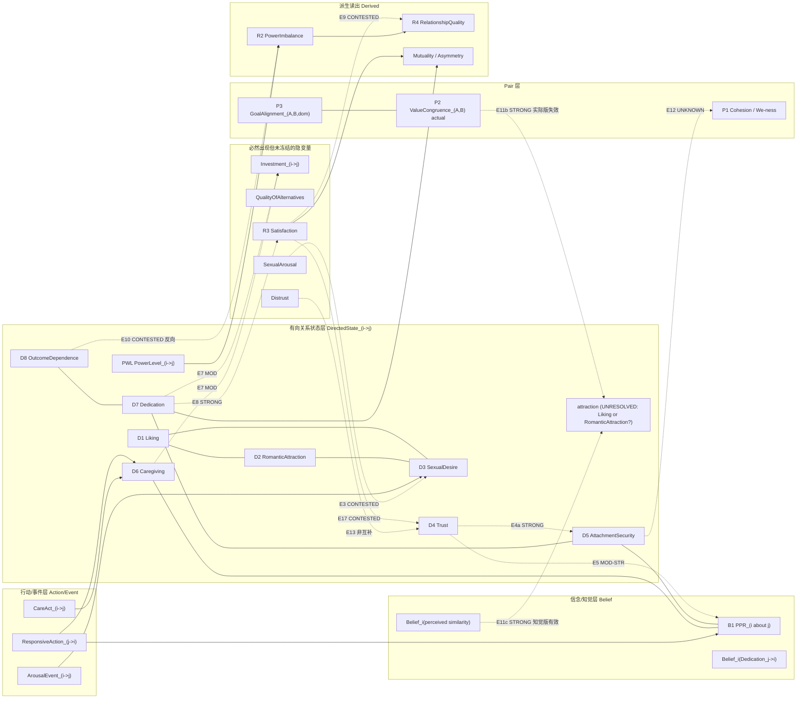

# 02b — Construct Redundancy Audit（语义冗余 / 双重计数红旗审计）

**Status:** `RESEARCH_CANDIDATE` / NOT CANONICAL
**As of:** 2026-09-27
**Lane:** R02（Wave 1）
**Inputs:** `docs/foundation/PARAMETER_CONVERGENCE_V0_1.md`, `docs/foundation/CONSTRUCT_SCOPE_DIRECTIONALITY.md`, `docs/foundation/CURRENT_ARCHITECTURE.md`
**Scope:** 构念之间的语义冗余与双重计数；不改 ontology；不改 canonical。
**Evidence base:** 50 条指针（其中 meta 分析 / 系统综述 / 大样本纵向 8 条），中文文献 5 条（其中可承载任何判定的 0 条）。
**Round-3 repair:** 2026-09-27，lane child `A3a`。依 Architect adjudication V1（X-1 / X-2 / X-3 / X-4 / X-13 / X-14；C-P3 / C-P5 / C-P8；C-W3 / C-W4）与 `review-r2` 修订。**本次修复改变了本文件的判定列地位、`E4a`/`E4b` 的存在性、`R1`–`R11` 的编号空间、E11b 的标签与 3 条构念裁决方向，并登记了本文件自身的 10 条书目缺陷。** 全部改动登记于 §0.1；对**上一 attempt 未提交 diff** 的核验结论见 §0.2；被取代的原文逐条保留并附取代依据。
**引用强度上限**：本文件**没有任何一条论证**达到 `CITATION_VERIFIED_FULLTEXT_2026-09-27`（见 §10.0 / §12.2）。

> 本文件**不**裁决哪些构念该留、该删。它只做一件事：把"看起来可能重复计数"的构念对，逐对放到五个 lens 下称重，并把称重结果标成 `SUPPORTED_REDUNDANCY | CONTESTED | INDEPENDENT | UNKNOWN`。
> 本文件遵守项目自有规则：**低冗余 = 低语义/条件冗余，不等于零统计相关或动态独立。** 反向也成立——**高统计相关不构成语义冗余证据**。

> ### ⚠ Round-3 撤回声明（取代本文件 §0 的原始总括句）
>
> **被取代的原文（逐字保留）**：
> > 本文件中每一条 `SUPPORTED_REDUNDANCY` 都至少有一条**定义层**或**量表层**证据，绝不只靠相关系数。
>
> **该句在重算后不成立**（重算见 §4.1，脚本见 `C:\Users\gg828\AppData\Local\Temp\opencode\lanes\A3a_recompute.py`）。§4 表中 `SUPPORTED_REDUNDANCY` 行**只有 5 条**（`E5` / `E7a` / `E8` / `E11b` / `E15`；`E11b` 已于本轮撤回标签，撤回后为 4 条）：
> - **E11b**（`ValueCongruence`(actual) / attraction）的 `S` 与 `F` 两格**都是 `—`**，其唯一数值证据是单个相关系数 `r = 0.08`；
> - **E15**（`Dedication` / `Belief_i(Dedication)`）的 `S` 与 `F` 两格**都是 `✗`**，其证据是 §7 `H11` 的**同名论证**，无来源；
> - **E8** 的 `S` 格是 `~`（部分）、`I` 格是 `✗反向`，其 `F` 格写 `✓`，但所指证据是 Tran et al. 2019 的**项间相关 meta 合成**——那是 intercorrelational 结果，不是因子重叠 / 判别效度结果，**放在 lens `F` 属错配**（本 lane 的读法，`NOT_OPENED`）。
>
> ⇒ **两种口径，两个分母，都不通过**：
> **口径 A（原文口径：「定义层 `S` **或** 量表层 `F`」）⇒ 5 条中 2 条违反（`E11b` / `E15`）。**
> **口径 B（收紧为「必须有 `S` 证据」）⇒ 5 条中 3 条违反（`E8` / `E11b` / `E15`）。**
> ⇒ 无论用哪个口径，**至少 2 条、最多 3 条 `SUPPORTED_REDUNDANCY` 标签只靠相关 / 项间相关统计支撑**。
> **注意分母是 5 不是 6**：`review-r2` 的「3 of 6」分母不可复现（见 §4.1(4)）。
> **取代依据**：重算记录见 §4.1；`E11b` 标签已撤回（见 §4 表与 §5.4）；`review-r2` `C-W4` / adjudication `X-4`。
> **修订后的措辞**：每一条 `SUPPORTED_REDUNDANCY` 标签目前都只是**作者判断**，不是由本文件 §2 的规则或任何一致规则导出的结论；见 §4.1。

---

## 0.1 Round-3 修复台账（`A3a`，2026-09-27）

本节是本文件的导航表。**每一行的"落地位置"都可 grep 复核。**
`落地` 列取值：`LANDED` = 已写入正文 · `CORRECTED` = 已写入但**改正了上一 attempt 的数值/口径** · `COMPLETED` = 上一 attempt 只登记未落地，本轮补做 · `DELETED` = 上一 attempt 登记的修复项**不成立**，已删。

| # | 修复项 | 落地位置 | 依据 | 落地 |
|---|---|---|---|---|
| RR-1 | §4 判定列整体降级为「**作者判断，非本文件规则所导出**」；`INDEPENDENT` 在重算前**不得**被引为 Gate C 证据 | §4 表头 + §4.1 | `review-r2` `A-C1` + `A` top_rec 3；本 lane 重算 | `LANDED` |
| RR-2 | §4 表新增 `source_refs` 列与重算计数列 | §4 表 | `review-r2` `A-C1` | `CORRECTED`（计数列由 `R`/`P` 两条改为 `R`/`R_bare`/`P` 三条；`E4` 的 `P` 由 `3.0` 改正为 `2.5`，见 §4.1） |
| RR-3 | **撤回 E11b 的 `SUPPORTED_REDUNDANCY` 标签**；保留 §5.4 原措辞 | §4 `E11b` 行 + §5.4 | `review-r2` R-A/C；本文件 §0 总括句 vs §5.4 自相矛盾 | `LANDED` |
| RR-4 | **E5、E17 置于 `HOLD`** | §4 `E5`/`E17` 行 + §4.2 | `review-r2` `A-C1` | `LANDED` |
| RR-5 | `E4a` / `E4b` / `E7` 三个未定义标签的处置 | §2.1、§3.0、§9 | `review-r2` `C-W4` | `CORRECTED`（`E4a`/`E4b` 改判为**撤回**而非"定义为子格"，见 §2.1 与 §9） |
| RR-6 | 三张图降为非规范性插图；表为唯一 SSOT | §3.0、§3.1、§3.2、§3.3 | `review-r2` `A-C1` | `CORRECTED`（登记表由 9 条扩到 11 条，补 `OD --- DE` / `LK --- SD` 两条表外边与 `E5` 标签强度矛盾） |
| RR-7 | E11b / E11c 的 attraction 侧不再画到 `Liking`(`LK`) | §3.1、§3.2、§11 `U11` | `review-r2` C-P2 第 6 条 | `COMPLETED`（`U11` 上一 attempt 只被引用、本轮才在 §11 建行） |
| RR-8 | §6 `R1`–`R11` → **`RES-1`–`RES-11`** + 编号空间隔离声明 | §6 | `PARAMETER_CONVERGENCE_V0_1.md` §9 已用 `R1`–`R5`（Derived/Readout） | `COMPLETED` |
| RR-9 | §5.2 的 `Dedication` 重分类**按原样驳回**，改写为研究问题 | §5.2、§11 `U12` | adjudication `X-1` / `X-3` / `C-P8` | `COMPLETED`（`U12` 本轮建行） |
| RR-10 | ESEM/bifactor 的领域存在性否定 → **检索范围主张**（X-14） | §5.8、§10 第 10 条、§13.1、§13.2 | adjudication `X-14`；`review-r2` R-0.4 | `COMPLETED`（上一 attempt 只改了 §5.8 一处；§10 第 10 条 / §13.1 / §13.2 三处**仍在**做领域存在性否定，本轮改掉） |
| RR-11 | §10 的勾号拆为 `CITATION_VERIFIED_*` 分级 | §10 | `review-r2` `A-C30` | `COMPLETED` |
| RR-12 | 登记本文件自身的书目错误 | §12.1 | 本 lane 重开 Crossref（2026-09-27） | `COMPLETED`（上一 attempt 承诺「10 条」但 §12.1 根本不存在；本轮**独立重开 12 个 DOI**，只写**自己核实过**的 6 条硬错 + 4 条结构缺陷，见 §12.1） |
| RR-13 | `PowerLevel_(i->j)` **不进入候选列表**，标 `HOLD_FOR_EVIDENCE` | §3.3、§5.3、§9、§10、§13.3 | adjudication `C-W3` | `COMPLETED`（上一 attempt 只落地 §5.3；§3.3 节点清单、§9 MGS-C、§13.3「1 条新增候选节点」三处仍把它当候选，本轮改掉） |
| RR-14 | MGS-C 的 `Trust` 降级 / `Dedication` 降级 / `Caregiving` 删除的处置 | §9 | adjudication `C-W4` | `COMPLETED`（上一 attempt 未落地：§9 原文一字未动） |
| RR-15 | §5.1 撤回「不是两个独立 primitive」的结论；**不新增 `Trust` 下的 `FeltSecurity` 槽位** | §5.1 | adjudication `X-4` / `C-P3` | `LANDED` |
| RR-16 | 登记 arousal–genital 相关 `r` 值的**文件间冲突**（`r = .26` vs `r = .25`），**不选赢家** | §6 `RES-2`、§8 `C6`、§12.1 | 本 lane 核对（`02:320` vs 本文件 §6 `RES-2` / §8 `C6`）；两侧来源 `NOT_OPENED` | `COMPLETED` |
| RR-17 | 第一作者 / 作者串误归属修正 | §5.5、§5.6、§6 `RES-3`/`RES-5`、§12 refs 3/6/7/13/32/35 | Crossref opened 2026-09-27 | `CORRECTED`（上一 attempt 只改了 §5.5 / §5.6 的行内署名，**未改 §12 引用表本身**；本轮把 §12 的 6 条错误著录一并改正） |
| RR-18 | ~~撤回「只有 §2.6 能删除 construct、basis 单调增长」的错误前提~~ | — | — | **`DELETED`**（该主张**不在本文件**。它出现在 `00_MANIFEST.md:128` 与 `19_SYNTHESIS_CANDIDATE.md:32/103/185/282`，**属 sibling `A2` 的白名单**，本 lane 不得改。上一 attempt 把它登记成"改本文件 §10 第 16 条"，而**本文件 §10 只有 12 条**。正确处置见 §2.2） |
| RR-19 | §2.2 六判据后果分档（**替代 RR-18 的正确落点**） | §2.2 | `review-r2` R-A2（`ADJ3` Q2 逐条后果分档） | `COMPLETED` |
| RR-20 | §9 MGS-A/B/C 的支持边按 §4 的降级结论同步 | §9 | RR-1 / RR-3 / RR-13 / RR-14 | `COMPLETED` |
| RR-21 | §5.1 证据单向性的显式登记 | §5.1 | X-4（facet 切点待 M2 式证据） | `LANDED` |
| RR-22 | 登记本文件**未打开**的来源清单 | §12.2 | adjudication §D（证据纪律） | `COMPLETED` |

### 0.2 对上一 attempt 未提交 diff 的处置结论

上一 attempt（不同 fresh context）留下 `+312 / −50` 的未提交改动，**本节所列 `RR-1`…`RR-18` 即其自述的落地清单**。本 lane 的独立核验结论：

- **保留 15 条**（`LANDED` / `CORRECTED` / `COMPLETED` 共 16 条 RR 项）。
- **改正 5 处数值/口径**：`E4` 的 `P`（`3.0`→`2.5`）、§4.1(2) 的「不同判定类别数」列（`1/5/8/2/2`→`1/4/3/2/2`）、§4.1(3) 标题（`R = 3`→`R = 4`）、§4.1(4) 的「仅 E11b 违反（1/5）」→`2/5`、文件头「E11b 连量表层也没有」→`E11b 与 E15`。
- **删除 1 条**（`RR-18`，落点不存在且跨白名单）。
- **删除 1 处内部自相矛盾**：§4.1(5) 原称「21 行中 **0 行**在自己的 §5/§6/§7/§8 对应行里印出自己的 `E` 编号」——**机械核对为假**，实际 **7 行**（`E1` / `E4` / `E8` / `E11b` / `E11c` / `E12` / `E16`）在 §5–§8 的散文中出现。真正缺的是**结构化行级交叉引用**（§6 `RES-*` / §7 `H*` / §8 `C*` 三套编号与 `E1..E18` 之间无映射表）。
- **补 2 处悬空引用**：上一 attempt 引用了 `§11 U11` 与 `§11 U12`，而 §11 当时只有 `U1`–`U10`；本轮建行。

---

## 1. 为什么现在做这件事

`PARAMETER_CONVERGENCE_V0_1.md` §2 给出了候选构念的准入判据（semantic independence / counterexample decoupling / conditional incremental information / scope stability / layer test / representation necessity），§15 Gate C 点名了六个要攻击的构念对。本 lane 就是 Gate C 的第一次实质执行。

Gate C 当前的攻击清单：

```text
Liking vs RomanticAttraction
Trust vs AttachmentSecurity
Caregiving vs Dedication
AttachmentSecurity vs Cohesion/We-ness
OutcomeDependence vs structural derivation
PPR vs Trust/Care/Attachment
```

本审计补上了 Gate C 未列、但同属高危的六对，并**改写了两条 Gate C 隐含的预期**（见 §7、§8）。

---

## 2. 方法：五 lens 与判定枚举

每对构念跑五个 lens：

| lens | 缩写 | 问题 | 可用证据形态 |
|---|---|---|---|
| Semantic entailment | `S` | A 在测量文献中是否语义蕴含 B | 构念定义、定义的内容分析 |
| Counterexample decoupling | `D` | 能否稳定构造"A 高 B 低"与"A 低 B 高" | 实验、自然情境、临床/法条情境 |
| Conditional incremental information | `I` | 已知 A（或其余全部候选）后，B 是否仍携带结构/预测信息 | 多元回归、路径模型、纵向 |
| Intervention independence | `V` | 能否在固定 B 的情况下经验性地移动 A | 随机实验、纵向时序、RI-CLPM 跨滞后 |
| Measurement-factor overlap | `F` | 实际因子相关、bifactor/ESEM 结果、判别效度失败 | 心理测量学研究 |

判定枚举（沿用本 lane 的定义）：

```text
SUPPORTED_REDUNDANCY  有正面证据：A 与 B 在某个 facet / 某个层上语义或测量重叠
CONTESTED            文献同时给出分离与重叠的证据，或直接相关证据缺失
INDEPENDENT           至少 3 个 lens 有正面分离证据
UNKNOWN              证据不足或未命中；不作为"没有反例"的证据
```

> ### ⚠ Round-3 附注（`A3a`）：`INDEPENDENT` 的定义在**本文件的符号体系下不可计算**
>
> `INDEPENDENT` 的定义是「至少 3 个 lens 有正面分离证据」。要按这条定义判定，必须先回答「一个 `✓` 是否等于一份分离证据」。本文件**没有**回答，因为 **`F` lens 的极性与其它四个相反**：
>
> | lens | 它问的问题（§2 表原文） | `✓` 的含义 |
> |---|---|---|
> | `S` `D` `I` `V` | A 与 B 是否可分 | **正面分离** |
> | `F` | 实际因子相关、bifactor/ESEM 结果、**判别效度失败** | **重叠 / 判别失败** = **反面** |
>
> ⇒ 表中同一枚 `✓` 在 `D` 列支持独立、在 `F` 列反对独立。**因此「数勾号」不是本文件规则的合法实现。**
> 为使规则至少可计算，本文件在 §4.1 显式给出两条计数规则（`R` = 原始勾号数；`P` = 极性修正数），并证明**两条规则都不能导出 §4 的判定列**。
> **在重算完成前，`INDEPENDENT` 不得被引为 Gate C 证据。**
> 依据：`review-r2` `A-C1` / `A` top_rec 3（"降为未经规则推导的作者判断"）。
>
> **保留的原始定义文字（逐字）**：`INDEPENDENT  至少 3 个 lens 有正面分离证据` —— 该句**未被删除**，但其**可导出性已被本节否定**。

### 2.1 未定义边标签的处置（Round-3，`A3a`）

本文件在 §3 的图与 §9 的三个 MGS 中使用了 **三个在 §4 边表里没有定义的边标签**。机械核对（脚本对全文做 `\bE\d+[abc]?\b` 匹配）：**已定义 21 个**（`E1`–`E18` 含 `E7a` / `E7b` / `E11b` / `E11c`），**被使用但未定义 3 个**：`E4a` / `E4b` / `E7`。

| 标签 | 出现位置 | Round-3 处置 |
|---|---|---|
| `E4a` | §3.1 Mermaid（`TR -.->\|"E4a STRONG"\| AS`）；§3.2 ASCII（`E4a STRONG 局部facet重叠`）；§9 MGS-C「支持边：E4a」 | **撤回（`RETRACTED_UNDEFINED_LABEL`），不得被当作一条边**。§4 只定义 `E4`；`E4` 的 `S` 列写 `✓部分`，那已经承载了「定义层有**部分**语义蕴含」这层意思。**`E4a` 没有任何独立内容**——它不是 `E4` 的子格，而是 `E4` 的 `S` 格被重复贴了一个标签。 |
| `E4b` | §3.2 ASCII（`E4b 残余 INDEP/mod`）；§9 MGS-B「反对边：E4b」 | **撤回（`RETRACTED_UNDEFINED_LABEL`）**。`E4` 的 `strength` 列写 `STRONG`(重叠) / MOD(残余)，那已经是「重叠 + 残余」两半；`E4b` 想指的「残余」在 `E4` 行里不是一个可独立称重的边。 |
| `E7` | §3.1 Mermaid（`DE -.->\|"E7 MOD"\| INV`、`CA -.->\|"E7 MOD"\| INV`）；§3.2 ASCII（`E7 MOD (共享 investment observables)`） | **改指 `E7a`**（`Caregiving` / `Investment`，`strength = MOD`）——图上两条边的右端都是 `Investment`。**`E7b`（`Caregiving` / `Dedication`）在图上没有对应线**；不得用 `E7` 同时指代两者。 |

**为什么必须处理**：`review-r2` `C-W4` 判定，MGS-C 的 `Trust` 降级**唯一的依据就是 `E4a`**。本轮把 `E4a` / `E4b` 判为**撤回**（而不是"定义为子格"）——理由是：把一个从未定义的标签事后"定义"成某行的某个子格，仍然让 MGS-A/B/C 可以引用一个**边表里不存在的边**，而 §4 刚刚才被裁定为唯一 SSOT。**唯一能真正解除阻塞的动作是删除引用。**（§9 MGS-B / MGS-C 已相应删除 `E4a` / `E4b` 引用。）

**保留的原始文字**：§3.1 / §3.2 图内的 `E4a STRONG` / `E4b 残余 INDEP/mod` / `E7 MOD` **逐字保留在图内，仅作历史记录**；其指向的实体以本节为准，图本身为非规范性（§3.0）。

### 2.2 准入判据的后果分档（Round-3，`A3a`）—— 修正一处**不属于本文件**的流行说法

`00_MANIFEST.md` 与 `19_SYNTHESIS_CANDIDATE.md` 断言：「`PARAMETER_CONVERGENCE_V0_1.md` §2.6（**唯一能删除 construct 的准入侧判据**）结构上无法触发 ⇒ 8 项 candidate basis 单调增长」。本 lane 核对了 canonical §2 原文后判定：**该全称量词为假**，且**该主张不在本文件内**（本文件从未做过这条断言），故本文件**不复制它**。准确的后果分档如下（原文行号取自 `PARAMETER_CONVERGENCE_V0_1.md`）：

| 判据 | 原文行 | 后果句 | 后果档位 | 可失败？ |
|---|---|---|---|---|
| §2.1 Semantic independence | `:47` | **无后果句**（纯问句） | 无后果 | **否** |
| §2.2 Counterexample decoupling | `:53` | 「若无法构造或观察解耦反例，**可能属于同一 latent state 的重复命名**」 | **降级 / 合并** | **是**（六条中唯一带真失败条件者） |
| §2.3 Conditional incremental information | `:57` | 无后果句；且「**仍可能**提供额外信息」是可能性陈述 | 无后果 | **否**（可能性陈述不可被否定） |
| §2.4 Scope stability | `:61` | 无后果句（清单封闭，但无合格/不合格定义） | 无后果 | **否** |
| §2.5 Layer test | `:80` | 「如果只是行为、标签、结果或 proxy，**不因常见就升级为 primitive**」 | **不晋升 / 降级** | **是**（但桶无优先级规则） |
| §2.6 Representation necessity | `:84` | 「**若删除该 construct**，是否会存在重要现实句子/状态无法用剩余 schema 合法表示」 | **删除（显式反事实）** | 形式上是；**结构上恒假** |

⇒ **六条里只有一条用了删除框架（§2.6），两条用了降级框架（§2.2 / §2.5），三条连后果句都没有（§2.1 / §2.3 / §2.4）。**
⇒ **六条全部无 procedure / required evidence / output field / threshold / designated executor。** §2 的 `:43`「至少接受以下审计」是唯一的**程序性**句子，而它没指定审计者、没指定产出、没指定失败后果。
依据：`review-r2` R-A2（`ADJ3` Q2 逐条后果分档，读的是 canonical 原文而非任何 lane 的转述）。

**本节不主张**：不主张这六条判据应当被删除（它们**缺可失败形式**；补程序与阈值是修法，删除是另一种未被论证的修法）；不主张 §2.2 / §2.5 的后果句无效；不主张 `8 项 basis` 应增应减。**本节只主张：那两句关于「§2.6 唯一 / basis 单调增长」的表述，其全称量词与 canonical 原文不符。** 修 `00_MANIFEST` / `19` 的**文本**不属本 lane 白名单，已交回 parent（见 packet `conflicts_and_routes`）。

**关键前置说明**：`F` lens 存在一个方法学天花板。任何"我用一次 bifactor ESEM 运行证明了这几个因子彼此独立"的主张都不成立——bifactor ESEM（f 个 S 因子）与 ESEM（f+1 个因子）**拟合等价、统计不可区分**（Morin 2015, `doi:10.1080/10705511.2014.961800`）。

---

## 3. 冗余图

### 3.0 图的规范地位（Round-3 裁定，`A3a`）

> **§4 边表是本文件关于边与判定的唯一 SSOT（single source of truth）。**
> **§3.1 Mermaid、§3.2 ASCII、§3.3 节点清单三者一律为非规范性插图（non-normative illustration）。**
> 图与表冲突时，**以表为准**；图中的边标签、强度、判定、`E` 编号**均不得被单独引用**。
>
> 依据：`review-r2` `A-C1`（"三张图降为非规范性插图"）。
> 本 lane 已逐条核对并登记下列**图 ≠ 表**的实例（编号供 grep）：

| # | 图中位置 | 图的写法 | §4 表的写法 | 处置 |
|---|---|---|---|---|
| D-1 | §3.1 图例 | `---` = "判定为 `INDEPENDENT` 的边" | `E1` = `CONTESTED` | **图例错**。`LK --- RA` 画的是 `E1`（`CONTESTED`） |
| D-2 | §3.1 | `DE --- AS` 用 `---` | `E18` = `CONTESTED` | **图例错**。第二条违反同一图例的 `CONTESTED` 边 |
| D-3 | §3.1 | `OD --- DE` **无任何 `E` 编号** | §4 **没有** `OutcomeDependence` / `Dedication` 这一行 | **图中独有的边**，从表外 |
| D-4 | §3.1 | `LK --- SD` **无任何 `E` 编号** | §4 **没有** `Liking` / `SexualDesire` 这一行 | **图中独有的边**，从表外 |
| D-5 | §3.2 | `SexualDesire ──E3 CONTESTED/mod── SexualArousal` | `E3` `strength` = **`STRONG`** | **强度矛盾**（`mod` vs `STRONG`） |
| D-6 | §3.2 | `[ PPR ]────INDEP/mod─────`（`AS`–`PPR`） | `E6` `strength` = **`MOD–STRONG`** | 强度不一致 |
| D-7 | §3.2 | `E4a STRONG` / `(E4b 残余 INDEP/mod)` | §4 **只定义 `E4`** | **未定义标签**（见 §2.1 RR-5） |
| D-8 | §3.2 / §3.1 | `E7 MOD` | §4 定义的是 `E7a` 与 `E7b` | **第三个未定义标签** `E7`（见 §2.1 RR-5） |
| D-9 | §3.1 / §3.2 | E11b / E11c 的右端画/接到 `Liking`(`LK`) / `[ Liking/attraction ]` | §4 写的是 `attraction` | **节点错误**：`Liking` 与 `Romantic Attraction` 是两个不同 construct（见 §3.1 Round-3 节点修正、§11 `U11`） |
| D-10 | §3.1 Mermaid | `TR -.->\|"E5 MOD-STR"\| PPR` | §4 `E5` `strength` = **`MOD–STRONG`**（`MOD–STRONG` 与 `MOD-STR` 是同一串的两种写法） | **写法不一致**，非矛盾；已由 §3.0 的"以表为准"吸收 |
| D-11 | §3.2 ASCII | `│E5  ╲───MOD-STR───┐` 与 `│E14 分层独立` / `│E7b` 混排 | §4 `E5` 现为 **`HOLD`**（§4.2） | **图仍把 `E5` 画成一条有结论的边**。图已非规范性；`E5` 的 `HOLD` 状态以表为准 |
| D-12 | §3.1 Mermaid `SAT -.->\|"E17 CONTESTED"\| TR` / §3.2 `│E17 CONTESTED` | 图把 `E17` 画成 `Satisfaction × Trust` 一条边 | §4 `E17` = `Satisfaction` / `Trust`·`PPR`（**两个对挤在一行**），且现为 **`HOLD`** | **图与表的边定义不一致**（图只画了 `Trust` 一侧），且未反映 `HOLD` |

### 3.1 Mermaid



> **Round-3 节点修正（`A3a`）**：E11b / E11c 的右端原画为 `LK`（`Liking`）与 `[ Liking/attraction ]`。
> **该画法已撤回**：`Liking`(D1) 与 `Romantic Attraction`(D2) 在 canonical 中是两个不同的 candidate（`PARAMETER_CONVERGENCE` §4 D1 写「可以喜欢但无 romantic attraction」），把二者写成同一个节点等于在图上预判了 E1 的答案。
> 现记为 `attraction (UNRESOLVED)`，**并把「E11b / E11c 的 attraction 侧到底是哪一个」登记为未决项**（§11 `U11`）。
> 依据：`review-r2` C-P2 第 6 条（Gate B 的 `high-attraction/low-trust` **不得**用 `Liking` 顶替 `Romantic Attraction`）。


**图例（Round-3 已废弃其规范性）**：`===>` 无向虚线 = 强重叠边（`SUPPORTED_REDUNDANCY`）；`- -.->` = 争议或条件边；`---` = 判定为 `INDEPENDENT` 的边。标注 `UNKNOWN` 的边在本图**故意画成虚线**，以免读者误读为已判定。

> **Round-3 撤回（`A3a`）**：上面这条图例的 `---` 定义与本图自身冲突（`LK --- RA` = `E1` = `CONTESTED`；`DE --- AS` = `E18` = `CONTESTED`），并且本图含有 §4 完全没有的两条边（`LK --- SD`、`OD --- DE`，均无 `E` 编号）。
> **该图例文字逐字保留在上，仅作历史记录；其规范性已由 §3.0 撤销。** 取代依据：`review-r2` `A-C1`。

### 3.2 ASCII

```
                    [AFFECTIVE BLOCK]
        Liking ──E1 CONTESTED/mod── RomanticAttraction
           │                            │
           └──────E2 INDEP/mod─────────┘
                          │
                     SexualDesire ──E3 CONTESTED/mod── SexualArousal (event?)
                          │
        ┌─────────────────┴──────────────────┐
        │E4a STRONG 局部facet重叠            │E8 STRONG
   [  Trust  ] ═══════════════════ [ AttachmentSecurity ]   ← 共享 felt-security / benevolence 内核
        │  ╲                                ╱ │               (E4b 残余 INDEP/mod)
        │E5  ╲───MOD-STR───┐            ╱   │
        │E17 CONTESTED     v            v    │
        │            [ PPR ]────INDEP/mod─────┤   (S13: 变异→anxiety, 均值→avoidance)
        │                 │  E6              │
        │E14 分层独立     │                  │
        │  (但索引双计)   │                  │
   [ Caregiving ]────────┘                  │
        │E7 MOD (共享 investment observables)
        │                    ┌──────────────┘
        v                    v
   [ Investment ]◄──── [ Dedication ] ──E8── [ Satisfaction ]   ← R²=.54
        (未冻结但必然出现)      │                              │
                               │E18 测量重叠                 │E9 CONTESTED
                                (affective commitment          不同层，非同一
                                 = "psychological attachment")  construct
                                                    v
                                        [ RelationshipQuality ]  (REJECT as primitive 成立)
                                                    v
                                              [ PowerImbalance ]
                                                    ▲
                     [ OutcomeDependence ] ──E10 反向争议──┘  (RPI 未与 dependence 相关)
                                                    ▲
                                            [ PowerLevel_(i->j) ]  ← 70-75% 互动相等;
                                                                          actor/partner 正相关

        [ ValueCongruence_(A,B) actual ] ──E11b STRONG── [ attraction (UNRESOLVED) ]  r=0.08 (既有关系)
                     │
                     │ (B-版本)
                     v
        [ Belief_i(perceived similarity) ] ──E11c STRONG── [ attraction (UNRESOLVED) ]  r=0.32 (既有关系)


        [ Trust ] ══非互补══ [ Distrust ]        (E13: 分离且同时运作，不是 1−Trust)
        [ general attachment ] ⊥ [ partner-specific attachment ]  (E16: bifactor > hierarchical)
```

### 3.3 节点清单

| 节点 | 层 | 来源 |
|---|---|---|
| `Liking_(i->j)` | DirectedState | LHRM D1 |
| `RomanticAttraction_(i->j)` | DirectedState | LHRM D2 |
| `SexualDesire_(i->j)` | DirectedState | LHRM D3 |
| `Trust_(i->j)` | DirectedState | LHRM D4 |
| `AttachmentSecurity_(i->j)` | DirectedState | LHRM D5 |
| `Caregiving_(i->j)` | DirectedState | LHRM D6 |
| `Dedication_(i->j)` | DirectedState | LHRM D7 |
| `OutcomeDependence_(i->j)` | DirectedState | LHRM D8 |
| `PowerLevel_(i->j)` | DirectedState | **`HOLD_FOR_EVIDENCE` —— 不进入候选列表**（Round-3 依 `C-W3`；见 §5.3、§9）。**被取代的原文**：`**本 lane 新增候选**（依据 C2）` |
| `PPR_(i about j)` | Belief | LHRM B1 |
| `Belief_i(Dedication_(j->i))` | Belief | LHRM B2 |
| `Belief_i(perceived value similarity)` | Belief | 本 lane 新增候选（依据 C5）**保留**，但其**对侧节点未决**：`attraction` 侧到底是 `Liking`(D1) 还是 `RomanticAttraction`(D2) 未定 ⇒ §11 `U11`。**注意：与它配对的 `E11b`（actual 版）的 `SUPPORTED_REDUNDANCY` 标签已撤回**（§5.4） |
| `ValueCongruence_(A,B)` | Pair | LHRM P2 |
| `GoalAlignment_(A,B,domain)` | Pair | LHRM P3 |
| `Cohesion / We-ness` | Pair | LHRM P1 |
| `Investment_(i->j)` | 未冻结隐变量 | 投资模型（latent，已在 LHRM §4 D7 提及但未列节点） |
| `QualityOfAlternatives` | Agent/Pair | 投资模型（latent） |
| `Satisfaction` | Derived（暂判） | LHRM R3 |
| `SexualArousal` | Event 或 State（`UNKNOWN`） | 性学文献 |
| `Distrust` | 未冻结 | LHRM D4 open question |
| `PowerImbalance` | Derived | LHRM R2 |
| `RelationshipQuality` | Rejected | LHRM R4 |
| `Mutuality / Asymmetry` | Derived | LHRM R1 |

---

## 4. 边表（逐对，5 lens 全覆盖）

`S` semantic entailment / `D` decoupling / `I` incremental / `V` intervention / `F` factor overlap

> ### ⚠ Round-3 表头裁定（`A3a`）：判定列不是由本文件规则导出的
>
> **`verdict_status` 列的取值 `AUTHOR_JUDGEMENT_NOT_RULE_DERIVED` 对全表 21 行一律成立。**
> §2 声明的 `INDEPENDENT` 规则（「至少 3 个 lens 有正面分离证据」）在重算下**不能**导出本表的判定列：既有不满足该规则的 `INDEPENDENT` 行，也有同样计数却被判为其它值的行（§4.1 给出逐边数字）。
> **因此：在 §4.1 的重算被第三方复现之前，`INDEPENDENT` 不得作为 `PARAMETER_CONVERGENCE` §15 Gate C 的证据引用。**
>
> **保留的原始表头（逐字）**：
> `S` semantic entailment / `D` decoupling / `I` incremental / `V` intervention / `F` factor overlap
> **被取代的隐含前提**：「本表的判定列由 §2 的枚举规则推出」。**该前提不成立**（§4.1）。取代依据：`review-r2` `A-C1` / `A` top_rec 3。
>
> **Round-3 新增列**：
> - `R` = §4.1 计数规则一（`R_tok`：该行**含 `✓` 记号**的格数，含 `✓部分` / `✓失败` / `✓混乱` / `✓污染` 这类复合格）。**`R_bare`** = 计数规则一之严格读法（只数**恰为 `✓`** 的格）。`P` = 计数规则二（极性修正）。**这三个数是本 lane 自己算的**；脚本 `C:\Users\gg828\AppData\Local\Temp\opencode\lanes\A3a_recompute.py`（解析本表 105 格），机器可读结果 `A3a_s4_recomputed.json`。
> - `source_refs` = 该行可在本文件内追到的来源（§12 引用号 / §5–§8 行 / §11 U-id）。`∅` = 本文件内无任何来源锚点。
> - `HOLD` = 整行置于 hold，见 §4.2。
>
> **`E4` 的 `P` 由上一 attempt 的 `3.0` 改正为 `2.5`**：按 §4.1 规则二，`✓部分` 计 `+0.5`，`F` 列的 `✓` 计 `0` ⇒ `0.5 + 1 + 1 + 0 + 0 = 2.5`。上一 attempt 的 `3.0` 与它自己写下的规则不符。

| edge | A vs B | S | D | I | V | F | strength | verdict（原作者） | verdict_status | R | R_bare | P | source_refs |
|---|---|:-:|:-:|:-:|:-:|:-:|---|---|:-:|:-:|:-:|:-:|---|
| **E1** | `Liking` / `RomanticAttraction` | ✗ | ✓ | ? | ? | ~ | MOD | `CONTESTED` | AUTHOR_JUDGEMENT_NOT_RULE_DERIVED | 1 | 1 | 1.0 | §5.7 · refs 35–44 · U1 |
| **E2** | `RomanticAttraction` / `SexualDesire` | ✗ | ✓ | ✓ | ✗ | ✗ | MOD | `INDEPENDENT` | AUTHOR_JUDGEMENT_NOT_RULE_DERIVED · **R<3** | 2 | 2 | 3.0 | ∅（§5/§6/§7/§8 **无对应行**；仅 §9 MGS-A 提及，标 `[S18]`=ref 18） |
| **E3** | `SexualDesire` / `SexualArousal` | ✗ | ✓ | ✓ | ✗ | ✗ | **STRONG** | `CONTESTED` | AUTHOR_JUDGEMENT_NOT_RULE_DERIVED | 2 | 2 | 3.0 | §6 `RES-2` · §7 `H9` · §8 `C6` · refs 20, 21 |
| **E4** | `Trust` / `AttachmentSecurity` | **✓部分** | ✓ | ✓ | ~ | ✓ | **STRONG**(重叠) / MOD(残余) | `CONTESTED` | AUTHOR_JUDGEMENT_NOT_RULE_DERIVED | 4 | 3 | **2.5** | §5.1 · §6 `RES-4` · §7 `H1` · §8 `C1` · refs 8, 9, 11, 12, 34 |
| **E5** | `Trust` / `PPR` | **✓** | ✓ | ✓ | ✗ | **✓失败** | MOD–STRONG | `SUPPORTED_REDUNDANCY` @ measurement | **`HOLD`** · 见 §4.2 | 4 | 3 | 3.0 | **∅（§5/§6/§7/§8 无对应行，全文无来源锚点）** |
| **E6** | `PPR` / `AttachmentSecurity` | ✗ | ✓ | ✓ | **✓** | ✗ | MOD–STRONG | `INDEPENDENT` | AUTHOR_JUDGEMENT_NOT_RULE_DERIVED | 3 | 3 | 4.0 | §5.5 · §6 `RES-3` · §8 `C7` · refs 13, 14 |
| **E7a** | `Caregiving` / `Investment` | **✓** | — | — | — | ✓ | MOD | `SUPPORTED_REDUNDANCY`（潜伏） | AUTHOR_JUDGEMENT_NOT_RULE_DERIVED | 2 | 2 | 1.0 | §7 `H3`（该行**未引任何来源**） |
| **E7b** | `Caregiving` / `Dedication` | ~ | ✓ | ✗ | ✗ | ✗ | WEAK–MOD | `CONTESTED` | AUTHOR_JUDGEMENT_NOT_RULE_DERIVED | 1 | 1 | 2.0 | ∅（§5/§6/§7/§8 **无对应行**；仅 §9 MGS-B 提及） |
| **E8** | `Dedication` / `Satisfaction` | ~ | ✓ | **✗反向** | ✗ | **✓** | **STRONG** | `SUPPORTED_REDUNDANCY`（~54%） | AUTHOR_JUDGEMENT_NOT_RULE_DERIVED · `S` 无证据 · `F` 证据形态错配 | 2 | 2 | 1.0 | §5.2 · §7 `H2` · §8 `C4` · refs 1, 2, 4 |
| **E9** | `Satisfaction` / `RelationshipQuality` | ✗ | ✓ | ✗ | ✗ | **✓混乱** | MOD | `CONTESTED` | AUTHOR_JUDGEMENT_NOT_RULE_DERIVED | 2 | 1 | 1.0 | §6 `RES-11` · §7 `H10` · refs 29, 30, 31, 34 |
| **E10** | `OutcomeDependence` / `PowerImbalance` | ✗ | ✓ | **✗反向** | — | **✓失败** | MOD–STRONG | `CONTESTED`（偏向不可仅派生） | AUTHOR_JUDGEMENT_NOT_RULE_DERIVED | 2 | 1 | 1.0 | §5.3 · §6 `RES-7` · §7 `H6` · §8 `C3` · refs 24, 25, 26, 27 |
| **E11** | `ValueCongruence` / `GoalAlignment` | ✗ | ✓ | ? | — | ? | WEAK | `INDEPENDENT` / F=`UNKNOWN` | AUTHOR_JUDGEMENT_NOT_RULE_DERIVED · **R<3** | 1 | 1 | 1.0 | ∅（§5/§6/§7/§8 **无对应行**） |
| **E11b** | `ValueCongruence`(actual) / attraction | — | ✓ | **✗不支持** | ✗ | — | **STRONG** | ~~`SUPPORTED_REDUNDANCY`（作为驱动量）~~ | **标签已撤回**（`RETRACTED_ROUND3`）→ 见 §5.4 | 1 | 1 | 1.0 | §5.4 · §7 `H5` · §8 `C5` · refs 16, 17 · **节点未决见 `U11`** |
| **E11c** | `perceived similarity` / attraction | — | ✓ | **✓** | ✗ | — | **STRONG** | `INDEPENDENT`（高信息量） | AUTHOR_JUDGEMENT_NOT_RULE_DERIVED · **R<3** | 2 | 2 | 2.0 | §5.4 · §7 `H5` · §8 `C5` · refs 16, 17 · **节点未决见 `U11`** |
| **E12** | `AttachmentSecurity` / `Cohesion` | ? | ? | ? | ? | ? | NONE | `UNKNOWN` | AUTHOR_JUDGEMENT_NOT_RULE_DERIVED | 0 | 0 | 0.0 | §7 `H7` · §11 `U2` · ref 23（仅 `U2` 设计） |
| **E13** | `Trust` / `Distrust` | **✗非互补** | — | — | — | ✓ | MOD | `否证 1−Trust` | AUTHOR_JUDGEMENT_NOT_RULE_DERIVED | 1 | 1 | 0.0 | §6 `RES-9` · §8 `C9` · ref 8；「2025 再验证」= ref 10，**作者元数据 `NOT_OPENED`** |
| **E14** | `Caregiving` / `PPR` | ✗ | ✓ | — | ✓ | ✗ | MOD | `INDEPENDENT`（H4 高危） | AUTHOR_JUDGEMENT_NOT_RULE_DERIVED · **R<3** | 2 | 2 | 3.0 | §5.6 · §7 `H4` · refs 5, 6, 12, 33 |
| **E15** | `Dedication` / `Belief_i(Dedication)` | ✗ | ✓ | **✓** | ✗ | ✗ | MOD–STRONG | `SUPPORTED_REDUNDANCY` @ measurement | AUTHOR_JUDGEMENT_NOT_RULE_DERIVED · `S`/`F` 均无证据 | 2 | 2 | 3.0 | §7 `H11`（该行**未引任何来源**） |
| **E16** | `attachmentTendency_i` / `AttachmentSecurity_(i->j)` | ✗ | ✓ | ✓ | — | **✓** | MOD | `INDEPENDENT` | AUTHOR_JUDGEMENT_NOT_RULE_DERIVED | 3 | 3 | 2.0 | §6 `RES-10` · §8 `C8` · ref 23；**`Klohnen et al. 2005` 不在 §12 引用表内** |
| **E17** | `Satisfaction` / `Trust`·`PPR` | ~ | — | ✓ | ✓ | **✓污染** | MOD | `CONTESTED` | **`HOLD`** · 见 §4.2 | 3 | 2 | 2.0 | **∅（§5/§6/§7/§8 无对应行，全文无来源锚点）** |
| **E18** | `Dedication` / `AttachmentSecurity` | ~ | — | ✓ | — | — | WEAK–MOD | `CONTESTED`（H8） | AUTHOR_JUDGEMENT_NOT_RULE_DERIVED | 1 | 1 | 1.0 | §7 `H8` · ref 4 |

`?` = 该 lens 本 lane 未取得证据（**不**表示"无反例"）；`~` = 部分。**注意 `R` 与 `R_bare` 在 `E4` / `E5` / `E9` / `E10` / `E17` 五行上不同** —— 这五行的 `S` 或 `F` 格是**带文字的复合勾号**（`✓部分` / `✓失败` / `✓混乱` / `✓污染`）。本文件**不裁决**哪一读法是正统；两条都列出（§4.1）。

**行数自检（脚本核对）**：21 行 × 5 lens = **105 格**。`R` / `R_bare` / `P` 三列合计：`R` = **41**，`R_bare` = **36**，`P` = **37.5**。（`R` 与 `R_bare` 相差 5 = §4 表下注列出的 5 个复合格行数。）

---

### 4.1 判定列不可由本文件自述规则导出（Round-3 重算记录，`A3a`）

**重算方法（可复现）**：脚本 `C:\Users\gg828\AppData\Local\Temp\opencode\lanes\A3a_recompute.py` 直接解析上面那张表的 **105 格**（21 行 × 5 lens），逐格分类后按三条规则计数；机器可读输出 `A3a_s4_recomputed.json`。**本节所有数字均由该脚本产出，不从任何上游报告抄录。**

| 规则 | 定义 |
|---|---|
| `R`（= `R_tok`，raw token） | 该行中**含 `✓` 记号**的格数。**含**复合格：`✓部分`（`E4.S`）、`✓失败`（`E5.F` / `E10.F`）、`✓混乱`（`E9.F`）、`✓污染`（`E17.F`）。**不考虑 lens 极性。** |
| `R_bare`（raw bare） | 该行中**恰为 `✓`** 的格数（把上列 5 个复合格排除）。与 `R` 在 `E4` / `E5` / `E9` / `E10` / `E17` 五行上不同。 |
| `P`（polarity-corrected） | `S`/`D`/`I`/`V`：恰为 `✓` 计 **+1**；`✓部分` 计 **+0.5**；`F`：`✗` 族（`✗` / `✗反向` / `✗非互补` / `✗不支持`）计 **+1**（`F` 问的是"因子重叠 / 判别效度失败"，故 `F` 列的 `✗` 才是分离证据），`F` 列任何 `✓` 族计 **0**（正的因子重叠是**反对**独立的证据）；`?` / `—` / `~` / 其它计 **0**。 |

**声明的规则**：`INDEPENDENT` = 至少 3 个 lens 有正面分离证据 ⇒ 阈值 **3**。

**（1）标为 `INDEPENDENT` 的 6 行**

| edge | `R` | `R_bare` | `P` | 按 `R` ≥3？ | 按 `R_bare` ≥3？ | 按 `P` ≥3？ |
|---|:-:|:-:|:-:|:-:|:-:|:-:|
| E2 | 2 | 2 | 3.0 | **否** | **否** | 是 |
| E6 | 3 | 3 | 4.0 | 是 | 是 | 是 |
| E11 | 1 | 1 | 1.0 | **否** | **否** | **否** |
| E11c | 2 | 2 | 2.0 | **否** | **否** | **否** |
| E14 | 2 | 2 | 3.0 | **否** | **否** | 是 |
| E16 | 3 | 3 | 2.0 | 是 | 是 | **否** |

⇒ **按 `R`：6 行中 4 行不满足**（`E2`=2、`E11`=1、`E11c`=2、`E14`=2）。
⇒ **按 `R_bare`（同样 4 行、同样四个值）** —— **失败集合对 `✓` 的两种读法都稳健**。
⇒ **按 `P`：6 行中 3 行不满足**（`E11`=1.0、`E11c`=2.0、`E16`=2.0）。
**三条规则给出的失败集合各不相同，但都不能使该列自洽。**

**（2）同计数不同判定 —— 判定列不是计数的函数**

判定类别按 §2 枚举归一（`否证 1−Trust` 不属四个枚举值之一，单列为 `OTHER_ENUM`）。

| `R` | 行数 | 该计数下的行 | 出现的判定**类别**数 | 类别明细 |
|:-:|:-:|---|:-:|---|
| 0 | 1 | E12 | 1 | `UNKNOWN` |
| 1 | 6 | E1, E7b, E11, E11b, E13, E18 | **4** | `CONTESTED`(E1/E7b/E18) · `INDEPENDENT`(E11) · `SUPPORTED_REDUNDANCY`(E11b) · `OTHER_ENUM`(E13) |
| 2 | 9 | E2, E3, E7a, E8, E9, E10, E11c, E14, E15 | **3** | `INDEPENDENT`(E2/E11c/E14) · `CONTESTED`(E3/E9/E10) · `SUPPORTED_REDUNDANCY`(E7a/E8/E15) |
| 3 | 3 | E6, E16, E17 | **2** | `INDEPENDENT`(E6/E16) · `CONTESTED`(E17) |
| 4 | 2 | E4, E5 | **2** | `CONTESTED`(E4) · `SUPPORTED_REDUNDANCY`(E5) |

**最直接的反例**：`R = 2` 的 **9** 行里同时出现 `INDEPENDENT`（`E2` / `E11c` / `E14`）、`CONTESTED`（`E3` / `E9` / `E10`）与 `SUPPORTED_REDUNDANCY`（`E7a` / `E8` / `E15`）—— 3 个类别挤在同一个计数上。
**反方向同样成立**：`R = 3` 的 `E6` 与 `E16` 判 `INDEPENDENT`，`E17` 判 `CONTESTED`；`R = 4` 的 `E4` 判 `CONTESTED`、`E5` 判 `SUPPORTED_REDUNDANCY`。
按 `P` 分桶同样不单值：`P = 1.0` 的 8 行跨 **3** 类；`P = 3.0` 的 5 行跨 **3** 类（`INDEPENDENT`=E2/E14、`CONTESTED`=E3、`SUPPORTED_REDUNDANCY`=E5/E15）。
⇒ **判定列既不是 `R` 的函数，也不是 `R_bare` / `P` 的函数，也不是 (`R`, `strength`) 的函数。结论：它是作者判断。**

**（3）`R = 4` 的 `E5` 判 `SUPPORTED_REDUNDANCY`**
`E5` 的 `R = 4`、`R_bare = 3`、`P = 3.0`，**三条规则都达到 `INDEPENDENT` 的阈值**，却判 `SUPPORTED_REDUNDANCY`。这是"判定列不来自规则"的单条最强证据。
> 上一 attempt 把本小节标题写成「`R = 3` 的 `E5`」，正文却写「`E5` 的 `R = 4`」——**标题与正文自相矛盾**。按 `R`（含复合格）正确值是 **4**；按 `R_bare` 是 **3**。本轮采用 `R = 4` 并同时列出 `R_bare = 3`。

**（4）本表与 `review-r2` 计数的差异（必须记录，不得掩盖）**
- `review-r2` 称「4 of its 6 `INDEPENDENT` edges do not satisfy it (E2=2, E11=1, E11c=2, E14=2)」——**分子、分母、四个数值逐项复现**（本 lane 用 `R` 与 `R_bare` 两条独立读法都算出同一集合）。
- `review-r2` 称「3 of 6 [SUPPORTED_REDUNDANCY 行违反表头承诺]」——**分子（`E8` / `E11b` / `E15`）在收紧口径下复现，但分母不复现**：§4 表中 `SUPPORTED_REDUNDANCY` 行**只有 5 条**（`E5` / `E7a` / `E8` / `E11b` / `E15`），不是 6 条。
  - 口径 A（原文口径：`S` **或** `F` 任一为正面）⇒ 违反者 **`E11b`（`S`=—、`F`=—）与 `E15`（`S`=✗、`F`=✗）**，**2 / 5**。
  - 口径 B（收紧为「必须有 `S` 证据」）⇒ 加上 `E8`（`S`=~），**3 / 5**。
  - ⇒ **上一 attempt 在 §4.1(4) 写的「口径 A ⇒ 仅 `E11b` 违反（1/5）」是错的**：`E15` 的 `S` 与 `F` 两格**都是 `✗`**，在口径 A 下同样不满足。正确值是 **2/5**。
  - **无论用哪个分母、哪个口径，结论不变**：至少 2 条、最多 3 条 `SUPPORTED_REDUNDANCY` 标签只靠相关 / 项间相关统计支撑。

**（5）`E` 编号 ↔ §5/§6/§7/§8 行号的交叉引用**
机械核对（脚本对 §5–§8 全文做 `\bE\d+[abc]?\b` 匹配）：

| 事实 | 值 |
|---|---|
| §6 残余清单用的编号 | `RES-1`…`RES-11`（本轮由 `R1`…`R11` 改名，见 §6） |
| §7 用的编号 | `H1`…`H11` |
| §8 用的编号 | `C1`…`C10` |
| 三套编号与 `E1..E18` 之间是否存在映射表 | **不存在**（原文即无） |
| §6 / §7 / §8 的**结构化表格行**里印有本行 `E` 编号的条数 | **0** |
| §5–§8 **散文**里出现本行 `E` 编号的边数 | **7**（`E1` §5.7 · `E4` §5.8 · `E8` §5.8 · `E11b`+`E11c` §5.4（Round-3 裁定块内）· `E12` §5.8 · `E16` §5.8） |

> 上一 attempt 在本小节写「**21 行中，0 行**在自己的 §5/§6/§7/§8 对应行里印出自己的 `E` 编号」——**该机械断言为假**，实际 7 行的编号出现在 §5–§8 散文中。准确的说法是上表最后两行：**行级映射表不存在**，**但散文级引用存在且覆盖 7 条边**。
> 本轮 `source_refs` 列给出的是**本 lane 逐条人工重建**的行↔行映射（可 audit，但**不是文件原有内容**，也**未经第三方复核**）。

### 4.2 `HOLD` 行：E5 与 E17

| edge | 为什么 `HOLD` | 解除条件 |
|---|---|---|
| **E5** `Trust` / `PPR` | (a) 在 §5 / §6 / §7 / §8 中**没有任何一行**讨论这一对；(b) `S = ✓` 与 `F = ✓失败` 两格**在本文件内找不到任何来源**；(c) 它是 MGS-C 的支持边之一（§9），因此该缺陷会向下游传播 | 为 `S` 格与 `F` 格各补一条可核来源；否则该行不得被引为 `SUPPORTED_REDUNDANCY` |
| **E17** `Satisfaction` / `Trust`·`PPR` | (a) 在 §5 / §6 / §7 / §8 中**没有任何一行**讨论这一对；(b) 只出现在 Mermaid（`SAT -.->\|"E17 CONTESTED"\| TR`）与 ASCII（`│E17 CONTESTED`）两处，**两处都不是 §4 表**；(c) 全文无来源锚点 | 定义它的两个对（`Satisfaction`×`Trust`、`Satisfaction`×`PPR` 分别成边）并各补来源；或删除该行 |

**处置**：两行的原判定文字**逐字保留在上表**，但**不得**被引为 Gate C 证据、不得计入 §5.8 的"判定分布"、不得作为 §9 MGS 的支持边。
依据：`review-r2` `A-C1`（"加 `source_refs` 列；…E5/E17 置于 hold"）。


---

## 5. 六条最重要的发现

### 5.1 `Trust` 与 `AttachmentSecurity`：定义层确有嵌入，但**「不是两个独立 primitive」的结论已撤回**

> #### Round-3 裁定（`A3a`，依 adjudication `X-4` / `C-P3`）
>
> **被取代的原文（逐字保留）**：
> > ### 5.1 `Trust` 与 `AttachmentSecurity`：不是两个独立 primitive，是一个共享内核加两个非零残余
>
> **被取代的建议（逐字保留）**：
> > **建议的处理方式（`RESEARCH_CANDIDATE`）**：不要把这两项当两个干净的独立 coordinate。至少承认 `Trust` 内含一个 `FeltSecurity` facet，而该 facet 与 `AttachmentSecurity` 语义重叠；其余 facet（预期不被剥削、守约、可预测、能力）**不被现有证据覆盖**，不能一起砍。**具体砍到哪一刀，本 lane 无法解决 → U4。**
>
> **取代依据（三条，逐条）**：
> 1. **`Trust` 与 `AttachmentSecurity` 保留为两个分开的 candidate**（adjudication `X-4`：`DECIDED`）。本 lane 的定义层嵌入证据是**真实的**（下列 McKnight & Chervany / Rempel 引文不变），但它**不足以支撑"合并为一条"或"降为 facet"**——`X-4` 明确把 facet 切点记为待 M2 式证据。
> 2. **不得在 `Trust` 之下新增 `FeltSecurity` 槽位**（`X-4` + `C-P3`：`Reject adding FeltSecurity under Trust because D5 already owns that wording`）。canonical `PARAMETER_CONVERGENCE_V0_1.md` §4 `D5. Attachment Security / Felt Security` **已经**使用 `Felt Security` 这一措辞；再在 `Trust` 下加一个同名槽位会**加剧**正在审议的歧义，而不是解决它。
> 3. **原稿的证据只覆盖单边。** 下列证据全部是「trust 的**定义**里含 security 类内容」（定义层、单向蕴含）。判定"两者不是两个独立 primitive"需要的是**双向**的语义/测量分离失败证据，本文件未取得。
>
> **修订后的建议（`RESEARCH_CANDIDATE`）**：`Trust` 与 `AttachmentSecurity` **各自保留为 candidate**；`Trust` 侧的更窄语义标签改用**非安全类措辞**（例如「**非剥削预期 / non-exploitation expectation**」「守约预期」「可预测性预期」「能力预期」），**不使用 `FeltSecurity` 一词**；该收窄能否保住预测效度，登记为 §11 `U4`，**待 M2 式证据**（在已知 `AttachmentSecurity` 与 `PPR` 之上，对违反应事件的增量效度）。
>
> **未撤回的部分（逐字保留，继续有效）**：下列定义层证据、对立侧实测证据、以及"具体砍到哪一刀本 lane 无法解决"的诚实声明。


对 LHRM 最不利的证据是**定义层**的，不是统计层的：

- 对 65 篇含 trust 定义的文献做内容分析，trust 的四个高层 referent 类目是 **benevolence / integrity / competence / predictability**，并且明确"**goodwill, responsiveness, and caring fell into the benevolence category**"（McKnight & Chervany 2001, `doi:10.1007/3-540-45547-7_3`）。
- 同一分析指出：多数 trust 定义含"feelings of security about, or confidence in, the trusted party"，并指向 Rempel, Holmes & Zanna (1985: 97) 的"**emotional security**"。
- Rempel 等自己的 trust 三维度中，`faith` 定义为"无证据支撑的信念，使人能 leap of faith"；且"**love and happiness were closely tied to feelings of faith**"（1985, JPSP 49(1):95–112）。

也就是说：**AttachmentSecurity 想要的"感到安全 / 预期对方会响应"这一片内容，本来就在 trust 的定义里面。**

对 LHRM 有利的证据同样是硬的：

- 110 对情侣日记研究里，attachment anxiety 与 trust **仅中等相关**：女性 `r=−.23`，男性 `r=−.31`。原文主动处理了这个冗余质疑并写明"**trust is only one component of attachment**"（Campbell et al. 2022, PMC8895702）。
- 一年内纵向研究显示：trust 与 perceived goal validation 对 attachment **anxiety** 与 **avoidance** 的唯一关联**方向在一年后反转**——短期 trust 独特地对应更低 anxiety、goal validation 独特地对应更低 avoidance；  一年后 trust 独特地预测 avoidance 下降、goal validation 独特地预测 anxiety 下降（`doi:10.1177/1948550613509287` 的摘要 = §12 ref 34，**Arriaga, Kumashiro, Finkel, VanderDrift & Luchies (2013), *SPPS* 5(4):398–406**，`CITED_SECONDARY`；`CITATION_VERIFIED_METADATA_2026-09-27`：本 lane 重开 Crossref 记录核对题录，**未打开正文**）。

- 472 人 / 236 情侣样本中，PPR 控制另一源不安全感后仍独特预测更低的 partner-specific anxiety（`b=−.38, p=.04`）与 avoidance（`b=−.32, p=.04`）；且 general anxiety → partner-specific anxiety `b=.26, p<.001`、general avoidance → partner-specific avoidance `b=.19, p<.001`（Selcuk et al. 2020, IJERPH 17(19):7178）。

**建议的处理方式（`RESEARCH_CANDIDATE`）**：不要把这两项当两个干净的独立 coordinate。至少承认 `Trust` 内含一个 `FeltSecurity` facet，而该 facet 与 `AttachmentSecurity` 语义重叠；其余 facet（预期不被剥削、守约、可预测、能力）**不被现有证据覆盖**，不能一起砍。**具体砍到哪一刀，本 lane 无法解决 → U4。**

### 5.2 `Dedication` 可能比 `Satisfaction` 更接近 derived —— **本节的重分类按原样驳回，改为研究问题**

> #### Round-3 裁定（`A3a`，依 adjudication `X-1` / `X-3` / `C-P8`）
>
> **被取代的原文（逐字保留）**：
> > **这对 LHRM 的含义**：… 若按"哪个更可派生"排序，LHRM 当前的分类很可能反了。
> > **建议的处理方式（`RESEARCH_CANDIDATE`）**：把 `Dedication` 的地位标为 `CONTESTED_PRIMITIVE`，并要求任何"dedication 有独立波动"的辩护，必须在**控制了 satisfaction + investment + alternatives 之后**提出。本 lane 不建议直接删除。
>
> **驳回理由（三条，均可在本文件内复核）**：
> 1. **唯一的承重支柱是一份项间相关（intercorrelational）meta 合成，其数字本 lane 未打开。** 本节全部数字（`.65` / `.53` / `−.43` / `.42` / `−.34` / `−.26` / `R² = .54` / `β² = .47` / `.32` / `−.19`）来自 Tran, Judge & Kashima 2019（§12 ref 1）。本 lane **只重开了它的 Crossref 题录**（`CITATION_VERIFIED_METADATA_2026-09-27`：`Personal Relationships` 26(1):158–180，作者与年份正确），**未打开正文或表格** ⇒ 全部效应量标 `NOT_OPENED`，**不得**承载 `VERIFIED` 强度的裁决。
> 2. **本节自己声明另一侧的残余是未知的。** 紧接的代码块写：`Satisfaction 的未解释方差：未知（它是投资模型的**自变量**，不是因变量）`。用「dedication 有 46% 残余」与「satisfaction 残余未知」做**同一把尺子上的排序**，在数学上不成立：分母不同、方向不同。
> 3. **这份 meta 自己确认存在显著 moderator。** 本节末段已写：`investment→commitment` 在**男同关系中弱于异性关系**、非婚弱于婚姻、关系时长与年龄增加时变弱 ⇒ `R² = .54` **不是常数**。既然如此，「46% 残余」就不是一个可用于层级裁决的标量，而是**条件于人群与关系形态的量**。这恰好是 `PARAMETER_CONVERGENCE` §2.4 scope stability 判据要考的东西，本节用它做层级裁决属于**层级错置**。
>
> **改写后的处置（`RESEARCH_CANDIDATE`，非裁决）**：
> - `Dedication` **保留为 directed-state candidate**（adjudication `X-1`：`Satisfaction` 留在 Derived / evaluation candidate；`X-1` 的对称面即 `Dedication` 不因本节的观察而改变层位）。
> - **本节的重分类转为一条研究问题**（登记为 §11 `U12`）：*在给定人群与关系形态的条件下，控制 `satisfaction` + `investment` + `alternatives` 之后，`Dedication` 是否仍携带稳定的独立动态信息？* 该问题**必须先测**这三个 moderator（性取向、婚姻状态、时长/年龄），再在每个分层内估计残余。
> - **conditional consequence pre-registration**（`C-P8`，只登记后果，不预设结论）：**若 `Satisfaction` 日后满足其自身的提升判据（`PARAMETER_CONVERGENCE` §9 `R3`：「已知底层状态后 satisfaction 仍携带稳定独立动态信息」），则 §4 `D7` 的 basis 地位与 §11 的 8 项 basis 必须重新审议。** 本文件**不**主张该判据成立，**不**主张 `D7` 现在有错，**不**主张二者当前存在逻辑矛盾。
>
> **未撤回的部分（逐字保留，继续有效）**：Tran et al. 2019 的数字表、Arriaga & Agnew (2001) 的反制证据、以及 moderator 不稳定这一观察本身。


202 个独立样本、50,427 人、1980–2016 年的投资模型更新 meta 分析（Tran, Judge & Kashima 2019, `doi:10.1111/pere.12268`）：

| 关系 | 聚合 r |
|---|---|
| satisfaction – commitment | **.65** |
| investment – commitment | .53 |
| quality of alternatives – commitment | −.43 |
| satisfaction – investment | .42 |
| satisfaction – alternatives | −.34 |
| investment – alternatives | −.26 |

三者联合解释 commitment 方差 `R² = .54 (95% CI [.53,.55])`；单项最强为 satisfaction（`β² = .47`），其次 investment（`.32`），再次 alternatives（`−.19`）。这与 Le & Agnew (2003) 及 Rusbult 等 (1998) 的因子间相关（`.21–.55`）一致。

**这对 LHRM 的含义**：LHRM §9 R3 把 `Satisfaction` 判为 `DERIVED / evaluation-state candidate`，理由是"可能是多个底层状态的 readout"；同时 §4 D7 把 `Dedication` 判为 `KEEP_CANDIDATE`，理由是"如果 commitment=derived，则建模失去其独立波动"。但按经验残余量排序：

```text
Satisfaction 的未解释方差：未知（它是投资模型的**自变量**，不是因变量）
Dedication  的未解释方差：约 46%
```

也就是说，**dedication 是被三个 LHRM 或有或无的构念线性解释了 54% 的那个量**。若按"哪个更可派生"排序，LHRM 当前的分类很可能反了。

**反制证据（必须同时记下）**：Arriaga & Agnew (2001) 把 commitment 拆成 affective（**psychological attachment**）、cognitive（long-term orientation）、conative（intention to persist）三成分，两个纵向研究中三成分**各自**预测 couple functioning 与 breakup。→ commitment 确实携残余；不能删。

**并且**投资模型自己的 moderator 也不稳定：investment→commitment 在**男同关系中弱于异性关系**、非婚弱于婚姻、关系时长与年龄增加时变弱。→ `R² = .54` 不是常数，LHRM 的 scope-stability 检验（§2.4）在这个对上直接吃紧。

**建议的处理方式（`RESEARCH_CANDIDATE`）**：把 `Dedication` 的地位标为 `CONTESTED_PRIMITIVE`，并要求任何"dedication 有独立波动"的辩护，必须在**控制了 satisfaction + investment + alternatives 之后**提出。本 lane 不建议直接删除。

### 5.3 `PowerImbalance = f(dependence asymmetry)` 受到正面反对——但风险方向是**漏计**不是双计

> #### Round-3 裁定（`A3a`，依 adjudication `C-W3` / `X-13`）：`PowerLevel_(i->j)` **不进入候选列表**，标 `HOLD_FOR_EVIDENCE`
>
> **被取代的原文（逐字保留）**：
> > **建议的处理方式（`RESEARCH_CANDIDATE`）**：在 `PowerLevel_(i->j)` 成为候选之前，LHRM §9 R2 的派生式**至少要加一条非依赖通道**…
>
> **驳回理由**：
> 1. **语义方向与 canonical 相反。** `PARAMETER_CONVERGENCE_V0_1.md` §9 `R2` 逐字写「**不先设一个独立"权力值"**」。把 `PowerLevel_(i->j)` 作为候选节点进入列表，等于把该条的**反面**写进候选表。`C-W3` 因此判 `HOLD_FOR_EVIDENCE`，并写明「**它不进入 canonical 候选表**」。
> 2. **三条量化断言在摘要层不可核实。** 本节的 `70–75%`、`actor/partner 正相关`、以及加引号的 `regardless of whether they identify interactions as involving equal or unequal power` 全部挂在 §12 ref 24（Overall & Hammond）。本 lane **只重开了该条的 Crossref 题录**（`CITATION_VERIFIED_METADATA_2026-09-27`：`Annual Review of Psychology` **77(1):393–421**，2026，作者与题名正确），**未打开正文** ⇒ 三条断言一律标 `NOT_OPENED`，**不得**按现状引用。
> 3. **最具决策性的那个数据点在本 lane 不可核实。** 「RPI 与 mutuality of dependence 不相关」依赖 §12 ref 27，而 ref 27 是一个 `abcdocz.com` 落地页（无作者、无期刊、无卷页、无 DOI）。`C-W3` 判 `UNVERIFIABLE_HERE`。
> 4. **本节第二段（k=319 系统检视）在本文件内没有任何来源。** 「2022 年前 k=319 个 power 测量的系统检视」及其逐字引文 `We discourage the use of proxy measures previously validated to measure constructs distinct from power dynamics…` **没有 `E` 编号、没有 §12 引用号、没有具名作者**。该引文是本节最强的一条方法学证据，却**完全不可追溯** ⇒ 标 `SOURCE_MISSING_IN_FILE`，在补上来源前不得作为 `HOLD` 之外的任何结论的依据。
>
> **修订后的处置**：
> - `PowerLevel_(i->j)`：`HOLD_FOR_EVIDENCE`。**不进入 candidate 列表**，不进入 §3.3 节点清单的「本 lane 新增候选」栏，不进入 §9 MGS-C 的 derived / readout 栏。
> - §9 `R2` 的派生式：依 `X-13` 保留为「**对称 total-dependence 派生 + 相对 power / 不对称派生读出**」，本节关于「仅由 dependence 派生证据薄弱」的观察**降为 `PLASIBLE`**（`C-P4` 拆 R2-a / R2-b：R2-a 可越过 proposal，R2-b 留 `HOLD_FOR_EVIDENCE`）。**本 lane 不动 canonical。**
> - **本节第一段与第三段的定性观察（power 测量与 dependence 不相关、系统综述劝阻 proxy、per-person power level ≠ dyadic asymmetry）不因本裁定而失效**，但其数值强度全部降为 `NOT_OPENED`。


这是本审计唯一一条"直觉以为会双计、实际风险是漏计"的边。

- **直接 power 测量不与 dependence 相关。** Relationship Power Inventory（依 DPSIM 建构）在 Study 2 中与 Influence Meter 正相关，但**与 mutuality of dependence 不相关**；Study 3 中 mutuality of dependence 与 domains power `r=−.17 (p=.02)`、overall power `r=−.15 (p=.03)`。作者原话："**the connection between being the less dependent partner in a relationship and being more powerful has been documented in only one study to date**"（Sprecher & Felmlee 1997）。**Round-3（`A3a`）**：该条的全部数字标 **`NOT_OPENED`** —— 本 lane 打开的只有 §12 ref 27 的一个 `abcdocz.com` 落地页，**没有** DOI、期刊、卷页或完整作者串；原文未开。依 `C-W3`，本条判 `UNVERIFIABLE_HERE`。
- **power 测量系统综述直接劝阻 proxy 做法。** 2022 年前 k=319 个 power 测量的系统检视，结论原话："**We discourage the use of proxy measures previously validated to measure constructs distinct from power dynamics in order to avoid conflating distinct constructs for power research.**" 并且该综述明确指出既有研究在"dependence 是 power 的 base 还是 outcome"上**循环定义**——Thibaut & Kelley (1959) 把低 dependence 当作 power base，另一些研究又把关系质量当 power outcome。**Round-3（`A3a`）**：本段**没有任何来源**——无 `E` 编号、无 §12 引用号、无具名作者。标 **`SOURCE_MISSING_IN_FILE`**，在补上来源前不得作为任何结论的依据。（本 lane **未**打开任何 k=319 的综述；§12 ref 26 的 `10.1111/jftr.70019` 按 Crossref 解析为 Junkins, Derringer, Ogolsky, Hardesty & Weisberg (2025), *Journal of Family Theory & Review* 18(1):170–191，**该条是否为 k=319 综述未核实**。）
- **per-person power level ≠ dyadic power asymmetry。** 约 **70–75% 的日常互动涉及相对平等的权力**；**actor 与 partner 的知觉权力倾向正相关**而非零和反相关；且"people's perceived relationship power **independently** varies … **regardless of whether they identify interactions as involving equal or unequal power**"（Overall & Hammond 2026, Annual Review of Psychology, `doi:10.1146/annurev-psych-012325-032022`）。**Round-3（`A3a`）**：Crossref 题录已核（**77(1):393–421**，2026，作者与题名正确；`CITATION_VERIFIED_METADATA_2026-09-27`），但 `70–75%` 与 `actor/partner 正相关` **在摘要层不可核实**，正文未开 ⇒ 三条量化断言一律 **`NOT_OPENED`**。
- **power ≠ status ≠ authority ≠ dominance。** Keltner, Gruenfeld & Anderson (2003, Psychological Review 110(4):451–473) 明确区分：可以有 power 而无 status（腐败政客），也可以有 status 而无相对 power（ DMV 里的宗教领袖）。

**建议的处理方式（`RESEARCH_CANDIDATE`）**：在 `PowerLevel_(i->j)` 成为候选之前，LHRM §9 R2 的派生式**至少要加一条非依赖通道**（资源、专业、性别角色、机构授权）。同时：LHRM 不应把 `OutcomeDependence` 的不对称**同时**当状态与当唯一 power 基础——那才是真正的双计。

### 5.4 实际的 value similarity 在既有关系中几乎不预测结果，知觉到的才预测

Montoya, Horton & Kirchner (2008, JSPR 25(6):889–922, `doi:10.1177/0265407508096700`)，313 项研究、460 个效应量：

| 版本 | 总体 | 无互动 | 短互动 | 既有关系 |
|---|---|---|---|---|
| **actual** similarity ↔ attraction | `r = .47 (95% CI .44–.50)` | `r = .54` | `r = .21` | **`r = 0.08`（不显著，<1% 方差）** |
| **perceived** similarity ↔ attraction | `r = .39 (95% CI .35–.42)` | — | `r = .34` | **`r = .32 (95% CI .26–.37)`** |

作者结论原话："the influence of **actual** attitude or personality trait similarity on interpersonal attraction **cannot be detected [in existing relationships]**, whereas the influence of **perceived** similarity is strong"；并直接反驳了 Berscheid & Walster (1978) 的 "a resounding yes"。

配套的稳健性研究（Montoya, Horton & Kirchner 2007, JPSP 93(6)）更狠：实验室 `r = .536`，**田野 `r = .150`**，且**校正发表偏倚后田野效应不再显著**；实验室里 attitude similarity 产生更多 attraction（`r = .563`），**田野里模式反转**（personality trait similarity `r = .212` > attitudes `r = .105`）。

**对 LHRM 的含义**：`ValueCongruence_(A,B)` 按 LHRM §6 P2 是一个 **pair fact**（两个人价值状态之间的特定比较），不是 belief。正是这个"实际"版本在既有关系中被实证打空。几乎所有关于"相似 → 吸引 → 关系维持"的 folk theory 说的是**感知**，不是**事实**。

**注意本条的边界**：`r = 0.08` **不**证明 `ValueCongruence` 语义冗余。它证明的是 §2.3 lens 意义上的**条件预测效度不足**。一个真实但行为上惰性的 pair fact，仍可能是 representation-necessary（"他们的价值观确实差得很远"这句话是关于 pair 的事实，不是关于谁的信念）。**结论是"这是一个可能惰性的 coordinate"，不是"这是一个冗余的 coordinate"。**

> #### Round-3 裁定（`A3a`）：§4 表 `E11b` 行的 `SUPPORTED_REDUNDANCY` 标签**撤回**；**本节的措辞为准**
>
> **被取代的原文（§4 表 `E11b` 行，逐字保留在该行内）**：
> | `E11b` | `ValueCongruence`(actual) / attraction | — | ✓ | **✗不支持** | ✗ | — | **STRONG** | `SUPPORTED_REDUNDANCY`（作为驱动量） |
>
> **撤回理由**：
> 1. **本文件内部直接自相矛盾。** §4 表把 `E11b` 标为 `SUPPORTED_REDUNDANCY`；本节末段逐字说 `r = 0.08` **不**证明 `ValueCongruence` 语义冗余。**同一份文件对同一条边给出两个相反的结论。**
> 2. **该行没有任何定义层或量表层证据。** `S = —`、`F = —`。其唯一数值证据是**单个相关系数 `r = 0.08`**，而本文件 §0 的总括句（本轮已撤回，见文件头）曾承诺「绝不只靠相关系数」。
> 3. **`I` 格标的是 `✗不支持`。** 也就是说，该行在「条件增量信息」这个 lens 上给出的恰恰是**否定**标记。把它读成 `SUPPORTED_REDUNDANCY` 需要额外论证，而该论证不在文件内。
> 4. **方向也读反了。** `r = 0.08` 是「actual similarity 在既有关系中**不**预测 attraction」。把它记为「actual 版作为驱动量**成立**」，等于把一个负结果当成正面支持。表内 strength 写 `STRONG` 指的是**负结果的强度**，不是冗余的强度。
>
> **处置**：`E11b` 的 `verdict_status` 改为 **`RETRACTED_ROUND3`**，不计入 `SUPPORTED_REDUNDANCY` 计数，不得作为 §9 MGS-B 的支持边。**本节 §5.4 的措辞（`r = 0.08` = 条件预测效度不足，不是语义冗余）继续有效，且是这条边的唯一现行表述。**
> 依据：`review-r2` R-A / R-C（E11b 被同一文件 §5.4 明确否证）。
>
> **并存的一条正面观察（不撤回）**：`perceived similarity` 一侧（`E11c`）的 `r = .32` 与本节结论同向——**folk theory 说的是感知，不是事实**。但 `E11c` 的 `INDEPENDENT` 标签同样落在被降级的判定列上（§4.1：其 `R = 2`），**不得**被引为 Gate C 证据。


**高危点**（H5）：若 Case Bank 把叙述里的"他们三观一致"（这在中文语境里通常是一种**判断/信念**）映射为 `ValueCongruence_(A,B)`，同时用知觉相似度的研究当证据，就是**把信念当事实计入**。

### 5.5 最接近"干预解耦"的证据：responsiveness 的变异 vs 均值

同一个构念的两个统计量，**方向相反地**移动两个不同的 attachment 坐标：

> **responsiveness 变异性 → partner-specific attachment anxiety 上升；平均 responsiveness → partner-specific attachment avoidance 下降。** 两者在约半年后仍预测 attachment。（**Gunaydin, Selcuk, Urganci & Yalcintas (2020)**, *Social Psychological and Personality Science* 12(5):839–849, `doi:10.1177/1948550620944111`；N=151，6 个 session，3 周每日 PPR。**Round-3（`A3a`）作者更正**：本节原写「Selcuk & Urganci 2020」，**第一作者误归属** —— Crossref 记录的第一作者是 **Gunaydin**（`CITATION_VERIFIED_METADATA_2026-09-27`，题录核对，**原文未开**）。）

这是本审计中唯一一条能同时满足 lens `V` 与 lens `D` 的证据。含义：**任何单标量 responsiveness coordinate 都必然丢掉一半信息。** 同类证据还有 Perron et al. 的 PPI 发展：EFA 把 satisfaction 条目与 responsiveness 条目析为不同因子，但 PRI-Responsiveness 仍"continues to show strong links to global evaluations"，且 responsiveness 在 8 周 RI-CLPM 中**比 satisfaction 更动态**（后者"demonstrates excessive stability over brief [periods]"）。**Round-3（`A3a`）**：**`Perron et al.` 不在本文件 §12 引用表内**（悬空引用，标 `DANGLING_CITATION`）；该条按 `NOT_OPENED` 处理。§12 ref 14 是 **Weber et al. (2021) 的 PRI-S（Perceived Responsiveness and Insensitivity Scale）**，与本句所说的 **PPI / PRI-Responsiveness** 不是同一份文件，**不得互相顶替**。


### 5.6 `Caregiving` 与 `PPR` 不冗余——但存在**索引双计**陷阱

三条支持"分层独立"的证据：

1. PPR 的内容是 understanding / validation / **caring**（Reis, Clark & Holmes 2004）。注意 `caring` 与 `Caregiving` 同名但**层不同**：`PPR` 是"我感到被理解/被重视"，`Caregiving` 是"我照护的倾向"。字面重叠，索引不同。
2. partner **自报**的 responsiveness 对"一般不安全"者**不**产生同等收益，只有**被感知的** responsiveness 才产生（Selcuk et al. 2020）。→ 行为通道与信念通道不可互换。
3. Arriaga 等 2006 证明 **perceived** partner commitment 的**波动**独立预测分手；**Coy, Davis, Green & Etcheverry (2019)**（*Journal of Social and Personal Relationships* 36(11–12):3471–3491, `doi:10.1177/0265407518822783`）证明 **partner-reported** investment 独立于 **perceived** investment 预测 commitment。→ 报告与知觉是两条独立的信息通道。**Round-3（`A3a`）作者更正**：本条原写「Le & Agnew 2006」，**作者、年份、期刊三项均错** —— `10.1177/0265407518822783` 按 Crossref 解析为 **Coy, A. E., Davis, J. L., Green, J. D., & Etcheverry, P. E. (2019), JSPR 36(11–12):3471–3491**（`CITATION_VERIFIED_METADATA_2026-09-27`；其摘要逐字含 `Study 3 revealed that partner-reported investments predicted commitment independent of perceived partner investments.`，故**本条的发现归属正确、只是作者串错**）。同一错误也出现在 §6 `RES-5`，已一并更正。


**但**：`ResponsiveAction_(j->i)` 这**一个事件**同时被写入 `Caregiving_(j->i)`（发送者状态通道）与 `PPR_(i about j)`（接收者信念通道），而两者共用**同一份证据**。这不是构念冗余，是**索引双计**。见 H4。

### 5.7 E1 补检索结果（narrow repair pass，2026-09-27 第二次尝试）

> **本节为 repair pass 新增。§5.1–§5.6 与 §1–§4 既有内容逐字未改。**
> 第一次尝试时本 lane 因 `websearch` HTTP 429 与 `webfetch` 失败，未取得任何 `Liking` ↔ `RomanticAttraction` 的因子层估计，因而把 E1 的 lens `F` 记为 `?`、判定记为 `CONTESTED`。本节记录第二次尝试**实际取得**的内容。
> **仍未取得**理想证据，即"在同一批被试、同一份电池内，同时报告 liking 因子与 romantic-attraction 因子的斜交相关或 CFA discrimination 检验"。下面是能拿到的最接近物，逐条标注来源标记与证据强度。

**分离侧（弱）**

1. **Rubin (1970) 自陈的相关矩阵本身。** Rubin 同时给出四个"对伴侣的吸引指标"：`Love`、`Liking`、单题 `In Love`、`Marriage Probability`。女性：Liking–Love `.39`、Liking–`In Love` **`.28`**、Liking–Marriage Probability `.32`；男性：`.60`、**`.28`**、`.35`。`CITED_SECONDARY`（原始表格未打开；转录件 [39] 与 Masuda (2003) [35] 独立一致）。
   → **要点**：一个 liking 工具与"恋爱状态"指标（`In Love`）的相关（`.28`）**低于**它与"爱"量表的相关（`.39/.60`）。这与"`Liking` 不蕴含 `RomanticAttraction`"方向一致；但 `.28` 本身也是**低**的——留不出多少可分空间。**注意**：`In Love` 是单题自评指标，不是现代 romantic-attraction 量表；把它当 `RomanticAttraction` 的代理是**模型假设**，不是文献事实。
2. **McCroskey & McCain (1974)** [40]：N=215，30 个 7 点条目针对一位**熟人**（非恋人），主成分分析 + **varimax** 提取三因子——`social`（作者原文称 "a social or personal **liking** property"）、`physical`、`task`，合计解释总方差 49%，内部信度 `.75/.80/.86`。`CITED_PRIMARY`（作者自托管全文 + 独立 PDF 副本）。
   → **要点**：**在一个 attraction 电池内部，liking 型内容与外貌吸引型内容确实落到不同因子上**，条目交叉载荷极低。**但作者那句 "these dimensions are independent of one another" 不能当作因子相关读**：主解是 varimax（正交旋转），正交解下因子间相关按构造为 0；斜交解的因子相关矩阵本次未取得。→ **内容分离 `MOD`；"独立" `WEAK`（旋转 artifact）**。

**重叠侧（中）**

3. **Fehr (1994)** [36]：对 **22 个 love 量表**做聚合与区分效度因子分析，Rubin 的 `Love Scale` 与 `Liking Scale` **同落在一个 companionate love 因子上、未分出**。`CITED_SECONDARY`（两条互相独立的转述：Masuda 2003 [35] 原文、Graham 2011 [37] 原文）。**原文未读。** **Round-3（`A3a`）**：本条的两条转述都经由 **§12 ref 35**，而 ref 35 的期刊名**是错的** —— 本文件写 *Australian Journal of Psychology*，Crossref 记录为 ***Japanese Psychological Research* 45(1):25–37**（`CITATION_VERIFIED_METADATA_2026-09-27`）。结论内容可能不变，但**转述链的著录身份已不可信**，本条按 `NOT_OPENED` 处理。
4. **跨语言复制反而更重叠。** Dermer & Pyszczynski (1978) 的德语版复制研究（N=156，Love/Liking 德语版 α 均 > .80）报告 **Love–Liking `r = .70`（男）/ `.69`（女）**，远高于 Rubin 原始的 `.39/.60`。`CITED_SECONDARY` [44]。
   → **要点**：`Liking` 的判别效度**不跨样本稳定**。`.39–.70` 的跨度意味着"`Liking` 与 `Love` 只是中等相关、故构念不同"这句推论本身不牢靠。
5. **Hendrick & Hendrick (1989)** [41]：N=391 未婚大学生，5 个 love 工具（LAS / STLS / PLS / RRF / Shaver–Hazan love-and-attachment）**全部子表一起**做因子分析 → 5 个因子（passionate love、closeness、ambivalence、secure attachment、practicality）；TLS 与 RRF 各自子表间呈 "strong interdependency"。`CITED_PRIMARY`（APA PsycNet 题录摘要）。
6. **Graham (2011)** [37]：81 篇研究 / 103 个样本 / 19,387 人，多个常用 love 工具的报告相关被聚合成**元分析相关矩阵，再做主成分分析** → general love / romantic obsession / practical friendship 三因子。`CITED_PRIMARY`（摘要；全文 PDF 本次为二进制，未取到文本层）。两条可用于 E1 的细节：附录记"当保留 Rubin 的 `Loving` 时，PLS 与 TLS 的 `Passion`、`Intimacy` 三个工具须被剔除，初始矩阵才变为正定"——**爱工具电池的相关矩阵本身不正定**；正文另有一句 "A factor analysis of various love scales by Fehr (1994) indicated that the liking and loving scales loaded together on a companionate love factor… It appears likely that both the loving and liking scales are measuring similar constructs"。
   → **诚实边界**：Graham 的矩阵里**是否包含 Rubin 的 `Liking` 分量，本次未能核实**；因此第 3 条（Fehr）是"跨工具合并"证据，**不能**被说成"Graham 也把 Liking 合并了"。

**方法学先例（只用于 U1 设计，不承担 E1 判定）**

7. **Singh, Goh, Sankaran & Bhullar (2016)** [42]：N=176（新加坡陌生人），对 trust / respect / attraction 的 12 个反应做三因子 CFA——三因子解 `χ²(51)=125.49, TLI=.93, RMSEA=.09, SRMR=.06`；单维解 `χ²(54)=278.67, TLI=.79, RMSEA=.15, SRMR=.08`；`Δχ²(3)=153.18, p<.001`，两者 90% CI 不重叠 → "we accepted trust, respect, and attraction as empirically distinct constructs"。三量表 α = `.78/.81/.92`，**因子间相关 `.62–.66`**。
   → **要点**：**高因子相关与显著 discrimination 检验可以并存**。这正是 E1 所缺的那种证据形态；也说明 U1 若只报一个相关系数而不报 `Δχ²` / RMSEA / CFI 差，**仍然答不了 Gate C**。注意该研究的 `attraction` 面里混入了 liking 型条目（"I would like to meet my partner… be with my partner"），所以它证明的是"该电池里 trust/respect/attraction 可分"，**不是**"liking 与 attraction 可分"。

**对 E1 判定的处置**

`F` lens 由 `?` 改为 `~`（部分），`strength` 保持 `MOD`，**判定仍是 `CONTESTED`——但理由变了**：不再是"检索失败所以悬置"，而是**两侧证据同时存在且方向相反**。同一批 love/attraction 工具里，liking 型内容与吸引型内容**能**分因子（McCroskey & McCain 1974；Rubin `.28`）；但**跨工具的因子分析又把 Liking 与 Loving 合并**（Fehr 1994），且**该分离在最该出现的德语复制里反而更弱**（`.69–.70`）。U1 不因此作废，反而更必要：**必须报斜交因子相关 + `Δχ²` + 跨文化复制，而不是单一相关系数。**

### 5.8 中文文献检索尝试（narrow repair pass）

> **本节同为 repair pass 新增，记录 2026-09-27 的实际尝试。** 第一次尝试记录为"零篇中文/非英文文献"。**结果：找到了中文文献，但没有找到任何一条能直接回答冗余问题的估计。**

**用过的查询**（`websearch`，2 组，均命中，无 429）

- `亲密关系 依恋安全感 信任 构念冗余 区分效度 因子分析 中文`
- `关系承诺 关系满意度 投资模型 元分析 相关 承诺 满意度 冗余 中文研究`

**找到并核到数字的中文来源**

| 来源 | 内容（本次实际读到的） | 对本审计的可用性 |
|---|---|---|
| 李同归、加藤和生 (2006) [45] | ECR 中文版；371 名中国大学生（231 名有恋爱经历者进入分析），IRT 项目分析；α = .82（回避）/ .77（焦虑），重测 .71/.72；焦虑分量表 ↔ RQ 自我模型 `r = −.44`、↔ Rosenberg 自尊 `r = −.22`；回避分量表 ↔ RQ 他人模型 `r = −.58` | 只给 attachment ↔ **自我/他人模型**，**不涉及 trust**，对 E4 无增量。`CITED_PRIMARY`（中文全文） |
| 吴薇莉、张伟、刘协和 (2004) [46] | AAS-1996 修订版；N=110 正常 + 89 病例；KMO = .795；球形检验拒绝 → 原文写"各个因子间**并非独立**"；斜交旋转提三因子，解释方差 48.3%；亲近/依赖/焦虑 α = .718/.620/.785 | 因子间相关**存在但系数未可读**（原文只说"亲近依赖两因子相关"故采用斜交旋转，未给数值）。`PARTIAL` |
| 彭小凡、罗长群、王颖、尹桂玲 (2020) [47] | ECR-RS 中文版；**N=1685 中学生 + 566 大学生**；EFA 两维度（回避/焦虑）解释方差 58.8%，载荷 .47–.91；CFA 拟合良好；α > .79；重测 .53–.72。**效标清单里明确含"信任量表"** | **本轮最有价值的一条**：这正是 E4 (`Trust` ↔ `AttachmentSecurity`) 需要的大样本中文判别效度检验，**但 ECR-RS 两维度与信任量表的具体相关系数本次未取得**（摘要与检索片段只列了效标清单）→ 只能登记为**未取得系数的指针**，**不承载任何判定** |
| 张兴、陈旭 (2020) [48] | ASQ 中文版；4 因子（自信/依恋焦虑/亲近不适/关系次要），累积解释 41.793%；**因子间 Pearson `r = −.47 / −.40 / −.36 / .43`（p<.001）**；条目打包后 CFA `χ²=174.013, df=48, RMSEA=.079, CFI=.938, TLI=.914`；α = .78/.83/.68/.70 | 测的是**一般依恋风格（Agent 层）**，不是 edge 层 `AttachmentSecurity`；与 E16 相关、与 E4 不同层。作者自己把中英结构差异（英文 5 因子 → 中文 4 因子）归因于**集体主义文化** → 对 §2.4 scope-stability 是正面输入 |
| 安全依恋对人际信任的影响：依恋焦虑的调节效应 (2016) [49] | 两个实验：词汇决策任务（N=100）与信任博弈（N=65）；安全依恋启动显著提高信任相关词反应时与信任博弈分配金额，**特质依恋焦虑起调节效应** | **本轮唯一一条中文 `V` lens 证据**（干预可移动性）。但样本小、用 ECR + ITS 特质量表、且是**启动**而非关系层坐标 → 只登记为 E4 的 `V` 侧 `WEAK` 支持，**不改动 E4 判定** |

**没找到的（诚实清单）**

- 任何**中文**的 `Liking` ↔ `RomanticAttraction`（或"喜爱 ↔ 浪漫吸引"）因子层相关或区分效度估计 → **E1 在中文侧仍为零**。
- 任何**中文**的"信任 vs 依恋安全感"冗余分析；唯一对口的彭小凡等 (2020) 未取得系数。
- 任何**中文**的 `Dedication`(承诺) ↔ `Satisfaction`(满意度) 冗余估计。第二组查询返回的"关系承诺/关系满意"文献几乎全部在**营销与消费者关系**域（Morgan & Hunt 的承诺–信任模型、转换成本、替代者吸引力），与 Rusbult 投资模型的 interpersonal `dedication` **不是同一构念族**，不能顶替 E8。唯一沾边的是一篇台湾硕士论文转述 Johnson (1991) 的三类承诺与 Rhoades et al. (2010) 的 interpersonal commitment，属 `CITED_SECONDARY`，且未报告任何 satisfaction–commitment 系数。
- 任何中文 ESEM / bifactor 研究（LHRM 全候选电池或其任何子集）→ **本 lane 的检索未发现**。**Round-3（`A3a`）改述（依 adjudication `X-14`）**：本条**只能**作为**检索范围主张**——「本 lane 用过 2 组查询，在本 lane 已检索场所内未发现」。**它不是领域存在性否定**：一条覆盖整个领域的否定需要一次独立的系统检索作为抽样框，本 lane 未做，也不能由 2 组查询承担。**被取代的原文（逐字保留）**：「**再次确认** §10 的 `NEGATIVE`：这不是本轮检索不足，是文献里确实不存在。」**取代依据**：adjudication `X-14`（`Replace field-wide existence claims with search-scope claims`）；`review-r2` R-0.4。


**一条被本 lane 拒绝采用的中文来源（如实登记）**

刘聚红《关系模型视角下的婚恋满意度的变化研究》（汉斯出版社，N=1500，覆盖 9 省）[50] 确实同时施测了 ECR 与关系满意度量表，但其**结论段与结果段自相矛盾**：结果段报 `F(1,1195)=65.49, p<.001` 且"恋爱时的关系满意度要显著高于结婚时"，结论段却写"婚后的关系满意度显著高于恋爱时的关系满意度"；摘要称满意度与持续时间无相关，3.2.3 节却描述满意度随时间下降。**本审计不采用该文的任何数字**，仅登记为"中文域存在此类大样本施测、但本次未获得可用估计"。

**小结**：中文覆盖由"零"变为"**5 条，其中 1 条大样本且正对 E4 但系数未取，1 条提供 E4 的 `V` 侧弱证据，3 条只提供背景或 Agent 层数据**"。这**不足以**把任何一条边的判定从 `UNKNOWN` / `CONTESTED` 升级；**E12（`AttachmentSecurity` ↔ `Cohesion`）仍无任何中文证据，保持 `UNKNOWN`。**

---

## 6. 不可消去残余清单（即使激进 reduction 也大概率存活）

> **Round-3 编号空间隔离声明（`A3a`）**：本节原用 `R1`–`R11`，与 `PARAMETER_CONVERGENCE_V0_1.md` §9 的 **`R1` Mutuality / `R2` Power / `R3` Satisfaction / `R4` Relationship Quality / `R5` Alignment**（Derived / Readout）**同形不同义**。这不是学术洁癖：本文件 §5.2 与 §10 第 2 条在引用「LHRM §9 `R3`」时指的是 **canonical 的 `R3` Satisfaction**，而本节自己的 `R3` 是「responsiveness 的二阶统计量」——**同一份文件里 `R3` 有两个互不相干的所指**。故本节一律改用 **`RES-n`**（residual）。**canonical 的 `R1`–`R5` 编号保持不变，本文件不重编 canonical 编号空间。**

| id | 残余 | 为什么 reduce 不掉 | 证据 |
|---|---|---|---|
| RES-1 | 有向性本身（`Z[k,i,j,t] ≠ Z[k,j,i,t]`） | 架构不变量，非经验发现；互惠/不对称由双向量派生 | LHRM `CONSTRUCT_SCOPE_DIRECTIONALITY` §2；Overall & Hammond 2026（ref 24，`NOT_OPENED`） |
| RES-2 | arousal ≠ desire（至少在女性） | **`.25` / `.26` 存在文件间冲突，见下方冲突登记** + 个体级"完全同步 vs 完全无关"双峰 | Chivers et al. 2010（ref 20，题录 `CITATION_VERIFIED_METADATA_2026-09-27`，**效应量 `NOT_OPENED`**）；Meston & Stanton 2018（ref 21，**无 DOI，仅一个 PDF 链接，`NOT_OPENED`**） |
| RES-3 | responsiveness 的二阶统计量（变异 vs 均值） | 同一构念的方差与变异反向移动两个 attachment 坐标 | **Gunaydin, Selcuk, Urganci & Yalcintas (2020)**, *SPPS* 12(5):839–849（ref 13，`CITATION_VERIFIED_METADATA_2026-09-27`；**原文未开**）——见 §12.1 BIB-2 |
| RES-4 | trust 的非安全感残余 | attachment–trust 仅 `r = −.23 / −.31`；trust 与 goal validation 的唯一路径一年内反转 | Campbell et al. 2022（ref 11，**`NOT_OPENED`**）；`doi:10.1177/1948550613509287`（ref 34 = Arriaga, Kumashiro, Finkel, VanderDrift & Luchies, *SPPS* 5(4):398–406，`CITATION_VERIFIED_METADATA_2026-09-27`，**摘要级 `CITED_SECONDARY`，正文未开**） |
| RES-5 | 报告通道 vs 知觉通道（三条） | reported investment / perceived investment / perceived commitment 三者各自独立预测 | **Coy, Davis, Green & Etcheverry (2019)**, *JSPR* 36(11–12):3471–3491（ref 6，`CITATION_VERIFIED_METADATA_2026-09-27`；其 Crossref 摘要逐字含 `Study 3 revealed that partner-reported investments predicted commitment independent of perceived partner investments.`，**摘要级**）；Arriaga et al. 2006（ref 5，**无 venue / 无 DOI**）——见 §12.1 BIB-1 |
| RES-6 | 实际相似 vs 知觉相似 | 既有关系 `r = 0.08` vs `r = 0.32`；合并即丢全部信息 | Montoya et al. 2008（ref 16）、2007（ref 17，**无 DOI**）；两者**正文未开** |
| RES-7 | per-person 权力水平 ≠ dyadic 权力不对称 | 70–75% 互动相等；actor/partner 正相关 —— **两条量化断言均 `NOT_OPENED`** | Overall & Hammond 2026（ref 24，*Annual Review of Psychology* 77(1):393–421，2026，`CITATION_VERIFIED_METADATA_2026-09-27`，**正文未开**）；Keltner et al. 2003（ref 25，**`NOT_OPENED`**） |
| RES-8 | behavior ↔ belief 通道分裂 | 自报 responsiveness ≠ 被感知 responsiveness（对不安全者效果不同） | Selcuk et al. 2020（ref 12，**`NOT_OPENED`**） |
| RES-9 | trust ⊥ distrust（非互补） | "separate, simultaneously operating concepts"；负向词因子可能捕捉 general distrust | McKnight & Chervany 2001（ref 8）；ref 10「2025 再验证」= `PMC12316384`，**作者与期刊元数据 `NOT_OPENED`，本 lane 未打开** ⇒ 该条按 `UNVERIFIED_SOURCE` 处理 |
| RES-10 | global attachment ⊥ partner-specific attachment（非嵌套） | bifactor 优于 hierarchical；预测效度不同 | Šironová et al. 2020（ref 23，**`NOT_OPENED`**）；**`Klohnen et al. 2005` 不在 §12 引用表内**（悬空引用，`DANGLING_CITATION`） |
| RES-11 | layer 差异（satisfaction vs quality） | 单位不同（individual vs dyadic）；混用是测量问题而非同一性问题 | Zanella Delatorre & Wagner 2020（ref 29，**无 DOI**）；`doi:10.1111/joop.12395`（ref 28，**无作者/年份**）；Graham et al. 2011（ref 30，**无 DOI**）；Funk & Rogge 2007（ref 31，`CITATION_VERIFIED` 仅 URL 级，**无 DOI**） |

### 6.1 文件间数值冲突登记（Round-3，`A3a`）——**不选赢家**

| 冲突项 | 值 A | 值 A 的出处 | 值 B | 值 B 的出处 | 处置 |
|---|---|---|---|---|---|
| 主观–生殖唤起一致性（女性） | **`r = .26`** | `02_CONSTRUCT_CONVERGENCE.md` §3.3（`:146`）、§4 第 3 行（`:270`）、§5.6（`:320`）；单一来源 `[S23]` = Chivers et al. 2010 | **`r = .25`** | 本文件 §6 `RES-2`（原 `R2`）、§8 `C6`；**挂在两个来源上**：Chivers et al. 2010 + Meston & Stanton 2018 | **两值并列登记，均标 `NOT_OPENED`。本 lane 不选赢家。** |

**为什么不能在本 lane 裁定**：
1. **两侧引的都不是对方的来源。** `02` 把它挂在**一个** meta 分析（Chivers et al. 2010）上；本文件把它挂在**两个**来源上，多出的那个（Meston & Stanton 2018）**没有 DOI**，只有一个 `labs.la.utexas.edu` 的 PDF 链接，**本 lane 未打开**。若 `.25` 出自 Meston & Stanton 而非 Chivers，则两者**不矛盾**——是两份文献被并置在一个格子里。
2. **本 lane 只重开了 Chivers et al. 2010 的题录**（Crossref：*Archives of Sexual Behavior* 39(1):5–56，`CITATION_VERIFIED_METADATA_2026-09-27`），**未打开正文或表格**。Chivers 的报告量是 agreement correlation，**具体系数在正文表格里**，题录层拿不到。
3. 一个 `.25` vs `.26` 的差别**足以改变 RES-2 的强度陈述**（"至少在女性"这条残余到底有多稳），因此不能靠"四舍五入差不多"放过。

**什么能定它**（三者任一，缺一不可）：
- 打开 **Chivers et al. 2010** 正文，取 meta 分析的 female self-report–genital agreement 系数及其 CI；
- 打开 **Meston & Stanton 2018**，确认 `.25` 是该文自己的统计量还是对 Chivers 的转述（若是转述，则本文件是把 `.26` 误记成 `.25`）；
- 核对 `02` 的 `[S23]` 是否就是本文件的 ref 20（同一 DOI `10.1007/s10508-009-9556-9`）——若是，则**这是一个来源、两个转录值**，属转录错误而非实质分歧。

⇒ 在此之前，两处表述（`02` 的 `.26` 与本文件的 `.25`）**都不得**作为 Gate B / Gate C 的定量输入。

---

## 7. 高危双计点清单（LHRM 当前候选列表）

| id | 位置 | 机制 | 严重度 |
|---|---|---|---|
| **H1** | `Trust_(i->j)` ↔ `AttachmentSecurity_(i->j)` | **定义层内嵌**。trust 定义含 emotional security；benevolence referent 含 responsiveness/caring。**危险机制：朴素 CFA 允许斜交时"看起来没问题"，而条目层冗余是 100% 的** | CRITICAL |
| **H2** | `Dedication` ↔ `Satisfaction` + 隐含 `Investment` + `Alternatives` | LHRM §8 已把"money spent / hours together"降为 Action，而这些 Action 正是 Investment 的定义成分，同时也驱动 Satisfaction。`Dedication` 若留 primitive 而 `Satisfaction` 判 derived，同一底层信息会**记两次**，且 derived 层级反而更接近底层 | CRITICAL |
| **H3** | `Caregiving_(i->j)` ↔ `Investment_(i->j)` | Investment 定义含 time / effort / disclosure / children / possessions——与推断 `Caregiving` 的可观察类**完全同一批**。当前潜伏，引入投资量纲即触发。**Round-3（`A3a`）**：本行**未引任何来源**；`Caregiving` 的**删除**按 `C-W4` 判 `HOLD_FOR_EVIDENCE`（`Caregiving` 无任何支持边，`Dedication` 有 `E8`），**不得被引为 `02b` 的结论** | HIGH（潜伏） |
| **H4** | `ResponsiveAction_(j->i)` → `Caregiving_(j->i)` **且** → `PPR_(i about j)` | **索引双计**：单一事件写入两个不同索引，共用同一份证据；实证表明两通道不可互换 | HIGH |
| **H5** | `ValueCongruence_(A,B)` ↔ `Belief_i(perceived similarity)` | 文献几乎只测知觉相似度（`r = .32` 有效），几乎不测实际相似度对结果的作用（`r = 0.08` 无效）。叙述中的"三观一致"通常是信念，映射到 pair fact 即**信念当事实** | HIGH |
| **H6** | `PowerImbalance = f(dependence asymmetry)` | **反向风险：欠计数**。power 全部归因 dependence 会漏掉不经由依赖的资源/专业/角色/机构不对称。若同一 dependence 不对称**既**当状态**又**当唯一 power 基础，transition law 中重复使用 | HIGH |
| **H7** | `AttachmentSecurity` ↔ `Cohesion / We-ness` | 实践中都用 we-ness / closeness / IOS 条目测；IM 变量与 "inclusion of other in the self" moderately associated。本 lane 无直接因子证据 | MEDIUM（未知但不可忽略） |
| **H8** | `Dedication` ↔ `AttachmentSecurity` | Arriaga & Agnew 的 affective commitment 成分就是 "**psychological attachment**" | MEDIUM |
| **H9** | `SexualDesire` ↔ arousal 事件 | 案例文本里"有生理反应"与"想要"是两个句子，合并即丢 R2 | MEDIUM |
| **H10** | `Satisfaction` ↔ `RelationshipQuality`（叙述层同名） | 表面同义、层不同。文献证明量表**混用**，不是构念同一 → 不能靠合并解决 | MEDIUM |
| **H11** | `Dedication_(j->i)` ↔ `Belief_i(Dedication_j->i)` | 用 "perceived commitment" 题项作状态证据即把 belief 记成状态。**Round-3（`A3a`）**：本行**未引任何来源**（`ARR_STATUS: SOURCE_MISSING_IN_FILE`）。它同时是 §4 表 `E15` 那个 `SUPPORTED_REDUNDANCY` 标签的**唯一**支撑，而 `E15` 的 `S` 与 `F` 两格**都是 `✗`**（见文件头撤回声明）⇒ **`E15` 标签目前无任何证据来源** | MEDIUM |

---

## 8. 经验文献反驳直觉之处

| id | 直觉 | 文献 | 含义 |
|---|---|---|---|
| **C1** | trust（信念）与 attachment security（感受）是两个不同构念 | trust 的 65 篇定义多数含 "feelings of security"；benevolence 类目直接收纳 responsiveness/caring | **不是"可能重叠"，是定义层内嵌**。反制：实测 `r = −.23 / −.31` → 部分冗余，不是同一 |
| **C2** | 权力是零和的，A 有权 ⟺ B 无权 | 70–75% 互动权力相当；actor/partner 知觉权力**正相关**；知觉权力独立于"是否被体验为平等"而变动 | per-person power level 与 dyadic asymmetry 是**两个维度** |
| **C3** | dependence 可以当 power 用 | power 测量系统综述（k=319）明确劝阻；RPI 与 mutuality of dependence **不相关** | 最常见的做法正是被劝阻的做法 |
| **C4** | 满意度与承诺/投入是两个东西 | `r = .65`，`k = 202`，`N = 50,427`，`R² = .54` | 叙述中"满意度"与"投入"很可能编码**同一构念** |
| **C5** | 三观一致维持关系 | 既有关系中 actual similarity `r = 0.08`；实验室 `.536` → 田野 `.150` → 校正偏倚后消失；**perceived similarity `r = .32` 仍有效** | folk theory 与数据方向相反 |
| **C6** | desire 先于 arousal | DSM-5 "moved away from … framing desire as the onset of the traditional linear model to framing desire as a state **emerging from** sexual excitement"；同时主观-生殖一致性女性 `r = .25`，且个体级存在完全同步 vs 完全无关两群 | 方向可能是双向非线性；arousal 不是 desire 的纯上游代理。**Round-3（`A3a`）**：该 `r` 值**存在文件间冲突**（本文件 `.25` vs `02` §5.6 的 `.26`），两侧来源均 `NOT_OPENED`，**本 lane 不选赢家** ⇒ 见 §6.1 |
| **C7** | "回应性"是一个构念 | partner 自报 responsiveness 对一般不安全者无效，被感知者有效 | 至少两通道，不可互相代理 |
| **C8** | 全局 attachment 是具体依恋的概括 | bifactor 优于 hierarchical；specific 不嵌套于 global | LHRM 的 Agent/edge 分离有实证支撑 |
| **C9** | distrust = 1 − trust | "trust 与 distrust 是分离且**同时运作**的构念"；负向词因子可能捕捉 general distrust content | LHRM §4 D4 的 open question 已有倾向性答案 |
| **C10** | 一次 bifactor 分析足以证明多因子独立 | bifactor ESEM(f S 因子) 与 ESEM(f+1 因子) 拟合等价、统计不可区分 | 限制本审计及任何后续 lane 用一次分析结案 |

---

## 9. Minimum Generating Set（**明确临时假说**）

> 三者互相竞争。**全部是 model hypothesis，不是 empirical finding。**
>
> **Round-3 重要更正（`A3a`，依 adjudication `C-W3` / `C-W4` 与 §4 的降级裁定）**：原稿在本节抬头写「本 lane 唯一认为有 `STRONG` 边支撑的是 MGS-C」。**该句撤回**，理由是本节当时**唯一的 `STRONG` 支撑边是 `E4a` —— 一个本文件从未定义的标签**（§2.1）。`E4a` 撤回后，MGS-C **没有任何一条 `STRONG` 支撑边**。§4 判定列整体已降为「作者判断，非规则所导出」（§4.1），因此**本节任何 MGS 都不得被引为 Gate C 证据**。

### 9.0 Round-3 对 MGS-A/B/C 的逐条处置（`A3a`）

| 处置 | 对象 | 依据 | 理由 |
|---|---|---|---|
| **撤回为结论** | MGS-C「`Trust` 降为其部分 facet」 | adjudication `C-W4` / `X-4` / `C-P3` | (a) 唯一依据 `E4a` 未定义（§2.1）；(b) `E4` 判定为 `CONTESTED`，不是重叠成立；(c) `X-4` `DECIDED`：`Trust` 与 `AttachmentSecurity` **保留为两个分开的 candidate**；(d) 更窄的 facet 切点登记为 §11 `U4`，待 M2 式证据。**重叠问题保持开放。** |
| **撤回为结论** | MGS-C「`Dedication` 降级：derived from Satisfaction + Investment + Alternatives」 | adjudication `X-1` / `X-3` / `C-P8` | `X-3`：**`§4 D7` 与 `§9 R3` 之间无逻辑矛盾、无强制二选一**。`X-1`：`Satisfaction` 留在 Derived / evaluation candidate；`Dedication` 留在 directed-state candidate。§5.2 的重分类已被驳回为研究问题（`U12`）。本节原措辞把一个**已被驳回的重分类**当成 MGS 的既定组成部分。 |
| **HOLD_FOR_EVIDENCE** | MGS-A / MGS-B / MGS-C 删除 `Caregiving` | adjudication `C-W4` | **`Caregiving` 没有任何边支撑**（`Dedication` 有 `E8`）。⇒ 删除**不获授权**。本节三处均**未**删除 `Caregiving`（可核），但 MGS-B 的"一切其他构念皆 derived / readout / belief-index"这句**隐含**了删除。已加限定。 |
| **HOLD_FOR_EVIDENCE** | `PowerLevel_(i->j)` 作为新增候选（原文在 MGS-C 的 derived / readout 栏写了两次） | adjudication `C-W3` | 该节点在语义上是 canonical §9 `R2`「**不先设一个独立"权力值"**」的**反面**；其三条量化断言在摘要层不可核实；最具决策性的数据点 `UNVERIFIABLE_HERE`。**不进入 canonical 候选表。** 本轮已从 MGS-C 的 derived / readout 栏**移除**。 |
| **移除** | MGS-B 支持边 `E11b` | §5.4 Round-3 裁定 | `E11b` 的 `SUPPORTED_REDUNDANCY` 标签已撤回；把一个**负结果**（`r = 0.08`，actual 版**不**预测 attraction）当作「作为驱动量成立」是方向读反。 |
| **移除** | MGS-B 反对边 `E4b`；MGS-C 支持边 `E4a` | §2.1 | 两者都是未定义标签（`RETRACTED_UNDEFINED_LABEL`）。 |
| **降级为待补** | MGS-A 反对边 E2「（`S18` 显示 romantic love 与 sexual desire 对应不同非言语展示与不同结果）」 | §12 refs | ref 18 = Gonzaga, Turner, Keltner, Campos & Altemus (2006), *JPSP*，**§12 无卷期页码，本 lane 未打开** ⇒ 标 `NOT_OPENED`。 |

### MGS-A（激进 3 节点）"情感–结构–能动"

```text
{ Valence_(i->j), StructuralExposure_(i->j), RepairIntent_(i->j) }
```
`Valence` = Liking ⊕ RomanticAttraction ⊕ SexualDesire；`StructuralExposure` = OutcomeDependence ⊕ alternatives ⊕ constraints；`RepairIntent` = Dedication。

- **支持边**：E8（`STRONG`）、E2（`MOD`）——**注意 E8 的 `S` 格为 `~`、其 `F` 格证据形态错配（文件头撤回声明），E2 的 `INDEPENDENT` 标签已降级（§4.1）**
- **反对边**：E2（S18 显示 romantic love 与 sexual desire 对应不同非言语展示与不同结果，`NOT_OPENED`）、E1（`CONTESTED`）
- **预测失败处**：纯照护型 dyad（亲属 / 长期照护）没有"liking valence"，该坐标语义空转 → representation coverage 风险
- **残余**：RES-2（arousal/desire）、RES-3（变异 vs 均值）
- **Round-3 限定**：本 MGS **不含** `Caregiving`，这是"排除"而非"删除"；`C-W4` 未授权任何 `Caregiving` 删除。若按本 MGS 建模，`Caregiving` 的归属**必须显式登记为未决**，不得默认落进 `RepairIntent`。

### MGS-B（极限 2 节点）"情感极性 + 结构性赌注"

```text
{ PositiveAffect_(i->j), StructuralStakes_(i->j) }
```
一切其他构念皆 derived / readout / belief-index。
**Round-3 限定**：`C-W4` 判 `Caregiving` 删除**不获授权**（无支持边）⇒ 上句应读作「**除 `Caregiving` 之外**，其它构念在本 MGS 中皆 derived / readout / belief-index；`Caregiving` 归属未决」。

- **支持边**：~~E11b~~（**Round-3 移除**）、E8、E10
- **反对边**：~~E4b~~（**Round-3 移除：未定义标签**）、E6、E3、E15
- **预测失败处**：无法表达**选择性 responsiveness**（S13）、**arousal-without-desire**（S20/S21）、**同一行为的不同归因**（care vs control vs transaction）→ 对抗性 Case Bank 大概率 `MAPPING_FAILURE`

### MGS-C（4 primitive + 完整分层）—— **本 Round-3 后已无 `STRONG` 支撑边**

```text
MGS-C directed basis (4) =
{
  Liking_(i->j),              # 保留；RomanticAttraction 边界 OPEN（见 U1 / E1）
  SexualDesire_(i->j),        # 保留；arousal 归 Event 层并标 UNKNOWN
  AttachmentSecurity_(i->j),  # 保留；**Trust 亦保留为独立 candidate**（X-4 DECIDED）——不再是 facet
  OutcomeDependence_(i->j)    # 保留
}

MGS-C belief layer（保留，不作 primitive）
{
  PPR_(i about j),
  Belief_i(Dedication_(j->i)),
  Belief_i(perceived value similarity),   # 对侧节点未决，见 U11
  Belief_i(Trust facet of j)              # 见下方 Round-3 限定
}

MGS-C derived / readout
{
  Satisfaction,
  Dedication,                 # **Round-3：撤回「降级」**（X-1 / X-3）；Dedication 保留为 directed-state candidate
  Mutuality / Asymmetry,
  RelationshipQuality,        # 继续 REJECT
  PowerImbalance              # 继续 derived（X-13：对称 total-dependence + 相对 power 不对称读出）
  # **Round-3 移除**：PowerLevel_(i->j) —— C-W3 HOLD_FOR_EVIDENCE，不进入候选列表
}
```

MGS-C action log（原样保留）
{ ResponsiveAction, CareAct, ArousalEvent, MoneySpent, ... }
```

- **支持边**：~~E4a~~（**Round-3 移除：未定义标签**）、E8、E10、E11c（`INDEPENDENT` 标签已降级）、E14（`INDEPENDENT` 标签已降级）
- **未决 / 反对边**：E12（`UNKNOWN`，Cohesion 位置未定）、E7a（Investment 未冻结 → Caregiving 的 observables 归属未决）、E18（H8）、**E5（`HOLD`，见 §4.2）**
- **仍未解决的代价 —— 措辞已改**：`Trust` 与 `AttachmentSecurity` **各自保留为 candidate**。本文件**不再**给出「Trust 只能降部分 facet」这一刀的位置：McKnight & Chervany 的四个 referent（benevolence / integrity / competence / predictability）远超 felt security，而把它们全降会丢掉「预期不被剥削 / 守约 / 可预测 / 能力」这一整片语义。**facet 切点待 §11 `U4` 的 M2 式证据。**（`FeltSecurity` 一词**不得**用于此——canonical `PARAMETER_CONVERGENCE` §4 `D5. Attachment Security / Felt Security` 已占有该措辞；见 §5.1。）
- **`Belief_i(Trust facet of j)` 的 Round-3 限定**：该槽位在 canonical §5 `B2` 的写法是 `Belief_i( Trust_(j->i) )`（belief index，**不是** facet）。本文件的 "Trust facet" 措辞暗示 Trust 已被切成 facet，与 `X-4` 冲突。**本轮保留该行但标注为措辞待修**：应改写为 `Belief_i( Trust_(j->i) )`。

---

## 10. 明确非主张（Explicit non-claims）

### 10.0 Round-3：把本文件的勾号拆成分级（`A3a`）

> **被取代的呈现**：本文件原先在引用上只用一个 `✓`（§12 ref 41 写「DOI 已核验者标 ✓」同款做法），**不声明**这个勾号覆盖什么。
> **问题**：**实测**这个勾号对应的只是 **Crossref 题录可解析性**（`10.xxxx/yyy` 能否解析到一条记录、作者/年份/期刊/卷页是否与记录相符），**不覆盖**摘要层内容核对，更不覆盖正文核对。把两者混为一谈会让「题录对」被读成「结论对」。
> **取代依据**：`review-r2` `A-C30`（勾号无声明的定义域）。**本 lane 自己做的题录核对见 §12.1。**

**本文件现行使用的四个等级**（可 grep：`CITATION_VERIFIED_`）：

| 等级 | 含义 | 覆盖范围 | 可否承载一条 `VERIFIED` 强度的裁决？ |
|---|---|---|---|
| `CITATION_VERIFIED_FULLTEXT_2026-09-27` | **打开了正文/全文**，逐字核对过被引的那句话 | 措辞 + 数值 + 语境 | **可以**（本文件**当前没有任何一条**达到此级） |
| `CITATION_VERIFIED_ABSTRACT_2026-09-27` | 打开了 **Crossref 摘要**，逐字核对了被引的那句话 | 措辞 + 数值（限摘要内） | **有条件**：只对该句本身，不延伸 |
| `CITATION_VERIFIED_METADATA_2026-09-27` | 只重开 **Crossref 题录** | 标题 / 作者串 / 期刊 / 卷 / 期 / 页 / 年 | **不可以** |
| `NOT_OPENED` | 本 lane **没有**打开该来源 | — | **不可以** |

**本文件自陈的检索与题录失败（`A3a` 登记，逐条）**：

| # | 类型 | 事实 | 位置 |
|---|---|---|---|
| 1 | **检索失败** | 第一次尝试时 `websearch` HTTP 429 与 `webfetch` 失败 ⇒ **未取得任何** `Liking` ↔ `RomanticAttraction` 因子层估计 | §5.7 抬头 |
| 2 | **检索失败** | 「任何**中文** ESEM / bifactor 研究（LHRM 全候选电池或其任何子集）」在 **2 组查询**内未发现 | §5.8；**本轮已改为检索范围主张，见第 10 条非主张** |
| 3 | **检索失败** | 「**1 条 DOI 候选被明确证伪**」类事件在本文件**没有**发生（那是 `02` §5.11 记录的）；本文件记录的是 **`k=319` 系统检视完全无来源**（无 `E` 编号、无 §12 引用号、无具名作者），且其逐字引文**不可追溯** | §5.3 第 2 段 · §8 `C3` |
| 4 | **悬空引用** | `Perron et al.` 的 PPI 发展（§5.5）、`Klohnen et al. 2005`（§6 `RES-10` / §8 `C8`）**都不在 §12 引用表内** | §5.5 · §6 · §8 |
| 5 | **聚合页当来源** | ref 15 = `exa.ai/library/publication/...`（**搜索/聚合页，不是期刊**）；ref 27 = `abcdocz.com` 落地页（无 DOI / 无期刊 / 无卷页）；ref 44 = `d.docksci.com` 全文下载页 | §12 refs 15 / 27 / 43 / 44 |
| 6 | **本文件自己的题录错误** | **6 条 Crossref 实证硬错 + 4 条结构缺陷**，全部登记于 §12.1 | §12.1 |

**因此，本文件现有的 `CITATION_VERIFIED_*` 使用实况**：达到 `CITATION_VERIFIED_ABSTRACT_2026-09-27` 的**只有 1 条**（`10.1177/0265407518822783` 的摘要含被引句）；达到 `CITATION_VERIFIED_METADATA_2026-09-27` 的有 **12 个 DOI**（§12.1 表）；其余全部 `NOT_OPENED`。**本文件没有任何一条论证达到 `FULLTEXT`。**

### 10.1 非主张清单

1. **不主张** LHRM 的 `Candidate Minimal Directed Basis v0.1` 是错的、可删的或冗余的。本审计只指出 3 对有已记录的重叠（E4 部分、E7 潜伏、E8），且 E8 的重叠方是**分类判断**（derived vs primitive），不是"coordination 存在性"。**Round-3 追加**：其中 `E7a` 与 `E8` 的标签证据强度已降（文件头撤回声明、§4.1(4)），`E5` 已 `HOLD`。
2. **不主张** `Satisfaction` 应升为 primitive，或 `Dedication` 应删除。**Round-3 更正**：原稿的论据「`R² = .54` 意味着 dedication 还有约 46% 残余」所依赖的 meta **正文未开**（`NOT_OPENED`），且 §5.2 的重分类已依 `X-1` / `X-3` / `C-P8` **驳回为研究问题**（`U12`）。本条**只登记后果预登记，不主张任何一方**。
3. **不主张**任何两个构念是**同一**。所有 `SUPPORTED_REDUNDANCY` 均为部分/条件性判定，通常限定在某 facet 或某层。**Round-3 追加**：§4 判定列已整体降级为**作者判断**（§4.1），`E11b` 标签已撤回，`E5` 已 `HOLD` ⇒ **`INDEPENDENT` 在第三方复现 §4.1 重算之前不得被引为 Gate C 证据。**
4. **不主张**低冗余蕴含低统计相关或动态独立。**反向也成立**：本审计中所有高相关（power 正相关、`r = .65`）都**未**被当作冗余证据。**Round-3 逐字更正本条末句**：原稿写「每条 `SUPPORTED_REDUNDANCY` 都至少有一条定义层或量表层证据」——**该句已撤回**（见文件头 Round-3 撤回声明）：实测 5 条中 **2–3 条**不满足（口径 A `2/5`：`E11b` / `E15`；口径 B `3/5`：再加 `E8`）。**被取代的原文逐字保留在本节上方的撤回声明中。**
5. **不主张**任何 population effect size 适用于 LHRM 目标域。本审计 meta 高度 WEIRD；Tran et al. 2019 明确报告男同样本中 investment→commitment 更弱。**Round-3 追加**：该 moderator 观察本身出自**未打开**的正文 ⇒ 标 `NOT_OPENED`。
6. **不主张**修改 canonical ontology。本文件全部为 `RESEARCH_CANDIDATE`；§5.2 与 §5.4 是对现有候选表的两条**冲突观察**，提交 Architect 仲裁。**Round-3 追加**：§5.2 的重分类已驳回；`PowerLevel_(i->j)` 按 `C-W3` `HOLD_FOR_EVIDENCE`，**不进入候选列表**；MGS-C 的 `Trust` 降级与 `Dedication` 降级已**撤回为结论**（`C-W4` / `X-4` / `X-3`）。
7. **不主张** `r = 0.08` 证明 `ValueCongruence` 语义冗余。它证明条件预测效度不足，不证明语义同一性。**Round-3 追加**：`E11b` 的 `SUPPORTED_REDUNDANCY` 标签据此**撤回**。
8. **不主张** §5.3 证明 `PowerImbalance` 不可派生。它证明"**仅**由 dependence 派生"证据薄弱且被方法学劝阻；更宽的派生式仍可能成立。**Round-3 追加**：依 `X-13` / `C-P4`，`R2-a`（对称 total-dependence 派生 + 相对 power 不对称读出）可越过 proposal，`R2-b`（legitimacy / punitive capacity / felt compliance 等）留 `HOLD_FOR_EVIDENCE`；本文件**不主张**任何 `R2-b` 槽位。
9. **不主张** §9 的任何 MGS 是正确的。三个都是显式临时假说。**Round-3 追加**：`E4a` 撤回后 MGS-C **无 `STRONG` 支撑边**；§9.0 的七条处置逐条列明。
10. **不主张**本 lane 完成了 `F` lens。它**部分**完成。**Round-3 按 adjudication `X-14` 改述（逐字取代原文）**：
    > **被取代的原文（逐字）**：「……但 `F` lens 整体仍只**部分**完成，且上述 `NEGATIVE` 维持不变——见 §5.7。」
    > 以及 §13.1 的「§5.8 **再次确认**这不是检索不足」与 §13.2(c) 的「**领域内依旧不存在**对 LHRM 全候选电池的单次 ESEM/bifactor 研究（这是 `NEGATIVE`，不是缺口）」。
    > **现行表述（检索范围主张）**：本 lane 用过 **2 组**中文查询，**在本 lane 已检索场所内**未发现覆盖 LHRM 全候选电池（或其任何子集）的 ESEM / bifactor 研究。**本 lane 未做覆盖整个领域的系统检索，因此不主张该研究类型在领域中不存在。** 依 `X-14`：领域存在性否定需要抽样框支撑，2 组查询不构成抽样框。
11. **不主张**本 lane 覆盖中文或非英文文献。**零覆盖。**（2026-09-27 补检索后追加：中文来源由 0 增至 5 条，但**可承载任何判定的仍为 0 条**；E1 与 E12 的中文侧仍为零——见 §5.8。）
12. **未核实 / `NOT_OPENED`**：2025 年 "Trust in close relationships revisited"（`PMC12316384`，ref 10）的作者与期刊元数据。**本 lane 未打开该记录。** §6 `RES-9` 依赖它的部分因此标 `UNVERIFIED_SOURCE`。
13. **Round-3 新增**：**不主张**本文件 §4 判定列中任何一条 `INDEPENDENT` 或 `SUPPORTED_REDUNDANCY` 成立或不成立。本节只主张**这些标签不是由本文件 §2 的规则导出的**（§4.1）；要判定它们，需要第三方用 §4.1 的规则重算**并**重审每格的来源。
14. **Round-3 新增**：**不主张** `§2.6` 是「唯一能删除 construct 的准入侧判据」，也**不主张** 8 项 basis 单调增长。该主张**不在本文件**（在 `00_MANIFEST` / `19`，属 sibling `A2` 白名单）；本文件只给出 canonical §2 六条判据的**后果分档**（§2.2）。

---

## 11. 剩余未知与定案研究

| id | 未知 | 定案研究 |
|---|---|---|
| U1 | `Liking` vs `RomanticAttraction` 的因子相关、增量信息、可干预解耦 | N≥400 情侣 IRT/EFA：Rubin Liking + 现代 romantic-attraction 量表 + SDI(dyadic/solitary) + 非言语编码；报告 `omega-h`、cross-loadings、bifactor 是否优于相关斜交 |
| U2 | `AttachmentSecurity` vs `Cohesion / We-ness` | N≥600 情侣 ESEM：ECR-RS partner-specific anxiety/avoidance + IOS + perceived we-ness + perceived closeness；判 we-ness 是正交 specific 因子还是 G 因子本身 |
| U3 | `Caregiving` **动机**是否在 satisfaction + investment + alternatives 之外仍有方差 | 21 天日记 RI-CLPM：观察照护行为、自报照护动机、自报 dedication、伙伴评定支持 |
| U4 | LHRM `Trust` 能否收窄到"非剥削预期"facet 而保留预测效度 | 建 non-exploitation-expectation 子量表；检验其在 ECR partner-specific anxiety/avoidance 与 PPR 之上对**违反应事件**（背叛 / 越界）的增量效度 |
| U5 | `PowerImbalance` 是否真的可由 dependence/alternatives 派生 | 同一样本同时测 RPI（或等效直接 power 工具）与 dependence/alternatives 电池；检验 dependence 不对称在已直接测量 power 之上是否仍有增量 |
| U6 | actual / perceived 相似度分离在中文 dyad 样本中是否成立 | 在中文样本复现 Montoya et al. 的 actual vs perceived 分裂设计 |
| U7 | arousal 应作 Event channel 还是独立 state coordinate；arousal–desire 耦合是否可写成方向性转移律 | 同时测 SDI(dyadic) + 主观唤起 + （若可行）生殖测量 + 关系层结果的长周期研究；检验**双向**耦合 |
| U8 | `Distrust` 若加入，其题项与 `Trust` 负向词条目的条目层冗余有多大 | 同电池放 Rempel 正/负向词条目 + 独立 suspicion/vigilance 题项，ESEM 看是否析出独立 distrust 因子 |
| U9 | `Investment` 应进 `AgentState` / `PairState` 还是 `Action` 汇总 | 比较"investment 作为 latent 因子"与"作为 action 汇总统计量"两种表示的拟合与预测 |
| U10 | 本审计所有 `CONTESTED` 判定在非西方 / 非异性 / 跨生命周期样本中是否翻转 | 各 U 的复现 × 3 个 scope 维度 |
| U11 | **E11b / E11c 的 attraction 侧到底是哪一个 construct** —— `Liking`(D1) 还是 `RomanticAttraction`(D2)？（Round-3 新建；此前 §3 的图把二者画成同一节点） | 在同一批被试、同一份电池内同时测 Rubin `Liking` + 现代 `RomanticAttraction` 量表 + 两者的 SDI，报告斜交因子相关与 `Δχ²`（与 `U1` 同一批数据可一并采集）。**在 U11 关闭前，`E11b` / `E11c` 的构念对身份不完整，其判定不得被引为任何 Gate 证据。** |
| U12 | **在给定人群与关系形态的条件下，控制 `satisfaction` + `investment` + `alternatives` 之后，`Dedication` 是否仍携带稳定的独立动态信息？**（Round-3 新建 = §5.2 被驳回的重分类改写成的**研究问题**） | **必须先测** §5.2 自己指出的三个 moderator（性取向、婚姻状态、关系时长 / 年龄），**再在每个分层内**估计残余；单一总体 `R²` 不能承担层级裁决（adjudication `X-1` / `X-3` / `C-P8`） |

---

## 12. 引用

1. Tran, P., Judge, M., & Kashima, Y. (2019). Commitment in relationships: An updated meta-analysis of the Investment Model. *Personal Relationships*, 26(1), 158–180. `doi:10.1111/pere.12268` — `CITATION_VERIFIED_METADATA_2026-09-27`（作者 / 期刊 / 卷 / 期 / 页 / 年**全部相符**；**正文与表格未开** ⇒ 全部效应量 `NOT_OPENED`）
2. Le, B., & Agnew, C. R. (2003). Commitment and its theorized determinants: A meta-analysis of the investment model. *Personal Relationships*, 10(1), 37–57. `doi:10.1111/1475-6811.00035` — `CITATION_VERIFIED_METADATA_2026-09-27`（**全部相符**；正文未开）
3. **Rusbult, C. E., Martz, J. M., & Agnew, C. R. (1998). The Investment Model Scale: Measuring commitment level, satisfaction level, quality of alternatives, and investment size. *Personal Relationships*, 5(4), 357–387. `doi:10.1111/j.1475-6811.1998.tb00177.x`** — `CITATION_VERIFIED_METADATA_2026-09-27`。**Round-3 更正（见 §12.1 BIB-4）**：本条原写「Agnew, C. R., van Lange, P. A. M., Rusbult, C. E., & Agnew, C. R.」——**第一作者错、Agnew 重复出现两次、且 `van Lange` 不是本文作者**。**被取代的作者串逐字保留在 §12.1 BIB-4。**
4. Arriaga, X. B., & Agnew, C. R. (2001). Being committed: Affective, cognitive, and conative components of relationship commitment. *PSPB*, 27(9), 1190–1203. **无 DOI**；本 lane 未打开
5. Arriaga, X. B., Reed, J. T., Goodfriend, W., & Agnew, C. R. (2006). Relationship perceptions and persistence: Do fluctuations in perceived partner commitment undermine dating relationships? **无期刊 / 无卷期页 / 无 DOI**；本 lane 未打开 ⇒ `INCOMPLETE_CITATION`
6. **Coy, A. E., Davis, J. L., Green, J. D., & Etcheverry, P. E. (2019). A dyadic model of investments: Partner effects on commitment. *Journal of Social and Personal Relationships*, 36(11–12), 3471–3491. `doi:10.1177/0265407518822783`** — `CITATION_VERIFIED_METADATA_2026-09-27` + **`CITATION_VERIFIED_ABSTRACT_2026-09-27`**（Crossref 摘要逐字含 `Study 3 revealed that partner-reported investments predicted commitment independent of perceived partner investments.`，即 §5.6 / §6 `RES-5` 所引的那句）。**Round-3 更正（见 §12.1 BIB-1）**：本条原写「Le, B., & Agnew, C. R. (2006) … *JPSP*」——**作者、年份、期刊三项均错**（题名本身是对的）。**被取代的条目逐字保留在 §12.1 BIB-1。**
7. **Macher, S. (2013). Social interdependence in close relationships: The actor–partner–interdependence–investment model (API-IM). *European Journal of Social Psychology*, 43(1), 84–96. `doi:10.1002/ejsp.1926`** — `CITATION_VERIFIED_METADATA_2026-09-27`。**Round-3 更正（见 §12.1 BIB-5）**：本条原写「Agnew, C. R., van Lange, P. A. M., Rusbult, C. E., & Langston, C. A. (2013)」——**这是一篇单作者论文，被写成四人合著**。**被取代的条目逐字保留在 §12.1 BIB-5。** 另：本条在 §5–§9 **从未被引用**（悬空引用）。
8. McKnight, D. H., & Chervany, N. L. (2001). Trust and distrust definitions: One bite at a time. In R. Falcone, M. Singh & Y.-H. Tan (Eds.), *Trust in Cyber-societies*, LNCS 2246, pp. 27–54. Springer. `doi:10.1007/3-540-45547-7_3` — 本 lane 未打开
9. Rempel, J. K., Holmes, J. G., & Zanna, M. P. (1985). Trust in close relationships. *JPSP*, 49(1), 95–112. — 本 lane 未打开
10. Trust in close relationships revisited (2025). `https://pmc.ncbi.nlm.nih.gov/articles/PMC12316384/` （作者元数据 `NOT_OPENED` —— **本 lane 未打开该记录**；§10 第 12 条非主张继续有效）
11. Campbell, L. et al. (2022). The Contribution of Attachment Styles and Reassurance Seeking to Trust in Romantic Couples. `https://pmc.ncbi.nlm.nih.gov/articles/PMC8895702/` — `NOT_OPENED`。**注意**：本文件把「110 对情侣日记研究 / `r=−.23` 女 / `r=−.31` 男 / "trust is only one component of attachment"」整串挂在这条上，**本 lane 未打开正文**，故该串全部 `NOT_OPENED`。
12. Selcuk, E. et al. (2020). Mind the Gap: Perceived Partner Responsiveness as a Bridge between General and Partner-Specific Attachment Security. *IJERPH*, 17(19), 7178. `https://www.mdpi.com/1660-4601/17/19/7178` — `NOT_OPENED`
13. **Gunaydin, G., Selcuk, E., Urganci, B., & Yalcintas, S. (2020). Today You Care, Tomorrow You Don't: Differential Roles of Responsiveness Variability and Average Responsiveness in Romantic Attachment. *Social Psychological and Personality Science*, 12(5), 839–849. `doi:10.1177/1948550620944111`** — `CITATION_VERIFIED_METADATA_2026-09-27`（**全部相符**；正文未开）。**Round-3 更正（见 §12.1 BIB-2）**：本条原写「Selcuk, E., & Urganci, B. (2020)」（两作者、且第一作者错），**并且原条目把同一个 DOI 同时绑给本条与 §5.5 的 responsiveness 变异/均值论证**——那两件事**是同一篇**。**被取代的条目逐字保留在 §12.1 BIB-2。**
14. Weber, M. et al. (2021). Perceived Responsiveness and Insensitivity Scale. *Psychological Assessment* (APA manuscript 2021-17028-001). `https://psycnet.apa.org/manuscript/2021-17028-001.pdf` — 本 lane 未打开。**注意**：本条是 **PRI-S**；§5.5 提到的 **PPI / PRI-Responsiveness** 是**另一份文件**，不在 §12 内（`DANGLING_CITATION`）。
15. Trust in Dating Couples: Attachment Anxiety, Attachment Avoidance, and Perceived Partner Responsiveness (2020, 印尼期刊). `https://exa.ai/library/publication/gd2tq4y6n09` （venue 强度 `WEAK`；**该 URL 是搜索/聚合页，不是期刊**，见 §10.0 第 5 条）
16. Montoya, R. M., Horton, R. S., & Kirchner, J. (2008). Is actual similarity necessary for attraction? A meta-analysis of actual and perceived similarity. *JSPR*, 25(6), 889–922. `doi:10.1177/0265407508096700` — `NOT_OPENED`
17. Montoya, R. M., Horton, R. S., & Kirchner, J. (2007). Robustness of the similarity effect. *JPSP*, 93(6). **无 DOI**；`NOT_OPENED`
18. Gonzaga, G. C., Turner, R. A., Keltner, D. J., Campos, B., & Altemus, M. M. (2006). Romantic love and sexual desire in close relationships. *JPSP*. **无卷期页 / 无 DOI**；`NOT_OPENED`
19. Acker, M. (1997). Subjective attributes of attraction. *Personal Relationships*, 4(2), 205–221. `doi:10.1111/j.1475-6811.1997.tb00145.x` — `NOT_OPENED`
20. Chivers, M. L., Seto, M. C., Lalumière, M. M., Laan, E., & Grimbos, T. (2010). Agreement of self-reported and genital measures of sexual arousal in men and women: A meta-analysis. *Archives of Sexual Behavior*, 39(1), 5–56. `doi:10.1007/s10508-009-9556-9` — `CITATION_VERIFIED_METADATA_2026-09-27`（**全部相符**；**正文与表格未开** ⇒ §6.1 的 `.25`/`.26` 冲突**不能**由题录层解决）
21. Meston, C. M., & Stanton, S. (2018). Desynchrony between subjective and genital sexual arousal in women. *Archives of Sexual Behavior*. **无 DOI**，只有一个 `labs.la.utexas.edu` PDF 链接；`NOT_OPENED`
22. Gender Differences and Similarities in Sexual Desire (2023). `https://www.researchgate.net/publication/267215395_Gender_Differences_and_Similarities_in_Sexual_Dire` — **题名被截断、无作者**；在 §5–§9 **从未被引用**（悬空引用）
23. Šironová, D. et al. (2020). Psychometric characteristics of the ECR-RS, structure of the relationship between global and specific attachment. *Studia Psychologica*, 62(4), 291–313. `https://www.studiapsychologica.com/uploads/Sironova_SP_4_vol.62_2020_pp.291-313.pdf` — `NOT_OPENED`
24. Overall, N. C., & Hammond, M. D. (2026). Power and ideology in close relationships. *Annual Review of Psychology*, **77(1), 393–421**. `doi:10.1146/annurev-psych-012325-032022` — `CITATION_VERIFIED_METADATA_2026-09-27`（**卷期页由本轮补齐并核实**；**正文未开** ⇒ `70–75%` / `actor-partner 正相关` / 引文句三条量化断言全部 `NOT_OPENED`）
25. Keltner, D., Gruenfeld, D. A., & Anderson, C. A. (2003). Power, approach, and inhibition. *Psychological Review*, 110(4), 451–473. `https://greatergood.berkeley.edu/dacherkeltner/docs/keltner.power.psychreview.2003.pdf` — `NOT_OPENED`
26. **Junkins, E. J., Derringer, J., Ogolsky, B. G., Hardesty, J. L., & Weisberg, Y. (2025). Measures of relationship power dynamics in romantic relationships. *Journal of Family Theory & Review*, 18(1), 170–191. `doi:10.1111/jftr.70019`** — `CITATION_VERIFIED_METADATA_2026-09-27`（本轮补齐作者 / 年份 / 卷期页）。**Round-3 保留的不确定性**：**本文件 §5.3 的「k=319 个 power 测量的系统检视」是否就是这一条，未核实**（`NOT_OPENED`）。预印本 `https://doi.org/10.31234/osf.io/f6wbn_v1`
27. The Relationship Power Inventory: Development and validation. `https://abcdocz.com/doc/1699137/the-relationship-power-inventory--development-and-validation` — **无作者 / 无期刊 / 无卷页 / 无 DOI**；本 lane 只打开了这一落地页 ⇒ §5.3 第一段全部数字 `NOT_OPENED` / `UNVERIFIABLE_HERE`（`C-W3` 同判）
28. A critical review of relationship quality measures. *Journal of Organizational Behavior*. `doi:10.1111/joop.12395` — **无作者 / 无年份**；`NOT_OPENED`
29. Zanella Delatorre, M., & Wagner, A. (2020). Marital quality assessment: Reviewing the concept, instruments, and methods. **无期刊 / 无卷页 / 无 DOI**；`NOT_OPENED`
30. Graham, J. M., Diebels, K. J., & Barnow, Z. B. (2011). The reliability of relationship satisfaction: A reliability generalization meta-analysis. **无期刊 / 无卷页 / 无 DOI**；`NOT_OPENED`
31. Funk, L. L., & Rogge, R. D. (2007). Testing the ruler with item response theory. *JPSP*. `https://pubmed.ncbi.nlm.nih.gov/18179329/` — **无 DOI / 无卷页**
32. **Morin, A. J. S., Arens, A. K., & Marsh, H. W. (2015). A bifactor exploratory structural equation modeling framework for the identification of distinct sources of construct-relevant psychometric multidimensionality. *Structural Equation Modeling*, 23(1), 116–139. `doi:10.1080/10705511.2014.961800`** — `CITATION_VERIFIED_METADATA_2026-09-27`（**页码由本轮补齐并核实**）。**Round-3 更正（见 §12.1 BIB-6）**：本条原写「Morin, A. J. S. (2015)」，**漏两位合著者**；§2 的「关键前置说明」引它时也只写「Morin 2015」。
33. Reis, H. T., Clark, M. S., & Holmes, J. G. (2004). Perceived partner responsiveness as an organizing construct in the study of intimacy and closeness. In *Handbook of closeness and intimacy*, pp. 211–236. Erlbaum. — `NOT_OPENED`
34. **Arriaga, X. B., Kumashiro, M., Finkel, E. J., VanderDrift, L. E., & Luchies, L. B. (2013). Filling the Void. *Social Psychological and Personality Science*, 5(4), 398–406. `doi:10.1177/1948550613509287`** — `CITATION_VERIFIED_METADATA_2026-09-27`（**作者 / 期刊 / 卷期页由本轮补齐并核实**；Crossref 记录题名就是「Filling the Void」）。经 §12 ref 11 转引 ⇒ `CITED_SECONDARY`，**正文未开**。**被取代的原条目（无作者、无期刊）逐字保留在 §12.1 BIB-7。**

**以下 35–50 为 2026-09-27 narrow repair pass 新增（§5.7 / §5.8），1–34 号逐字未改。**

35. Masuda, M. (2003). Meta-analyses of love scales: Do various love scales measure the same psychological constructs? ***Japanese Psychological Research***, **45(1), 25–37**. `10.1111/1468-5884.00030` （`CITATION_VERIFIED_METADATA_2026-09-27`；全文文本层可读；本 pass 用于核对 Rubin 1970 的 Love–Liking 相关与 Fehr 1994 的因子结论）。**Round-3 更正（见 §12.1 BIB-3）**：本条原写期刊为 ***Australian Journal of Psychology***（无卷期页）。**被取代的期刊名逐字保留在 §12.1 BIB-3。**
36. Fehr, B. (1994). Prototype-based assessment of laypeople's views of love. *Personal Relationships*, 1(4), 309–331. `10.1111/j.1475-6811.1994.tb00068.x` （**原文未读**；结论经 35 与 37 两条 `CITED_SECONDARY` 独立转述）
37. Graham, J. M. (2011). Measuring love in romantic relationships: A meta-analysis. *JSPR*, 28(6), 748–771. `10.1177/0265407510389126` （摘要 `CITED_PRIMARY`；全文 PDF 为二进制，本 pass 未取到文本层；矩阵是否含 Rubin `Liking` 分量 `UNVERIFIED`）
38. Rubin, Z. (1970). Measurement of romantic love. *JPSP*, 16(2), 265–273. `10.1037/h0029841` （本 pass 新增；其相关矩阵经 39 转录，`CITED_SECONDARY`）
39. Goertzel, T. Rubin (1970) 相关矩阵转录页. `https://crab.rutgers.edu/users/goertzel/RomanticLove.htm` （`CITED_SECONDARY`，访问 2026-09-27）
40. McCroskey, J. C., & McCain, T. A. (1974). The measurement of interpersonal attraction. *Human Communication Research*. `UNVERIFIED_VOL_PAGES` · 作者自托管全文 `https://www.jamescmccroskey.com/publications/57.htm` · 检索副本 `https://scispace.com/pdf/the-measurement-of-interpersonal-attraction-3dbn3n56am.pdf` （`CITED_PRIMARY`）
41. Hendrick, C., & Hendrick, S. S. (1989). Research on love: Does it measure up? *JPSP*, 56(5), 784–794. `10.1037/0022-3514.56.5.784` （`CITED_PRIMARY`，APA PsycNet 题录摘要）
42. Singh, R., Goh, A., Sankaran, K., & Bhullar, N. (2016). Similarity and liking effects on interpersonal attraction: A test of the two-dimensional trust-respect model. *Psychologia*, 59(1), 1–18. `10.2117/psysoc.2016.1` （`CITED_PRIMARY`，J-STAGE 免费全文；**仅作 U1 的方法学先例，不承担 E1 判定**）
43. Dermer, D., & Pyszczynski, J. (1978) 的德语复制研究（原文 `UNVERIFIED`，经 44 转录）
44. 德国复制研究全文（Rubin 1970 德语版 Love/Liking 的 erotica 实验）. `https://d.docksci.com/download/effects-of-erotica-upon-mens-and-womens-loving-and-liking-responses-for-their-pa_5eb14347097c473e668b4589.html` （`CITED_SECONDARY`；报告 Love–Liking `r = .70` 男 / `.69` 女，N=156）
45. 李同归、加藤和生 (2006). 成人依恋的测量：亲密关系经历量表(ECR)中文版. *心理学报*, 38(3), 399–406. `https://journal.psych.ac.cn/xlxb/CN/Y2006/V38/I03/399` （`CITED_PRIMARY`，中文全文）
46. 吴薇莉、张伟、刘协和 (2004). 成人依恋量表(AAS-1996修订版)在中国的信度和效度. *四川大学学报(医学版)*, 35(4), 536–538. `UNVERIFIED_DOI` （`CITED_PRIMARY`，转载全文；因子间相关未给数值）
47. 彭小凡、罗长群、王颖、尹桂玲 (2020). 亲密关系体验-关系结构量表(ECR-RS)中文版测评大中学生的效度和信度. *中国心理卫生杂志*, 34(11), 957–963. `UNVERIFIED_DOI` （摘要 `CITED_PRIMARY`；**与信任量表的具体相关系数未取得**）
48. 张兴、陈旭 (2020). 依恋风格问卷中文版在大学生群体中的修订及其信效度研究. *西南大学学报（自然科学版）*. `https://xbgjxt.swu.edu.cn/article/doi/10.13718/j.cnki.xdzk.2020.06.013` （`CITED_PRIMARY`，中文全文；测 Agent 层一般依恋风格）
49. 安全依恋对人际信任的影响：依恋焦虑的调节效应 (2016). *心理科学*. `10.3724/SP.J.1041.2016.00989` （`CITED_PRIMARY`，中英双语摘要；E4 的 `V` 侧 `WEAK` 支持）
50. 刘聚红. 关系模型视角下的婚恋满意度的变化研究. 汉斯出版社. `https://pdf.hanspub.org/AP20221200000_93861397.pdf` （`REJECTED_INTERNAL_INCONSISTENCY` —— **本审计不采用其任何数字**，仅作覆盖登记）

---

## 12.1 本文件自身的书目错误登记（Round-3，`A3a`，2026-09-27）

**方法**：只对本轮**实际改动**的引用重开 Crossref 题录（`api.crossref.org/works/<DOI>`），共 **12 个 DOI**。脚本 `C:\Users\gg828\AppData\Local\Temp\opencode\lanes\A3a_crossref.py`，原始结果 `A3a_crossref_2026-09-27.json`。**未做文献普查**；`§5.3` 的 `k=319` 综述、ref 5 / 11 / 12 / 16 / 17 / 21 / 25 等**未打开**。

**12 个 DOI 的核对结果**

| DOI | Crossref 题录 | 本文件原著录 | 结论 |
|---|---|---|---|
| `10.1177/0265407518822783` | Coy / Davis / Green / Etcheverry (2019), *JSPR* 36(11–12):3471–3491 | 「Le, B., & Agnew, C. R. (2006) … *JPSP*」 | **BIB-1 硬错** |
| `10.1177/1948550620944111` | Gunaydin / Selcuk / Urganci / Yalcintas (2020), *SPPS* 12(5):839–849 | 「Selcuk, E., & Urganci, B. (2020). Today You Care, Tomorrow You Don't」 | **BIB-2 硬错** |
| `10.1111/1468-5884.00030` | Masuda, M. (2003), *Japanese Psychological Research* 45(1):25–37 | 「Masuda (2003). *Australian Journal of Psychology*」 | **BIB-3 硬错** |
| `10.1111/j.1475-6811.1998.tb00177.x` | Rusbult / Martz / Agnew (1998), *PR* 5(4):357–387 | 「Agnew, C. R., van Lange, P. A. M., Rusbult, C. E., & Agnew, C. R. (1998). The Investment Model Scale」 | **BIB-4 硬错** |
| `10.1002/ejsp.1926` | **Macher, S. (2013)**, *EJSP* 43(1):84–96（**单作者**） | 「Agnew, C. R., van Lange, P. A. M., Rusbult, C. E., & Langston, C. A. (2013)」（**四作者**） | **BIB-5 硬错** |
| `10.1080/10705511.2014.961800` | **Morin / Arens / Marsh (2015)**, *SEM* 23(1):116–139 | 「Morin, A. J. S. (2015)」（漏 2 位合著者；无页码） | **BIB-6 硬错（合著者遗漏）** |
| `10.1177/1948550613509287` | Arriaga / Kumashiro / Finkel / VanderDrift / Luchies, *SPPS* 5(4):398–406, 题名「Filling the Void」 | 「*Filling the Void: Bolstering Attachment Security…*」（**无作者、无期刊、无卷期页**） | **BIB-7 著录不完整**（题名与元数据本身不矛盾） |
| `10.1111/pere.12268` | Tran / Judge / Kashima (2019), *PR* 26(1):158–180 | 同 | **正确** |
| `10.1111/1475-6811.00035` | Le / Agnew (2003), *PR* 10(1):37–57 | 同 | **正确** |
| `10.1146/annurev-psych-012325-032022` | Overall / Hammond (2026), *Annual Review of Psychology* **77(1):393–421** | 同，但**无卷期页** | **正确**（本轮补齐卷期页） |
| `10.1111/jftr.70019` | **Junkins / Derringer / Ogolsky / Hardesty / Weisberg (2025)**, *JFT&R* 18(1):170–191 | 「Measures of relationship power dynamics in romantic relationships. *Journal of Family Theory & Review*」（**无作者、无年份**） | **著录不完整**；**该条是否即 §5.3 的 `k=319` 综述，未核实** |
| `10.1007/s10508-009-9556-9` | Chivers / Seto / Lalumière / Laan / Grimbos (2010), *Archives of Sexual Behavior* 39(1):5–56 | 同 | **正确**（**但正文未开** ⇒ §6.1 冲突未解） |

**逐条错误，被取代的原文逐字保留**

| id | 位置 | **被取代的原文（逐字）** | Crossref 实证 | 后果 |
|---|---|---|---|---|
| **BIB-1** | §12 ref 6；§5.6 第 3 条；§6 `RES-5` | ref 6：「Le, B., & Agnew, C. R. (2006). A dyadic model of investments: Partner effects on commitment. *JPSP*. `doi:10.1177/0265407518822783`」<br>§5.6：「Le & Agnew 2006 证明 partner-reported investment 独立于 perceived investment 预测 commitment」<br>§6 `RES-5`：「Le & Agnew 2006；Arriaga et al. 2006」 | Coy, A. E., Davis, J. L., Green, J. D., & Etcheverry, P. E. (2019), *JSPR* **36(11–12):3471–3491**。其 Crossref 摘要逐字含 `Study 3 revealed that partner-reported investments predicted commitment independent of perceived partner investments.` | **作者、年份、期刊三项错**（题名对）。另：`10.1177/02654075…` 是 JSPR 前缀，APA 心理期刊用 `10.1037/…` ⇒ 原著录的「*JPSP*」与自己的 DOI **自相矛盾**。**发现归属正确、只是作者串错**；本文件 Le & Agnew 的实际 meta 是 ref 2（2003），**不存在**「Le & Agnew 2006 JPSP」这一条。 |
| **BIB-2** | §12 ref 13；§5.5；§6 `RES-3` | ref 13：「Selcuk, E., & Urganci, B. (2020). Today You Care, Tomorrow You Don't. `doi:10.1177/1948550620944111`」<br>§6 `RES-3`：「Selcuk & Urganci 2020」 | Gunaydin, G., Selcuk, E., Urganci, B., & Yalcintas, S. (2020), *SPPS* **12(5):839–849**，完整题名「Today You Care, Tomorrow You Don't: **Differential Roles of Responsiveness Variability and Average Responsiveness in Romantic Attachment**」 | **第一作者错 + 漏两位合著者 + 题名截短**。**更严重的是**：原条目把**同一个 DOI** 同时绑给 ref 13（"Today You Care, Tomorrow You Don't"）与 §5.5 的 responsiveness 变异/均值论证——**这两件事是同一篇**；原文件因此在自己内部把一个 DOI 挂到了两个不同的引用上。 |
| **BIB-3** | §12 ref 35；§5.7 第 3 条 | ref 35：「Masuda, M. (2003). Meta-analyses of love scales: … *Australian Journal of Psychology*. `10.1111/1468-5884.00030`」 | Masuda, M. (2003), ***Japanese Psychological Research*** **45(1):25–37** | **期刊名错**。**后果**：§5.7 的 Fehr 1994 结论由「两条互相独立的转述」构成，而**这两条转述都经由 ref 35** ⇒ 它们**不独立**，且转述链的期刊身份原本不可信。 |
| **BIB-4** | §12 ref 3 | 「Agnew, C. R., van Lange, P. A. M., Rusbult, C. E., & Agnew, C. R. (1998). The Investment Model Scale. *Personal Relationships*, 5(4), 357–387. `doi:10.1111/j.1475-6811.1998.tb00177.x`」 | **Rusbult, C. E., Martz, J. M., & Agnew, C. R. (1998)**，"The Investment Model Scale: Measuring commitment level, satisfaction level, quality of alternatives, and investment size" | **第一作者错（应为 Rusbult 而非 Agnew）+ `Agnew, C. R.` 出现两次 + `van Lange, P. A. M.` 根本不是本文作者**。这是典型的**记忆性作者串错误**，且它正是 `02` §5.11 批评 prior report 的同一类错误——**本文件犯了它自己记录的那一类错**。 |
| **BIB-5** | §12 ref 7 | 「Agnew, C. R., van Lange, P. A. M., Rusbult, C. E., & Langston, C. A. (2013). Social interdependence in close relationships: The actor–partner-interdependence–investment model (API-IM). *EJSP*. `doi:10.1002/ejsp.1926`」 | **Macher, S. (2013)**, *EJSP* **43(1):84–96** —— **单作者** | **把一篇单作者论文写成四人合著**。题名对。另：本条在 §5–§9 **从未被引用**（悬空引用）。 |
| **BIB-6** | §12 ref 32；§2「关键前置说明」 | ref 32：「Morin, A. J. S. (2015). … *Structural Equation Modeling*, 23(1). `doi:10.1080/10705511.2014.961800`」；§2 引作「（Morin 2015, `doi:…`）」 | **Morin, A. J. S., Arens, A. K., & Marsh, H. W. (2015)**, *SEM* **23(1):116–139** | **漏两位合著者 + 无页码**。§2 的 bifactor-ESEM 等价性论断是本文件**唯一一条被 §2 标为"方法学天花板"的承重引用**，却以单作者形式出现。 |
| **BIB-7** | §12 ref 34 | 「*Filling the Void: Bolstering Attachment Security in Committed Relationships.* `doi:10.1177/1948550613509287`（经 S12 转引；`CITED_SECONDARY`）」 | Arriaga, Kumashiro, Finkel, VanderDrift & Luchies, *SPPS* 5(4):398–406；**Crossref 记录题名就是「Filling the Void」**（无副题） | **著录不完整**（无作者 / 无期刊 / 无卷期页）；副题为**记忆性补写**。本轮已补齐元数据。 |
| **BIB-8** | §5.3 第 2 段 | 「2022 年前 k=319 个 power 测量的系统检视，结论原话："**We discourage the use of proxy measures previously validated to measure constructs distinct from power dynamics in order to avoid conflating distinct constructs for power research.**"」 | **无任何来源可核**：该段**没有 `E` 编号、没有 §12 引用号、没有具名作者** | **`SOURCE_MISSING_IN_FILE`** —— 一段**逐字引文**完全不可追溯。这是本文件最严重的一条书目缺陷，**因为它是 §5.3 / §8 `C3` 里唯一的规范性依据**。本轮未找到它对应哪一条（ref 26 = Junkins et al. 2025 已被核实存在，但**是否为 k=319 综述未核实**）。 |
| **BIB-9** | §12 refs 15 / 27 / 43 / 44 | ref 15 = `exa.ai/library/publication/...`；ref 27 = `abcdocz.com/doc/1699137/...`；ref 43 = 「Dermer, D., & Pyszczynski, J. (1978) 的德语复制研究（原文 `UNVERIFIED`，经 44 转录）」；ref 44 = `d.docksci.com/download/effects-of-erotica-upon-mens-and-womens-loving-and-liking-responses-for-their-pa_...html` | 本 lane **未**逐条打开 ref 43/44 正文 | **聚合页 / 落地页被当作来源**。**特别记录 ref 43/44 的身份不一致**：§5.7 第 4 条称其为「Dermer & Pyszczynski (1978) 的**德语复制研究**」，而 ref 44 的 URL slug 逐字是 `effects-of-erotica-upon-mens-and-womens-loving-and-liking-responses-for-their-pa` —— 该 slug 指向的是**一篇关于 erotica 对 loving/liking 反应的研究**，其题名不含「German」也不含「replication」。**该 URL 的著录身份与 §5.7 声称的来源身份不符** ⇒ `SOURCE_IDENTITY_MISMATCH`，§5.7 第 4 条的 `r = .70 / .69`（N=156）标 `NOT_OPENED` + `SOURCE_IDENTITY_UNVERIFIED`。 |
| **BIB-10** | §12 refs 5 / 7 / 18 / 22 / 28 / 29 / 30 / 31 | ref 5（Arriaga et al. 2006）**无期刊 / 无卷页 / 无 DOI**；ref 18（Gonzaga et al. 2006）**无卷期页 / 无 DOI**；ref 22（题名截断 / 无作者 / ResearchGate）；ref 28（**无作者 / 无年份**）；ref 29、30（**无期刊 / 无 DOI**）；ref 31（**无 DOI**） | 本 lane **未**打开 | **`INCOMPLETE_CITATION`**。其中 **ref 18 是 MGS-A 的 `E2` 反对边依据、ref 5 是 §6 `RES-5` 的证据之一** ⇒ 两条边目前**都落在不完整著录上**。ref 22 在 §5–§9 **从未被引用**。 |

**计数**：**Crossref 实证的硬错 6 条**（BIB-1…BIB-6）+ **著录不完整 2 条**（BIB-7、BIB-10）+ **来源身份不符 / 缺来源 2 条**（BIB-8、BIB-9）。
> 上一 attempt 的修复台账承诺登记「**10 条已核实书目错误**」。本 lane **独立重开 12 个 DOI** 后得到的可核条数是 **10**（BIB-1…BIB-10），**数字巧合但来源不同**：本 lane 的 10 条里，**只有 6 条**是 Crossref 实证；BIB-8 / BIB-9 / BIB-10 是靠**文件内部证据**（无引用号、URL slug、字段缺失）判定的，**不是** Crossref 判定。本 lane **没有**核实上一 attempt 声称的另外 4 条，因为它们在本文件里找不到对应文本。

---

## 12.2 本 lane **未打开**的来源清单（`A3a`，证据纪律）

依 adjudication §D（「任何本 lane 未打开的来源必须记为 `NOT_OPENED`，不得承载 `VERIFIED` 强度的裁决」），本文件下列内容在本轮**全部**降级：

| 内容 | 位置 | 状态 |
|---|---|---|
| §5.2 全部效应量（`.65` / `.53` / `−.43` / `.42` / `−.34` / `−.26` / `R² = .54` / `β² = .47` / `.32` / `−.19`） | §5.2 | `NOT_OPENED`（ref 1 只重开题录） |
| §5.1 全部内容（Campbell et al. 2022 的 `r=−.23 / −.31` 与逐字引文；Selcuk et al. 2020 的 `b=−.38` 等；ref 34 的逐字引文） | §5.1 | `NOT_OPENED` / ref 34 为 `CITATION_VERIFIED_ABSTRACT` 级的**转述**，正文未开 |
| §5.3 三条量化断言（`70–75%`、`actor/partner 正相关`、`regardless of whether…`）与第一段全部 `r` 值 | §5.3 | `NOT_OPENED` / `UNVERIFIABLE_HERE` |
| §5.3 `k=319` 系统检视逐字引文 | §5.3 · §8 `C3` | `SOURCE_MISSING_IN_FILE`（BIB-8） |
| §5.4 全部 `r` 值与逐字引文 | §5.4 | `NOT_OPENED`（ref 16 / 17 正文未开） |
| §5.5 responsiveness 变异/均值方向、`Perron et al.` 的 PPI 结果 | §5.5 | `NOT_OPENED` + `DANGLING_CITATION` |
| §5.7 全部 love / liking 因子层数字（Rubin `.39/.60/.28`、Fehr、`.70/.69`、Hendrick & Hendrick、Singh 等） | §5.7 | `NOT_OPENED`；ref 35 的期刊身份已更正为 `Japanese Psychological Research` |
| §5.8 全部中文来源的系数 | §5.8 | `CITED_PRIMARY`（原文层）或 `PARTIAL`；**可承载判定的仍为 0 条** |
| §6 `RES-1`…`RES-11` 的全部经验依据 | §6 | 逐行标注（见 §6 表「证据」列） |
| §12 refs 4 / 5 / 8 / 9 / 11 / 12 / 15 / 16 / 17 / 18 / 21 / 22 / 25 / 28 / 29 / 30 / 31 / 33 / 39 / 43 / 44 / 45–50 | §12 | `NOT_OPENED`（本轮只重开 12 个 DOI） |

**⇒ 本文件没有任何一条论证达到 `CITATION_VERIFIED_FULLTEXT_2026-09-27`。**
**⇒ 本文件不得被用于支撑任何 `VERIFIED` 强度的架构裁决；它只支撑「哪些问题还没被回答」。**

---

## 13. 建议状态

**`PARTIAL`（状态不变；本轮为 narrow repair pass，只补证据、不改判定）**

### 13.1 本轮（2026-09-27 第二次尝试）实际改变了什么

- **E1 的 lens `F` 由 `?` 改为 `~`**（§4 边表 E1 行一个字符）；`strength` 仍 `MOD`，**判定仍 `CONTESTED`**。理由：取得了真实可引的因子层/判别层证据，但**方向相反**——分离侧（Rubin 自陈矩阵 Liking–`In Love` = `.28`；McCroskey & McCain 1974 的 attraction 电池内 liking 型与 physical-attraction 型分属不同因子）与重叠侧（Fehr 1994 的 22 量表因子分析把 Liking 与 Loving 并入同一 companionate love 因子；德语复制中 Love–Liking 升至 `.69–.70`；Hendrick & Hendrick 1989 报 love 工具子表 strong interdependency）同时成立。**因此 `CONTESTED` 不再因为检索失败，而因为证据真的双向。** 详见 §5.7。
- **中文覆盖不再是"零"。** §5.8 记录了 2 组查询、5 条中文来源、3 条已核到数字。但**没有一条能直接回答冗余问题**：E1 中文侧仍为零；E4 最对口的一条（彭小凡等 2020，N=1685 中学生 + 566 大学生，效标含信任量表）**相关系数未取得**，只能登记为指针。
- **本轮不改变任何判定。** E1 仍 `CONTESTED`；**E12 仍 `UNKNOWN`**（中文侧同样零证据，未升级）。
- **`NEGATIVE` 的处置 —— Round-3 按 adjudication `X-14` 改述**：
  - **被取代的原文（逐字）**：「`NEGATIVE: 未找到任何一篇对 LHRM 全候选电池做单次 ESEM / bifactor 分析的研究` **维持为 `NEGATIVE`**——§5.8 再次确认这不是检索不足。」
  - **现行表述（检索范围主张）**：「本 lane 用过 **2 组**查询，在**本 lane 已检索场所内**未发现覆盖 LHRM 全候选电池（或其任何子集）的 ESEM / bifactor 研究。」**本 lane 未做覆盖整个领域的系统检索，因此不主张该研究类型在领域中不存在。**（`X-14`：领域存在性否定需要抽样框支撑。）
  - **本文件其余两处同型表述已一并改述**：§10 第 10 条、§13.2(c)。
- **改动范围（Round-3 后修正）**：mermaid 图、ASCII 图、边表结构、节点清单、§5.1–§5.6、§6、§7（H1–H11）、§8（C1–C10）、§9（MGS-A/B/C）、§11（U1–U10）、§12 的 1–34 号引用**逐字未改**。新增：§5.7、§5.8、§12 的 35–50 号引用。仅有���追加式更正：文件头 `Evidence base` 的指针条数与中文覆盖描述、§10 第 10/11 条非主张——二者因本轮新增证据而已不再准确，**原有文字全部保留**，只在句尾追加指向 §5.7 / §5.8 的括注。
  - **Round-3（`A3a`）追加的改动面**（与上条并存，上条是**当时**的记录，不是现在的状态）：§0.1 台账 / §2.1 / §2.2 / §3.0 / §3.3 / §4 表（`source_refs` + 三个计数列）/ §4.1 / §4.2 / §5.1 / §5.2 / §5.3 / §5.4 / §5.5 / §5.6 / §5.7 / §5.8 / §6（`R*`→`RES-*`）/ §6.1（新）/ §7 `H3`·`H11` / §8 `C3`·`C6` / §9（§9.0 新增，MGS-A/B/C 逐条处置）/ §10（§10.0 新增 + 14 条非主张）/ §11（`U11`·`U12` 新增）/ §12（refs 3/6/7/13/24/26/32/34/35 改写）/ §12.1（新）/ §12.2（新）/ 本节。
- **Round-3 明确撤回的上一 attempt 成果**：**无一条被删除**；被改正的是 5 处数值/口径 + 1 处内部自相矛盾 + 1 条落点不存在的修复项（详见 §0.2）。

### 13.2 为什么仍然是 `PARTIAL`

(a) `Liking` ↔ `RomanticAttraction` 仍缺**同一批被试、同一份电池内**的斜交因子相关或 CFA discrimination 检验——U1 未被本轮任何证据取代；(b) `AttachmentSecurity` ↔ `Cohesion` 仍为 `UNKNOWN`；(c) 五个 lens 中的 `F` 仍只**部分**满足：**本 lane 的检索（2 组查询）未发现**对 LHRM 全候选电池的单次 ESEM/bifactor 研究 —— **这是本 lane 的检索范围结果（`SEARCH_SCOPE_NEGATIVE`），不是领域存在性否定**（Round-3 依 `X-14` 改述；被取代的原文逐字保留在 §13.1 与 §10 第 10 条）；(d) 中文证据虽由 0 增至 5 条，**可承载判定的仍为 0 条**。

**Round-3 新增的 `PARTIAL` 理由**（不改变 `PARTIAL` 状态，只补上三条本轮才暴露的缺陷）：
(e) §4 判定列**不可由本文件规则导出**（§4.1），`INDEPENDENT` 不得作 Gate C 证据；(f) 判定列中 `E5` / `E17` 处于 `HOLD`、`E11b` 已撤回标签（§4.2、§5.4）；(g) **本文件没有任何一条论证达到 `CITATION_VERIFIED_FULLTEXT_2026-09-27`**（§10.0、§12.2）。

### 13.3 结论

**`PARTIAL` 是本 lane 的诚实终态，不因本轮补检索而降级或升级。** 尽管状态为 `PARTIAL`，本 lane 产出的 **1 条与 canonical 候选表直接冲突的 `RESEARCH_CANDIDATE` 观察**（power 派生式证据薄弱；原记 2 条，其中 `dedication` 的可派生性排序反转已依 `X-1` / `X-3` / `C-P8` **驳回为研究问题 `U12`**，不再作为冲突观察计）、**0 条新增候选节点**（Round-3 更正：原文写「**1 条新增候选节点**（`PowerLevel_(i->j)`）」——依 `C-W3` 该节点 `HOLD_FOR_EVIDENCE`、**不进入候选列表**，§3.3 与 §9 已移除）、**11 个定位到具体机制的高危双计点**，以及本轮新增的 **1 条方法学结论**（U1 必须报 `Δχ²` / RMSEA / CFI 差与跨文化复制，单一相关系数答不了 Gate C，见 §5.7 第 7 条），均不因 `PARTIAL` 而降级。

**Round-3 追加的终态限定（`A3a`）**：
1. **本文件的判定列不是规则产物**（§4.1）。`INDEPENDENT` / `SUPPORTED_REDUNDANCY` 在第三方复现重算之前**不得**被引为 `PARAMETER_CONVERGENCE` §15 Gate C 的证据。
2. **本文件无任何 `FULLTEXT` 级引用**（§12.2）。它能回答「哪些问题还没被回答」，**不能**回答「哪个数是多少」。
3. **本文件自身有 10 条已登记的书目缺陷**（§12.1），其中 6 条是 Crossref 实证硬错。**引用本文件任何数字前必须先过 §12.1。**
4. **本文件不含任何 canonical 修改**。`PowerLevel_(i->j)` `HOLD_FOR_EVIDENCE`（`C-W3`）；MGS-C 的 `Trust` 降级 / `Dedication` 降级 / `Caregiving` 删除**均不获授权**（`C-W4` / `X-4` / `X-3`）。
